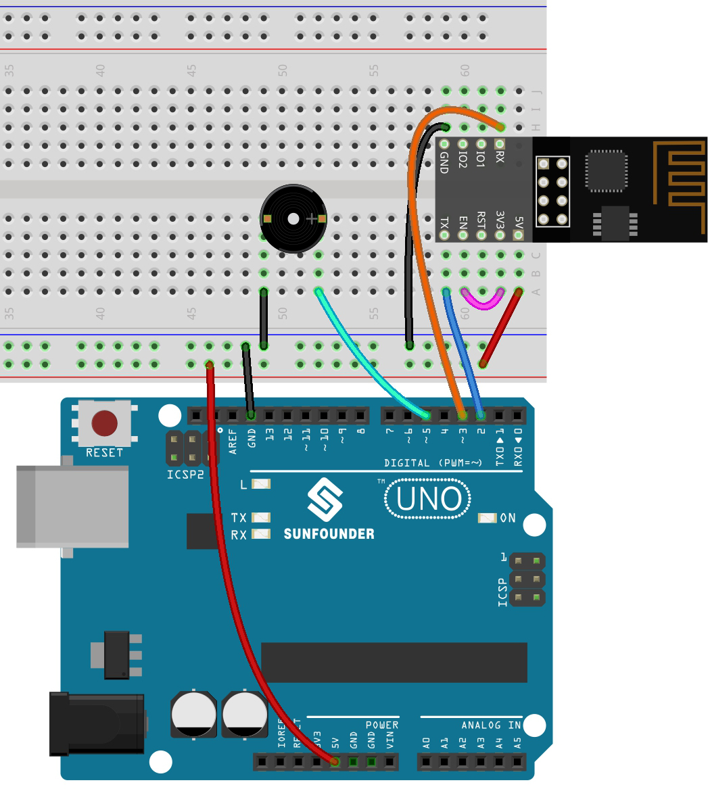

.. _iot_music:

4. Cloud Music Player
=====================================

The goal of this project is to create a music player using Blynk.
Music is played in the same way as in :ref:`ar_passive_buzzer`, by writing the song in the program and playing it with a passive buzzer.
however, in this example, we can click the switch to play/pause and slide the slider to change the playback progress.

**1. Build the Cirduit**

.. note::

    The ESP8266 module requires a high current to provide a stable operating environment when connected to the Internet, so make sure the 9V battery is plugged in.

* :ref:`cpn_uno`
* :ref:`cpn_breadboard`
* :ref:`cpn_esp8266`
* :ref:`cpn_buzzer`

**2. Edit Dashboard**

#. Create a **Datastream** of type **Virtual Pin** on the **Datastream** page as the value modified by the Slider widget added later or code. Set the DATA TYPE to **Integer** and MIN and MAX to **0** and **30**.

    .. image:: img/sp220610_104330.png

#. Also create another **Datastream** of type **Virtual Pin** to display the music name, and set the DATA TYPE to ``String``.

    .. image:: img/sp220610_105932.png

#. Go to the **Wed Dashboard** page, drag a **Switch** widget and set **Datastream** to V0 (V0 is already set in :ref:`iot_blink`); drag a **Label** widget and set it to V3; drag a **Slider** widget and set it to V2.

    .. image:: img/sp220610_110105.png

.. note::

    Your virtual pins may be different from mine, yours will prevail, but you need to modify the corresponding pin number in the code.

**3. Run the Code**

#. Open the ``4.cloud_music_player.ino`` file under the path of ``3in1-kit\iot_project\4.cloud_music_player``.

    .. raw:: html

        <iframe src=https://create.arduino.cc/editor/sunfounder01/34a49c4b-9eb4-4d03-bd78-fe1daefc9f5c/preview?embed style="height:510px;width:100%;margin:10px 0" frameborder=0></iframe>

#. Replace the ``Template ID``, ``Device Name``, and ``Auth Token`` with your own. You also need to enter the ``ssid`` and ``password`` of the WiFi you are using. For detailed tutorials, please refer to :ref:`connect_blynk`.
#. After selecting the correct board and port, click the **Upoad** button.

#. Open the Serial monitor(set baudrate to 115200) and wait for a prompt such as a successful connection to appear.

    .. image:: img/2_ready.png

    .. note::

        If the message ``ESP is not responding`` appears when you connect, please follow these steps.

        * Make sure the 9V battery is plugged in.
        * Reset the ESP8266 module by connecting the pin RST to GND for 1 second, then unplug it.
        * Press the reset button on the R3 board.

        Sometimes, you may need to repeat the above operation 3-5 times, please be patient.

#. Now, you can use Blynk's Button Control widget to start/pause the music and the Slider to adjust the playback progress, and you'll also see the name of the music.

    .. image:: img/sp220610_110105.png

#. If you want to use Blynk on mobile devices, please refer to :ref:`blynk_mobile`.

**How it works?**

 The datastream **V0** is used to get the status of the Switch widget and assign it to the variable **musicPlayFlag**, which controls pausing and playing the music.

.. code-block:: arduino

    int musicPlayFlag=0;

    BLYNK_WRITE(V0)
    {
        musicPlayFlag = param.asInt(); // START/PAUSE MUSIC
    }

The data stream **V2** is used to get the value of the slider widget and assign it to the variable **scrubBar** when the slider is moved.

.. code-block:: arduino

    int scrubBar=0;

    BLYNK_WRITE(V2)
    {
        scrubBar=param.asInt();
    }

When the device is connected to the **Blynk Cloud**, write the music name for the **V3** datastream and then display it with the **Label** widget.

.. code-block:: arduino

    BLYNK_CONNECTED() {
        String songName = "Ode to Joy";
        Blynk.virtualWrite(V3, songName);
    }

**Blynk Timer** will execute every second. Music is played if **musicPlayFlag** is not 0, i.e. the **Switch** widget is ON.
As soon as two notes are played, the progress bar variable ``scrubBar`` is incremented by 2, and the value is then written to the **Blynk Cloud**, which synchronizes the value of the **Slider** widget.

.. code-block:: arduino

    void myTimerEvent()
    {
        if(musicPlayFlag!=0)
        {
            tone(buzzerPin,melody[scrubBar],250);
            scrubBar=(scrubBar+1)%(sizeof(melody)/sizeof(int));
            delay(500);
            tone(buzzerPin,melody[scrubBar],250);
            scrubBar=(scrubBar+1)%(sizeof(melody)/sizeof(int));
            Serial.println(scrubBar);    
            Blynk.virtualWrite(V2, scrubBar);
        }
    }