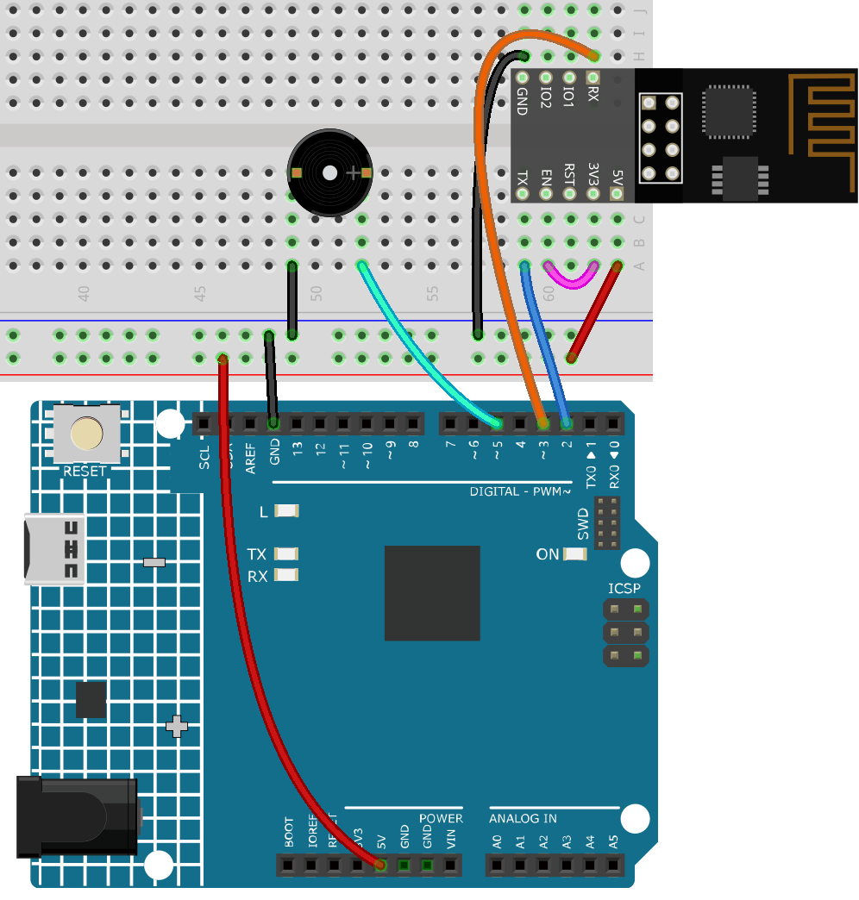

.. note::

    こんにちは、SunFounderのRaspberry Pi & Arduino & ESP32愛好家コミュニティへようこそ！Facebook上でRaspberry Pi、Arduino、ESP32についてもっと深く掘り下げ、他の愛好家と交流しましょう。

    **参加する理由は？**

    - **エキスパートサポート**：コミュニティやチームの助けを借りて、販売後の問題や技術的な課題を解決します。
    - **学び＆共有**：ヒントやチュートリアルを交換してスキルを向上させましょう。
    - **独占的なプレビュー**：新製品の発表や先行プレビューに早期アクセスしましょう。
    - **特別割引**：最新製品の独占割引をお楽しみください。
    - **祭りのプロモーションとギフト**：ギフトや祝日のプロモーションに参加しましょう。

    👉 私たちと一緒に探索し、創造する準備はできていますか？[|link_sf_facebook|]をクリックして今すぐ参加しましょう！

.. _iot_music:

4. クラウドミュージックプレイヤー
=====================================

このプロジェクトの目的は、Blynkを使用して音楽プレイヤーを作成することです。
音楽は、 :ref:`ar_passive_buzzer` と同じ方法で再生され、曲をプログラムに書き込んでパッシブブザーで再生します。
しかし、この例では、スイッチをクリックして再生/一時停止を切り替えたり、スライダーをスライドして再生の進行状況を変更することができます。

**必要な部品**

このプロジェクトでは、以下のコンポーネントが必要です。

キット全体を購入すると確かに便利です。以下にリンクを示します：

.. list-table::
    :widths: 20 20 20
    :header-rows: 1

    *   - 名前	
        - このキットのアイテム
        - リンク
    *   - 3 in 1 Starter Kit
        - 380+
        - |link_3IN1_kit|

以下のリンクから個別に購入することもできます。

.. list-table::
    :widths: 30 20
    :header-rows: 1

    *   - コンポーネントの紹介
        - 購入リンク

    *   - :ref:`cpn_uno`
        - \-
    *   - :ref:`cpn_breadboard`
        - |link_breadboard_buy|
    *   - :ref:`cpn_esp8266`
        - |link_esp8266_buy|
    *   - :ref:`cpn_wires`
        - |link_wires_buy|
    *   - :ref:`cpn_buzzer`
        - |link_passive_buzzer_buy|

**1. 回路を組む**

.. note::

    ESP8266モジュールは安定した動作環境を提供するために高い電流を必要とするので、9Vのバッテリーが接続されていることを確認してください。

**2. ダッシュボードの編集**

#. **Datastream** ページで **Virtual Pin** タイプの **Datastream** を作成します。これは、後で追加するスライダーウィジェットまたはコードによって変更される値として設定します。DATA TYPEを **Integer** に設定し、MINとMAXを **0** と **30** に設定します。

    .. image:: img/sp220610_104330.png

#. 音楽の名前を表示するための **Virtual Pin** タイプの別の **Datastream** も作成し、DATA TYPEを ``String`` に設定します。

    .. image:: img/sp220610_105932.png

#. **Wed Dashboard** ページに移動し、 **Switch** ウィジェットをドラッグし、 **Datastream** をV0に設定します（V0はすでに :ref:`iot_blink` で設定されています）； **Label** ウィジェットをドラッグしてV3に設定します； **Slider** ウィジェットをドラッグしてV2に設定します。

    .. image:: img/sp220610_110105.png

.. note::

    あなたの仮想ピンは私のものと異なる場合があります。あなたのものが優先されますが、コード内の対応するピン番号を変更する必要があります。

**3. コードを実行する**

#. ``3in1-kit\iot_project\4.cloud_music_player`` のパスの下の ``4.cloud_music_player.ino`` ファイルを開きます。

    .. raw:: html

        <iframe src=https://create.arduino.cc/editor/sunfounder01/34a49c4b-9eb4-4d03-bd78-fe1daefc9f5c/preview?embed style="height:510px;width:100%;margin:10px 0" frameborder=0></iframe>

#. ``Template ID``、 ``Device Name``、および ``Auth Token`` を自分のものに置き換えます。また、使用しているWiFiの ``ssid`` および ``password`` を入力する必要があります。詳しいチュートリアルは、 :ref:`connect_blynk` を参照してください。
#. 正しいボードとポートを選択したら、 **Upoad** ボタンをクリックします。

#. シリアルモニターを開き(baudrateを115200に設定)、接続が成功したというプロンプトが表示されるのを待ちます。

    .. image:: img/2_ready.png

    .. note::

        接続時に ``ESP is not responding`` というメッセージが表示された場合は、次の手順に従ってください。

        * 9Vのバッテリーが接続されていることを確認します。
        * ピンRSTを1秒間GNDに接続してESP8266モジュールをリセットし、その後、それを取り外します。
        * R4ボードのリセットボタンを押します。

        ときどき、上記の操作を3〜5回繰り返す必要があることがありますので、お待ちください。

#. これで、Blynkのボタン制御ウィジェットを使用して音楽の再生/一時停止を切り替えることができ、スライダーで再生の進行状況を調整することができます。また、音楽の名前も表示されます。

    .. image:: img/sp220610_110105.png

#. Blynkをモバイルデバイスで使用する場合は、 :ref:`blynk_mobile` を参照してください。

**どのように動作するのか？**

データストリーム **V0** は、Switchウィジェットのステータスを取得し、それを変数 **musicPlayFlag** に割り当てるために使用されます。これは、音楽の一時停止と再生を制御します。

.. code-block:: arduino

    int musicPlayFlag=0;

    BLYNK_WRITE(V0)
    {
        musicPlayFlag = param.asInt(); // 音楽の開始/一時停止
    }

データストリーム **V2** は、スライダーウィジェットの値を取得し、スライダーが移動されたときにそれを変数 **scrubBar** に割り当てるために使用されます。

.. code-block:: arduino

    int scrubBar=0;

    BLYNK_WRITE(V2)
    {
        scrubBar=param.asInt();
    }

デバイスが **Blynk Cloud** に接続されているとき、 **V3** データストリームの音楽名を書き込み、それを **Label** ウィジェットで表示します。

.. code-block:: arduino

    BLYNK_CONNECTED() {
        String songName = "Ode to Joy";
        Blynk.virtualWrite(V3, songName);
    }

**Blynk Timer** は毎秒実行されます。 **musicPlayFlag** が0でない場合、つまり、 **Switch** ウィジェットがONの場合、音楽が再生されます。
2つのノートが再生されると、プログレスバー変数 ``scrubBar`` が2増加し、その値は次に **Blynk Cloud** に書き込まれ、 **Slider** ウィジェットの値と同期されます。

.. code-block:: arduino

    void myTimerEvent()
    {
        if(musicPlayFlag!=0)
        {
            tone(buzzerPin,melody[scrubBar],250);
            scrubBar=(scrubBar+1)%(sizeof(melody)/sizeof(int));
            delay(500);
            tone(buzzerPin,melody[scrubBar],250);
            scrubBar=(scrubBar+1)%(sizeof(melody)/sizeof(int));
            Serial.println(scrubBar);    
            Blynk.virtualWrite(V2, scrubBar);
        }
    }
