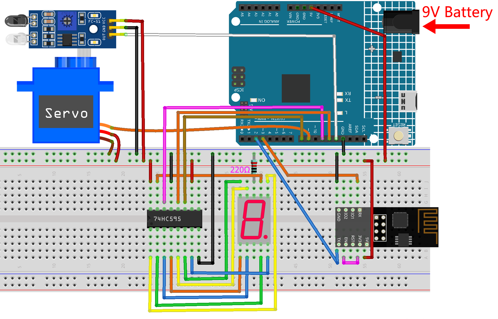

.. _iot_gate:

7. Current Limiting Gate
==================================

Some situations, such as parking lots, require quantity management.

Here we create a smart gate: a servo is used as the gate, and an IR obstacle detector is placed in front of it; if an object (like a car) is detected, the gate will open and the number will be increased by 1.
The count is displayed with a 7-segment display and is also uploaded to the Blynk Cloud for you to view remotely. Finally, Blynk has a Switch widget to enable or disable this smart gate system.

**Required Components**

In this project, we need the following components. 

It's definitely convenient to buy a whole kit, here's the link: 

.. list-table::
    :widths: 20 20 20
    :header-rows: 1

    *   - Name	
        - ITEMS IN THIS KIT
        - LINK
    *   - 3 in 1 Starter Kit
        - 380+
        - |link_3IN1_kit|

You can also buy them separately from the links below.

.. list-table::
    :widths: 30 20
    :header-rows: 1

    *   - COMPONENT INTRODUCTION
        - PURCHASE LINK

    *   - :ref:`cpn_uno`
        - \-
    *   - :ref:`cpn_breadboard`
        - |link_breadboard_buy|
    *   - :ref:`cpn_esp8266`
        - |link_esp8266_buy|
    *   - :ref:`cpn_wires`
        - |link_wires_buy|
    *   - :ref:`cpn_resistor`
        - |link_resistor_buy|
    *   - :ref:`cpn_servo`
        - |link_servo_buy|
    *   - :ref:`cpn_avoid`
        - |link_obstacle_avoidance_buy|
    *   - :ref:`cpn_7_segment`
        - |link_7segment_buy|
    *   - :ref:`cpn_74hc595`
        - |link_74hc595_buy|

**1. Build the Cirduit**

.. note::

    The ESP8266 module requires a high current to provide a stable operating environment, so make sure the 9V battery is plugged in.

**2. Edit Dashboard**

#. To record the number, create a **Datastream** of type **Virtual Pin** on the **Datastream** page. Set DATA TYPE to ``Integer`` and MIN and MAX to ``0`` and ``10``.

    .. image:: img/sp220610_165328.png
 
#. Now go to the **Wed Dashboard** page, drag a **Switch** widget to set its data stream to **V0** and a **Label** widget to set its data stream to **V8**.

    .. image:: img/sp220610_165548.png

**3. Run the Code**

#. Open the ``7.current_limiting_gate.ino`` file under the path of ``3in1-kit\iot_project\7.current_limiting_gate``, or copy this code into **Arduino IDE**.

    .. raw:: html
        
        <iframe src=https://create.arduino.cc/editor/sunfounder01/bd829175-652f-4c3e-85b0-048c3fda4555/preview?embed style="height:510px;width:100%;margin:10px 0" frameborder=0></iframe>

#. Replace the ``Template ID``, ``Device Name``, and ``Auth Token`` with your own. You also need to enter the ``ssid`` and ``password`` of the WiFi you are using. For detailed tutorials, please refer to :ref:`connect_blynk`.
#. After selecting the correct board and port, click the **Upoad** button.

#. Open the Serial monitor(set baudrate to 115200) and wait for a prompt such as a successful connection to appear.

    .. image:: img/2_ready.png

    .. note::

        If the message ``ESP is not responding`` appears when you connect, please follow these steps.

        * Make sure the 9V battery is plugged in.
        * Reset the ESP8266 module by connecting the pin RST to GND for 1 second, then unplug it.
        * Press the reset button on the R4 board.

        Sometimes, you may need to repeat the above operation 3-5 times, please be patient.

#. Now click on the Button Control widget on Blynk to enable the smart door system. If the IR obstacle avoidance module detects an obstacle, the gate will open and the 7-segment display and the Count widget on Blynk will add 1.

    .. image:: img/sp220610_165548.png

#. If you want to use Blynk on mobile devices, please refer to :ref:`blynk_mobile`.

    .. image:: img/mobile_gate.jpg

**How it works?**

The function ``BLYNK_WRITE(V0)`` gets the status of the **Switch** widget and assigns it to the variable ``doorFlag``, which will be used to determine if the smart gate system is enabled or not.

.. code-block:: arduino

    BLYNK_WRITE(V0)
    {
        doorFlag = param.asInt(); // Enable Gate
    }

In the Blynk Timer, ``doorFlag`` is judged every second and if it is enabled, the main function of the gate is executed.

.. code-block:: arduino

    void myTimerEvent()
    {
        if (doorFlag)
        {
            channelEntrance();
        }
    }

The main function of the gate is ``channelEntrance()``.
When an object approaches the gate (the sensor detects that there is an obstacle), the ``count`` is increased by 1.
Write ``count`` to the datastream ``V8``  of Blynk Cloud and 7-segment display on the circuit, and open the door.
If the object goes from present to absent, which means the object has entered the door, close the door.

.. code-block:: arduino

    void channelEntrance()
    {
        int currentState = digitalRead(irPin); // 0:obstacle 1:no-obstacle
        if (currentState == 0 && lastState == 1) {
            count=(count+1)%10;
            Blynk.virtualWrite(V8, count);
            showNumber(count);
            operateGate(true);
        } else if ((currentState == 1 && lastState == 0)) {
            operateGate(false);
        }
        lastState = currentState;
    }

The function ``showNumber(int num)`` is used to make the 7-segment display show the value.

.. code-block:: arduino

    void showNumber(int num)
    {
        digitalWrite(STcp, LOW); //ground ST_CP and hold low for as long as you are transmitting
        shiftOut(DS, SHcp, MSBFIRST, datArray[num]);
        digitalWrite(STcp, HIGH); //pull the ST_CPST_CP to save the data
    }

The function ``operateGate(bool openGate)`` slowly opens the door when the reference is ``True``, and slowly closes the door when the reference is ``False``.

.. code-block:: arduino

    void operateGate(bool openGate) {
        if (openGate == true) 
        {
            // open gate
            while (angle <= 90) { 
            angle++;
            myservo.write(angle);
            delay(5);
            }
        } else {
            // close gate
            while (angle >= 0){ 
            angle--;
            myservo.write(angle);
            delay(5);
            }
        }
    }