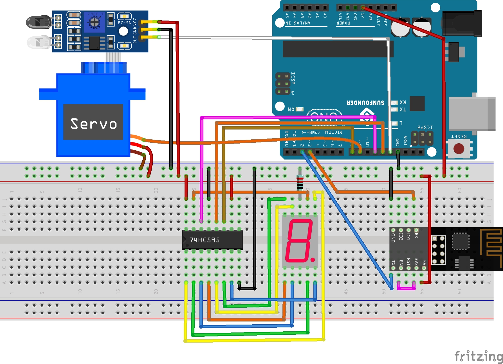

.. _iot_gate:

7. Puerta con Límite de Acceso
==================================

En algunas situaciones, como en los estacionamientos, es necesario gestionar la cantidad de vehículos.

Aquí creamos una puerta inteligente: se utiliza un servo como la puerta, y un detector de obstáculos IR se coloca frente a ella; si se detecta un objeto (como un coche), la puerta se abrirá y el número se incrementará en 1.
El conteo se muestra con un display de 7 segmentos y también se sube a Blynk Cloud para que puedas verlo de forma remota. Finalmente, Blynk tiene un widget de Interruptor para habilitar o deshabilitar este sistema de puerta inteligente.

**Componentes Necesarios**

Para este proyecto, necesitamos los siguientes componentes.

Es definitivamente conveniente comprar un kit completo, aquí está el enlace:

.. list-table::
    :widths: 20 20 20
    :header-rows: 1

    *   - Nombre	
        - ELEMENTOS EN ESTE KIT
        - ENLACE
    *   - 3 in 1 Starter Kit
        - 380+
        - |link_3IN1_kit|

También puedes comprarlos por separado en los enlaces a continuación.

.. list-table::
    :widths: 30 20
    :header-rows: 1

    *   - INTRODUCCIÓN AL COMPONENTE
        - ENLACE DE COMPRA

    *   - :ref:`cpn_uno`
        - |link_Uno_R3_buy|
    *   - :ref:`cpn_breadboard`
        - |link_breadboard_buy|
    *   - :ref:`cpn_esp8266`
        - |link_esp8266_buy|
    *   - :ref:`cpn_wires`
        - |link_wires_buy|
    *   - :ref:`cpn_resistor`
        - |link_resistor_buy|
    *   - :ref:`cpn_servo`
        - |link_servo_buy|
    *   - :ref:`cpn_avoid`
        - |link_obstacle_avoidance_buy|
    *   - :ref:`cpn_7_segment`
        - |link_7segment_buy|
    *   - :ref:`cpn_74hc595`
        - |link_74hc595_buy|

**1. Construir el Circuito**

.. note::

    El módulo ESP8266 requiere una alta corriente para proporcionar un entorno operativo estable, así que asegúrate de que la batería de 9V esté conectada.

**2. Editar el Tablero de Control**

#. Para registrar el número, crea un **Datastream** de tipo **Virtual Pin** en la página de **Datastream**. Configura el TIPO DE DATO a ``Integer`` y el MIN y MAX a ``0`` y ``10``.

    .. image:: img/sp220610_165328.png
 
#. Ahora ve a la página de **Wed Dashboard**, arrastra un widget **Switch** para configurar su flujo de datos a **V0** y un widget **Label** para configurar su flujo de datos a **V8**.

    .. image:: img/sp220610_165548.png

**3. Ejecutar el Código**

#. Abre el archivo ``7.current_limiting_gate.ino`` en la ruta ``3in1-kit\iot_project\7.current_limiting_gate``, o copia este código en **Arduino IDE**.

    .. raw:: html
        
        <iframe src=https://create.arduino.cc/editor/sunfounder01/bd829175-652f-4c3e-85b0-048c3fda4555/preview?embed style="height:510px;width:100%;margin:10px 0" frameborder=0></iframe>

#. Reemplaza el ``Template ID``, ``Device Name`` y ``Auth Token`` con los tuyos. También necesitas ingresar el ``ssid`` y ``password`` del WiFi que estás utilizando. Para tutoriales detallados, consulta :ref:`connect_blynk`.
#. Tras seleccionar la placa y puerto correctos, haz clic en el botón **Upoad**.

#. Abre el monitor Serial(configura la tasa de baudios a 115200) y espera un aviso como una conexión exitosa.

    .. image:: img/2_ready.png

    .. note::

        Si aparece el mensaje ``ESP is not responding`` al conectar, sigue estos pasos.

        * Asegúrate de que la batería de 9V esté conectada.
        * Restablece el módulo ESP8266 conectando el pin RST a GND durante 1 segundo, luego desenchúfalo.
        * Presiona el botón de reset en la placa R3.

        A veces, puede ser necesario repetir la operación anterior 3-5 veces, por favor ten paciencia.

#. Ahora haz clic en el widget de Control de Botón en Blynk para activar el sistema de puerta inteligente. Si el módulo de evitación de obstáculos IR detecta un obstáculo, la puerta se abrirá y el display de 7 segmentos y el widget de Conteo en Blynk se incrementarán en 1.

    .. image:: img/sp220610_165548.png

#. Si quieres usar Blynk en dispositivos móviles, consulta :ref:`blynk_mobile`.

    .. image:: img/mobile_gate.jpg

**¿Cómo funciona?**

La función ``BLYNK_WRITE(V0)`` obtiene el estado del widget **Switch** y lo asigna a la variable ``doorFlag``, que se usará para determinar si el sistema de puerta inteligente está habilitado o no.

.. code-block:: arduino

    BLYNK_WRITE(V0)
    {
        doorFlag = param.asInt(); // Enable Gate
    }

En el Temporizador de Blynk, ``doorFlag`` se evalúa cada segundo y si está habilitado, se ejecuta la función principal de la puerta.

.. code-block:: arduino

    void myTimerEvent()
    {
        if (doorFlag)
        {
            channelEntrance();
        }
    }

La función principal de la puerta es ``channelEntrance()``.
Cuando un objeto se acerca a la puerta (el sensor detecta que hay un obstáculo), el ``count`` se incrementa en 1.
Escribe ``count`` en el flujo de datos ``V8`` de Blynk Cloud y en el display de 7 segmentos del circuito, y abre la puerta.
Si el objeto pasa de estar presente a ausente, lo que significa que ha entrado por la puerta, cierra la puerta.

.. code-block:: arduino

    void channelEntrance()
    {
        int currentState = digitalRead(irPin); // 0:obstacle 1:no-obstacle
        if (currentState == 0 && lastState == 1) {
            count=(count+1)%10;
            Blynk.virtualWrite(V8, count);
            showNumber(count);
            operateGate(true);
        } else if ((currentState == 1 && lastState == 0)) {
            operateGate(false);
        }
        lastState = currentState;
    }

La función ``showNumber(int num)`` se usa para que el display de 7 segmentos muestre el valor.

.. code-block:: arduino

    void showNumber(int num)
    {
        digitalWrite(STcp, LOW); //ground ST_CP and hold low for as long as you are transmitting
        shiftOut(DS, SHcp, MSBFIRST, datArray[num]);
        digitalWrite(STcp, HIGH); //pull the ST_CPST_CP to save the data
    }

La función ``operateGate(bool openGate)`` abre lentamente la puerta cuando la referencia es ``True``, y cierra lentamente la puerta cuando la referencia es ``False``.

.. code-block:: arduino

    void operateGate(bool openGate) {
        if (openGate == true) 
        {
            // open gate
            while (angle <= 90) { 
            angle++;
            myservo.write(angle);
            delay(5);
            }
        } else {
            // close gate
            while (angle >= 0){ 
            angle--;
            myservo.write(angle);
            delay(5);
            }
        }
    }