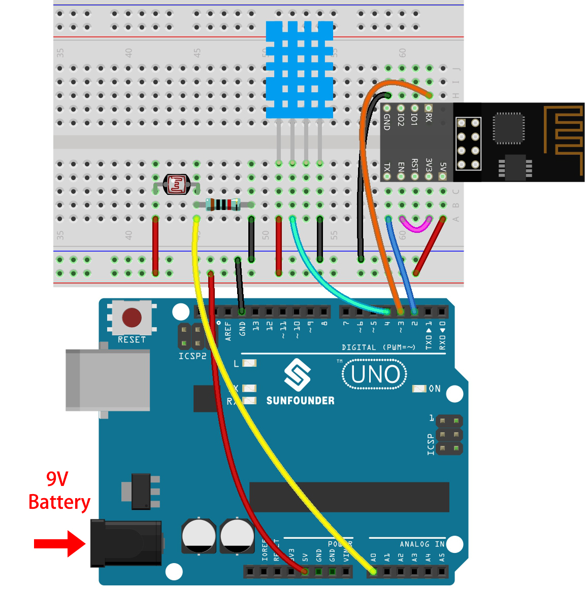
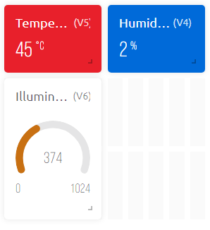

.. note::

    Hello, welcome to the SunFounder Raspberry Pi & Arduino & ESP32 Enthusiasts Community on Facebook! Dive deeper into Raspberry Pi, Arduino, and ESP32 with fellow enthusiasts.

    **Why Join?**

    - **Expert Support**: Solve post-sale issues and technical challenges with help from our community and team.
    - **Learn & Share**: Exchange tips and tutorials to enhance your skills.
    - **Exclusive Previews**: Get early access to new product announcements and sneak peeks.
    - **Special Discounts**: Enjoy exclusive discounts on our newest products.
    - **Festive Promotions and Giveaways**: Take part in giveaways and holiday promotions.

    👉 Ready to explore and create with us? Click [|link_sf_facebook|] and join today!

.. _iot_home:

5. Home Environment Monitoring
================================

In this chapter, we will use Blynk to create a home environment monitor.
You can measure the temperature, humidity, and light intensity of a room using the DHT11 and photoresistor.
By sending these values to Blynk, you will be able to know the environment of your home via the internet.

**Required Components**

In this project, we need the following components. 

It's definitely convenient to buy a whole kit, here's the link: 

.. list-table::
    :widths: 20 20 20
    :header-rows: 1

    *   - Name	
        - ITEMS IN THIS KIT
        - LINK
    *   - 3 in 1 Starter Kit
        - 380+
        - |link_3IN1_kit|

You can also buy them separately from the links below.

.. list-table::
    :widths: 30 20
    :header-rows: 1

    *   - COMPONENT INTRODUCTION
        - PURCHASE LINK

    *   - :ref:`cpn_uno`
        - |link_Uno_R3_buy|
    *   - :ref:`cpn_breadboard`
        - |link_breadboard_buy|
    *   - :ref:`cpn_esp8266`
        - |link_esp8266_buy|
    *   - :ref:`cpn_wires`
        - |link_wires_buy|
    *   - :ref:`cpn_resistor`
        - |link_resistor_buy|
    *   - :ref:`cpn_photoresistor`
        - |link_photoresistor_buy|
    *   - :ref:`cpn_dht11`
        - \-

**1. Build the Circuit**

.. note::

    The ESP8266 module requires a high current to provide a stable operating environment, so make sure the 9V battery is plugged in.

**2. Edit Dashboard**

#. For recording humidity values, create a **Datastream** of type **Virtual Pin** on the **Datastream** page. Set the DATA TYPE to **Double** and MIN and MAX to **0** and **100**. Also set the units to **Percentage, %**.

    .. image:: img/sp220610_145748.png

#. Then create a **Datastream** of type **Virtual Pin** for recording the temperature. Set DATA TYPE to ``Double``, MIN and MAX to ``-30`` and ``50``, and units to **Celsius, °C**.

    .. image:: img/sp220610_145811.png

#. Also create a **Datastream** of type **Virtual Pin** to record the light intensity. Use the default data type - **Integer**, with MIN and MAX set to ``0`` and ``1024``.

    .. image:: img/sp220610_145834.png

#. Go to the **Wed Dashboard** page, drag two **Label** widgets and set their data streams to **V4** and **V5** respectively, and drag a **Gauge** widget and set the data stream to **V6**. Also in the widget setting, you can enable **Change color based on value** and select the appropriate color to make the widget look better and more intuitive.

**3. Run the Code**

#. Open the ``5.home_environment_monitoring.ino`` file under the path of ``3in1-kit\iot_project\5.home_environment_monitoring``, or copy this code into **Arduino IDE**.

    .. note::

        * The ``DHT sensor library`` is used here, you can install it from the **Library Manager**.

            .. image:: ../img/lib_dht11.png

    .. raw:: html
        
        <iframe src=https://create.arduino.cc/editor/sunfounder01/4f0ad85e-8aff-4df9-99dd-c6741aed8219/preview?embed style="height:510px;width:100%;margin:10px 0" frameborder=0></iframe>

#. Replace the ``Template ID``, ``Device Name``, and ``Auth Token`` with your own. You also need to enter the ``ssid`` and ``password`` of the WiFi you are using. For detailed tutorials, please refer to :ref:`connect_blynk`.
#. After selecting the correct board and port, click the **Upoad** button.

#. Open the Serial monitor(set baudrate to 115200) and wait for a prompt such as a successful connection to appear.

    .. image:: img/2_ready.png

    .. note::

        If the message ``ESP is not responding`` appears when you connect, please follow these steps.

        * Make sure the 9V battery is plugged in.
        * Reset the ESP8266 module by connecting the pin RST to GND for 1 second, then unplug it.
        * Press the reset button on the R3 board.

        Sometimes, you may need to repeat the above operation 3-5 times, please be patient.

#. Now, you will see the current ambient temperature, humidity and light intensity on Blynk.

    .. image:: img/sp220610_150400.png
        :align: center

#. If you want to use Blynk on mobile devices, please refer to :ref:`blynk_mobile`.

    .. image:: img/mobile_home.jpg

**How it works?**

These two functions are used to get the temperature, humidity and light intensity of the room.

.. code-block:: arduino

    int readLight(){
        return analogRead(lightPin);
    }

    bool readDHT() {

        // Reading temperature or humidity takes about 250 milliseconds!
        // Sensor readings may also be up to 2 seconds 'old' (it's a very slow sensor)
        humidity = dht.readHumidity();
        // Read temperature as Celsius (the default)
        temperature = dht.readTemperature();

        // Check if any reads failed and exit early (to try again).
        if (isnan(humidity) || isnan(temperature)) {
            Serial.println("Failed to read from DHT sensor!");
            return false;
        }
        return true;
    }

With the Blynk ``Timer``, the ambient temperature, humidity, and light intensity are obtained every second and sent to the data stream on the Blynk Cloud, from which the widgets display the data.

.. code-block:: arduino

    void myTimerEvent()
    {
        bool chk = readDHT();
        int light = readLight();
        if(chk){
            Blynk.virtualWrite(V4,humidity);
            Blynk.virtualWrite(V5,temperature);
        }
        Blynk.virtualWrite(V6,light);
    }