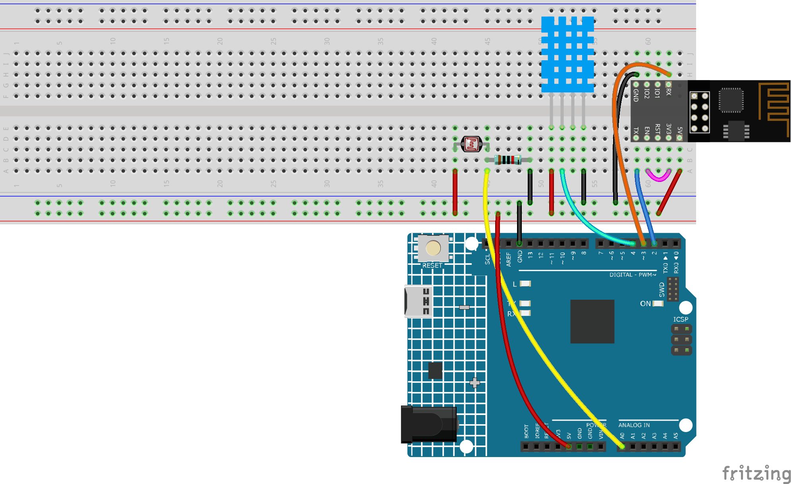

.. _iot_home:

5. Überwachung des häuslichen Umfelds
=========================================

In diesem Kapitel werden wir Blynk verwenden, um einen Umweltmonitor für das Zuhause zu erstellen.
Sie können mit dem DHT11 und dem Fotowiderstand die Temperatur, die Luftfeuchtigkeit und die Lichtintensität eines Raumes messen.
Indem Sie diese Werte an Blynk senden, können Sie die Umgebung Ihres Zuhauses über das Internet überprüfen.

**Benötigte Komponenten**

Für dieses Projekt benötigen wir die folgenden Komponenten.

Es ist definitiv praktisch, ein gesamtes Set zu kaufen, hier ist der Link:

.. list-table::
    :widths: 20 20 20
    :header-rows: 1

    *   - Name
        - ARTIKEL IN DIESEM KIT
        - LINK
    *   - 3 in 1 Starter Kit
        - 380+
        - |link_3IN1_kit|

Sie können diese auch separat über die untenstehenden Links kaufen.

.. list-table::
    :widths: 30 20
    :header-rows: 1

    *   - KOMPONENTENBESCHREIBUNG
        - KAUF-LINK

    *   - :ref:`cpn_uno`
        - \-
    *   - :ref:`cpn_breadboard`
        - |link_breadboard_buy|
    *   - :ref:`cpn_esp8266`
        - |link_esp8266_buy|
    *   - :ref:`cpn_wires`
        - |link_wires_buy|
    *   - :ref:`cpn_resistor`
        - |link_resistor_buy|
    *   - :ref:`cpn_photoresistor`
        - |link_photoresistor_buy|
    *   - :ref:`cpn_dht11`
        - \-

**1. Schaltung aufbauen**

.. note::

    Das ESP8266-Modul benötigt einen hohen Strom, um einen stabilen Betrieb zu gewährleisten. Stellen Sie also sicher, dass die 9V-Batterie angeschlossen ist.

**2. Dashboard bearbeiten**

#. Für die Aufzeichnung von Luftfeuchtigkeitswerten erstellen Sie einen **Datastream** vom Typ **Virtual Pin** auf der **Datastream**-Seite. Setzen Sie den DATENTYP auf **Double** und MIN und MAX auf **0** und **100**. Setzen Sie auch die Einheiten auf **Percentage, %**.

    .. image:: img/sp220610_145748.png

#. Erstellen Sie dann einen **Datastream** vom Typ **Virtual Pin** für die Temperaturaufzeichnung. Setzen Sie DATENTYP auf ``Double``, MIN und MAX auf ``-30`` und ``50``, und die Einheiten auf **Celsius, °C**.

    .. image:: img/sp220610_145811.png

#. Erstellen Sie auch einen **Datastream** vom Typ **Virtual Pin** zur Aufzeichnung der Lichtintensität. Verwenden Sie den Standarddatentyp - **Integer**, mit MIN und MAX auf ``0`` und ``1024`` eingestellt.

    .. image:: img/sp220610_145834.png

#. Gehen Sie zur **Wed Dashboard**-Seite, ziehen Sie zwei **Label**-Widgets und setzen Sie ihre Datenströme jeweils auf **V4** und **V5**. Ziehen Sie ein **Gauge**-Widget und setzen Sie den Datenstrom auf **V6**. In den Widget-Einstellungen können Sie **Farbänderung basierend auf Wert** aktivieren und die entsprechende Farbe auswählen, um das Widget ansprechender und intuitiver zu gestalten.

.. image:: img/sp220610_150400.png
    :align: center

**3. Den Code ausführen**

#. Öffnen Sie die Datei ``5.home_environment_monitoring.ino`` unter dem Pfad ``3in1-kit\iot_project\5.home_environment_monitoring`` oder kopieren Sie diesen Code in die **Arduino IDE**.

    .. note::

            * Hier wird die ``DHT sensor library`` verwendet. Sie können diese aus dem **Library Manager** installieren.

                .. image:: ../img/lib_dht11.png

    .. raw:: html
        
        <iframe src=https://create.arduino.cc/editor/sunfounder01/4f0ad85e-8aff-4df9-99dd-c6741aed8219/preview?embed style="height:510px;width:100%;margin:10px 0" frameborder=0></iframe>

#. Ersetzen Sie die ``Template ID``, den ``Device Name`` und den ``Auth Token`` durch Ihre eigenen. Sie müssen auch die ``ssid`` und das ``Passwort`` des von Ihnen verwendeten WLANs eingeben. Für detaillierte Anleitungen siehe :ref:`connect_blynk`.
#. Wählen Sie das richtige Board und den richtigen Port aus und klicken Sie auf den **Upoad**-Button.

#. Öffnen Sie den seriellen Monitor (Baudrate auf 115200 einstellen) und warten Sie, bis eine Meldung, wie z.B. eine erfolgreiche Verbindung, erscheint.

    .. image:: img/2_ready.png

    .. note::

        Wenn die Meldung ``ESP is not responding`` beim Verbinden erscheint, folgen Sie bitte diesen Schritten.

        * Stellen Sie sicher, dass die 9V-Batterie angeschlossen ist.
        * Setzen Sie das ESP8266-Modul zurück, indem Sie den RST-Pin für 1 Sekunde mit GND verbinden und dann trennen.
        * Drücken Sie den Reset-Knopf auf dem R4-Board.

        Manchmal müssen Sie den obigen Vorgang 3-5 Mal wiederholen, bitte haben Sie Geduld.

#. Nun sehen Sie die aktuelle Raumtemperatur, Luftfeuchtigkeit und Lichtintensität in Blynk.

    .. image:: img/sp220610_150400.png
        :align: center

#. Wenn Sie Blynk auf mobilen Geräten verwenden möchten, verweisen Sie auf :ref:`blynk_mobile`.

    .. image:: img/mobile_home.jpg

**Wie funktioniert das?**

Diese beiden Funktionen werden verwendet, um die Temperatur, Luftfeuchtigkeit und Lichtintensität des Raumes zu erhalten.

.. code-block:: arduino

    int readLight(){
        return analogRead(lightPin);
    }

    bool readDHT() {

        // Reading temperature or humidity takes about 250 milliseconds!
        // Sensor readings may also be up to 2 seconds 'old' (it's a very slow sensor)
        humidity = dht.readHumidity();
        // Read temperature as Celsius (the default)
        temperature = dht.readTemperature();

        // Check if any reads failed and exit early (to try again).
        if (isnan(humidity) || isnan(temperature)) {
            Serial.println("Failed to read from DHT sensor!");
            return false;
        }
        return true;
    }

Mit dem Blynk ``Timer`` werden die Raumtemperatur, Luftfeuchtigkeit und Lichtintensität jede Sekunde abgerufen und an den Datenstrom in der Blynk Cloud gesendet, von wo aus die Widgets die Daten anzeigen.

.. code-block:: arduino

    void myTimerEvent()
    {
        bool chk = readDHT();
        int light = readLight();
        if(chk){
            Blynk.virtualWrite(V4,humidity);
            Blynk.virtualWrite(V5,temperature);
        }
        Blynk.virtualWrite(V6,light);
    }