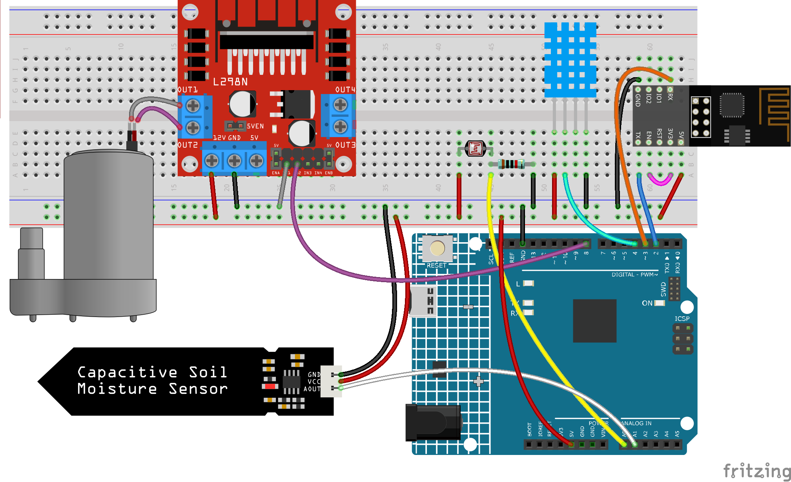

.. _iot_plant:

6. Pflanzenüberwachung
==========================

Das Ziel dieses Projekts ist es, ein intelligentes Bewässerungssystem zu erstellen, das die aktuelle Temperatur, Luftfeuchtigkeit, Lichtintensität und Bodenfeuchtigkeit erfasst und diese auf Blynk anzeigt.

Sobald Sie den Schalter in Blynk Cloud aktivieren, beginnt die Pumpe zu arbeiten und die Pflanzen werden bewässert.

**Benötigte Komponenten**

Für dieses Projekt benötigen wir die folgenden Komponenten.

Es ist definitiv praktisch, ein ganzes Set zu kaufen, hier ist der Link:

.. list-table::
    :widths: 20 20 20
    :header-rows: 1

    *   - Name	
        - ARTIKEL IN DIESEM KIT
        - LINK
    *   - 3 in 1 Starter Kit
        - 380+
        - |link_3IN1_kit|

Sie können sie auch separat über die untenstehenden Links kaufen.

.. list-table::
    :widths: 30 20
    :header-rows: 1

    *   - KOMPONENTENBESCHREIBUNG
        - KAUF-LINK

    *   - :ref:`cpn_uno`
        - \-
    *   - :ref:`cpn_breadboard`
        - |link_breadboard_buy|
    *   - :ref:`cpn_esp8266`
        - |link_esp8266_buy|
    *   - :ref:`cpn_wires`
        - |link_wires_buy|
    *   - :ref:`cpn_resistor`
        - |link_resistor_buy|
    *   - :ref:`cpn_photoresistor`
        - |link_photoresistor_buy|
    *   - :ref:`cpn_dht11`
        - \-
    *   - :ref:`cpn_soil_moisture`
        - |link_soil_moisture_buy|
    *   - :ref:`cpn_l9110` 
        - \-
    *   - :ref:`cpn_pump`
        - \-

**1. Bauen Sie den Schaltkreis**

.. note::

    Das ESP8266-Modul benötigt einen hohen Strom, um eine stabile Betriebsumgebung zu gewährleisten. Stellen Sie daher sicher, dass die 9V-Batterie angeschlossen ist.

**2. Dashboard bearbeiten**

#. Die in den vorherigen Projekten erstellten Datenströme müssen gespeichert werden, und sie werden auch in diesem Projekt verwendet.

#. Um die Bodenfeuchtigkeit aufzuzeichnen, erstellen Sie einen weiteren **Datastream** vom Typ **Virtual Pin** auf der **Datastream**-Seite. Setzen Sie den DATENTYP auf ``Integer`` und MIN und MAX auf ``0`` und ``1024``.

    .. image:: img/sp220610_155221.png

#. Gehen Sie nun zur **Wed Dashboard**-Seite, ziehen Sie 2 **Label**-Widgets und setzen Sie ihre Datenströme jeweils auf **V4** und **V5**; ziehen Sie 2 **Gauge**-Widgets und setzen Sie ihre Datenströme so, dass sie **V6** und **V7** anzeigen; und ziehen Sie schließlich ein **Switch**-Widget und setzen Sie seinen Datenstrom auf **V0**.

    .. image:: img/sp220610_155350.png

**3. Den Code ausführen**

Öffnen Sie die Datei ``6.plant_monitoring.ino`` im Pfad ``3in1-kit\iot_project\6.plant_monitoring``, oder kopieren Sie diesen Code in die **Arduino IDE**.

    .. note::

            * Hier wird die ``DHT sensor library`` verwendet. Sie können diese über den **Library Manager** installieren.

                .. image:: ../img/lib_dht11.png

    .. raw:: html
        
        <iframe src=https://create.arduino.cc/editor/sunfounder01/f738bcb5-4ee2-475b-b683-759e6b2041b0/preview?embed style="height:510px;width:100%;margin:10px 0" frameborder=0></iframe>

#. Ersetzen Sie die ``Template ID``, den ``Device Name`` und das ``Auth Token`` durch Ihre eigenen Angaben. Sie müssen auch die ``ssid`` und das ``password`` des von Ihnen verwendeten WLANs eingeben. Für detaillierte Anleitungen verweisen Sie bitte auf :ref:`connect_blynk`.
#. Wählen Sie das richtige Board und den Port aus und klicken Sie auf die Schaltfläche **Upoad**.

#. Öffnen Sie den Seriellen Monitor (Baudrate auf 115200 einstellen) und warten Sie auf eine Meldung, z. B. dass eine erfolgreiche Verbindung hergestellt wurde.

    .. image:: img/2_ready.png

    .. note::

        Wenn beim Verbinden die Meldung ``ESP is not responding`` erscheint, befolgen Sie bitte diese Schritte:

        * Stellen Sie sicher, dass die 9V-Batterie angeschlossen ist.
        * Setzen Sie das ESP8266-Modul zurück, indem Sie den RST-Pin für 1 Sekunde mit GND verbinden und dann trennen.
        * Drücken Sie den Reset-Knopf auf dem R4-Board.

        Manchmal müssen Sie den obigen Vorgang 3-5 Mal wiederholen. Bitte haben Sie Geduld.

#. Zurück in Blynk werden die aktuelle Temperatur, Luftfeuchtigkeit, Lichtintensität und Bodenfeuchtigkeit angezeigt. Mit dem Button Control Widget können Sie, falls nötig, die Pumpe aktivieren, um die Pflanzen zu bewässern.

    .. image:: img/sp220610_155350.png

#. Wenn Sie Blynk auf mobilen Geräten nutzen möchten, verweisen Sie bitte auf :ref:`blynk_mobile`.

    .. image:: img/mobile_plant.jpg

**Wie funktioniert das?**

Dieser ``BLYNK_WRITE`` bewirkt, dass das **Switch**-Widget von Blynk die Pumpe startet, wenn es eingeschaltet ist und ausschaltet, wenn es ausgeschaltet ist.

.. code-block:: arduino

    BLYNK_WRITE(V0)
    {
        if(param.asInt()==1){
            digitalWrite(pumpA,HIGH);
        }else{
            digitalWrite(pumpA,LOW); 
        }
    }

Diese drei Funktionen werden verwendet, um die aktuelle Umgebungstemperatur, Luftfeuchtigkeit, Lichtintensität und Bodenfeuchtigkeit zu messen.

.. code-block:: arduino

    int readMoisture(){
        return analogRead(moisturePin);
    }

    int readLight(){
        return analogRead(lightPin);
    }

    bool readDHT() {

        // Reading temperature or humidity takes about 250 milliseconds!
        // Sensor readings may also be up to 2 seconds 'old' (it's a very slow sensor)
        humidity = dht.readHumidity();
        // Read temperature as Celsius (the default)
        temperature = dht.readTemperature();

        // Check if any reads failed and exit early (to try again).
        if (isnan(humidity) || isnan(temperature)) {
            Serial.println("Failed to read from DHT sensor!");
            return false;
        }
        return true;
    }

Mit dem Blynk ``Timer`` werden jede Sekunde die Umgebungstemperatur, Luftfeuchtigkeit, Lichtintensität und Bodenfeuchtigkeit ermittelt und an den Datenstrom auf dem **Blynk Cloud** gesendet, von wo aus die Widgets die Daten anzeigen.

.. code-block:: arduino

    void myTimerEvent()
    {
        bool chk = readDHT();
        int light = readLight();
        int moisture = readMoisture();
        if(chk){
            Blynk.virtualWrite(V4,humidity);
            Blynk.virtualWrite(V5,temperature);
        }
        Blynk.virtualWrite(V6,light);
        Blynk.virtualWrite(V7,moisture);
    }
