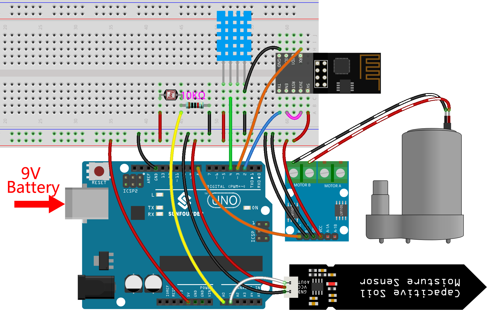

.. _iot_plant:

6. 植物モニター
==========================

本プロジェクトの目的は、現在の温度、湿度、光の強度、土壌の湿度を検出し、それらをBlynkに表示するスマートな水やりシステムを作成することです。

Blynk Cloudのスイッチトグルをオンにすると、ポンプが動作し始め、植物に水が供給されます。

**必要な部品**

このプロジェクトでは、以下の部品が必要です。

一式を購入するのが便利です。リンクは以下のとおりです:

.. list-table::
    :widths: 20 20 20
    :header-rows: 1

    *   - Name	
        - ITEMS IN THIS KIT
        - LINK
    *   - 3 in 1 Starter Kit
        - 380+
        - |link_3IN1_kit|

以下のリンクから個別に購入することもできます。

.. list-table::
    :widths: 30 20
    :header-rows: 1

    *   - コンポーネントの紹介
        - 購入リンク

    *   - :ref:`cpn_uno`
        - |link_Uno_R3_buy|
    *   - :ref:`cpn_breadboard`
        - |link_breadboard_buy|
    *   - :ref:`cpn_esp8266`
        - |link_esp8266_buy|
    *   - :ref:`cpn_wires`
        - |link_wires_buy|
    *   - :ref:`cpn_resistor`
        - |link_resistor_buy|
    *   - :ref:`cpn_photoresistor`
        - |link_photoresistor_buy|
    *   - :ref:`cpn_dht11`
        - \-
    *   - :ref:`cpn_soil_moisture`
        - |link_soil_moisture_buy|
    *   - :ref:`cpn_l9110`
        - \-
    *   - :ref:`cpn_pump`
        - \-

**1. Build the Cirduit**

.. note::

    ESP8266モジュールは、安定した動作環境を提供するために高電流が必要ですので、9Vのバッテリーが接続されていることを確認してください。

**2. ダッシュボードを編集**

#. 以前のプロジェクトで作成したデータストリームは保存しておく必要があり、このプロジェクトでも使用されます。

#. 土壌の湿度を記録するために、 **Datastream** ページで **Virtual Pin** タイプの別の **Datastream** を作成します。DATA TYPEを ``Integer`` に設定し、MINとMAXを ``0`` および ``1024`` に設定します。

    .. image:: img/sp220610_155221.png

#. さらに、 **Web Dashboard** ページに移動し、2つの **Label** ウィジェットをドラッグして、それぞれのデータストリームを **V4** および **V5** に設定します。次に、2つの **Gauge** ウィジェットをドラッグして、それぞれのデータストリームを **V6** および **V7** に設定します。最後に、 **Switch** ウィジェットをドラッグして、そのデータストリームを **V0** に設定します。

    .. image:: img/sp220610_155350.png

**3. コードの実行**

``3in1-kit\iot_project\6.plant_monitoring`` のパスの下で ``6.plant_monitoring.ino`` ファイルを開くか、このコードを **Arduino IDE** にコピーします。

    .. note::

        * ここでは ``DHT sensor library`` が使用されています。 **Library Manager** からインストールできます。

            .. image:: ../img/lib_dht11.png

    .. raw:: html
        
        <iframe src=https://create.arduino.cc/editor/sunfounder01/f738bcb5-4ee2-475b-b683-759e6b2041b0/preview?embed style="height:510px;width:100%;margin:10px 0" frameborder=0></iframe>

#. ``Template ID`` 、 ``Device Name`` 、 ``Auth Token`` を自分のものに置き換えます。また、使用しているWiFiの ``ssid`` と ``password`` を入力する必要があります。詳細なチュートリアルは :ref:`connect_blynk` を参照してください。
#. 正しいボードとポートを選択した後、 **Upoad** ボタンをクリックします。

#. シリアルモニター(ボーレートを115200に設定)を開き、接続成功などのプロンプトが表示されるのを待ちます。

    .. image:: img/2_ready.png

    .. note::

        接続時に ``ESP is not responding`` というメッセージが表示される場合、次の手順に従ってください。

        * 9Vのバッテリーが接続されていることを確認します。
        * ピンRSTを1秒間GNDに接続してESP8266モジュールをリセットし、その後プラグを抜きます。
        * R3ボードのリセットボタンを押します。

        ときどき、上記の操作を3～5回繰り返す必要がありますので、お待ちください。

#. Blynkに戻ると、現在の温度、湿度、光の強度、土壌の湿度が表示されます。必要に応じて、ボタン制御ウィジェットをクリックして植物に水をやることができます。

    .. image:: img/sp220610_155350.png

#. Blynkをモバイルデバイスで使用したい場合は、 :ref:`blynk_mobile` を参照してください。

    .. image:: img/mobile_plant.jpg

**どのように動作するのか？**

この ``BLYNK_WRITE`` は、Blynkの **Switch** ウィジェットがONのときにポンプを起動し、OFFのときにポンプをオフにします。

.. code-block:: arduino

    BLYNK_WRITE(V0)
    {
        if(param.asInt()==1){
            digitalWrite(pumpA,HIGH);
        }else{
            digitalWrite(pumpA,LOW); 
        }
    }

以下の三つの関数は、現在の環境温度、湿度、光の強度、土壌の湿度を取得するために使用されます。

.. code-block:: arduino

    int readMoisture(){
        return analogRead(moisturePin);
    }

    int readLight(){
        return analogRead(lightPin);
    }

    bool readDHT() {

        // Reading temperature or humidity takes about 250 milliseconds!
        // Sensor readings may also be up to 2 seconds 'old' (it's a very slow sensor)
        humidity = dht.readHumidity();
        // Read temperature as Celsius (the default)
        temperature = dht.readTemperature();

        // Check if any reads failed and exit early (to try again).
        if (isnan(humidity) || isnan(temperature)) {
            Serial.println("Failed to read from DHT sensor!");
            return false;
        }
        return true;
    }

Blynkの ``Timer`` を使用して、周囲の温度、湿度、光の強度、土壌の湿度が毎秒取得され、 **Blynk Cloud** 上のデータストリームに送信され、ウィジェットがデータを表示します。

.. code-block:: arduino

    void myTimerEvent()
    {
        bool chk = readDHT();
        int light = readLight();
        int moisture = readMoisture();
        if(chk){
            Blynk.virtualWrite(V4,humidity);
            Blynk.virtualWrite(V5,temperature);
        }
        Blynk.virtualWrite(V6,light);
        Blynk.virtualWrite(V7,moisture);
    }
