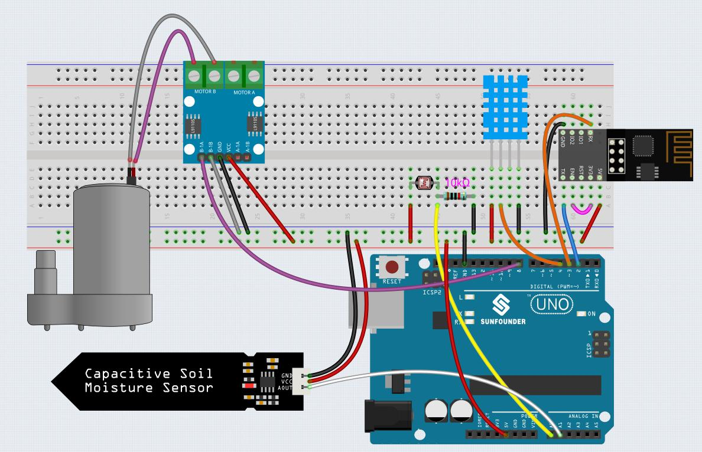

.. _iot_plant:

6. Plant Monitor
==========================

The purpose of this project is to create a smart watering system that detects the current temperature, humidity, intensity of light, and soil moisture and displays them on Blynk.

As soon as you turn on the Switch toggle in Blynk Cloud, the pump will start working and the plants will be hydrated.

**Required Components**

In this project, we need the following components. 

It's definitely convenient to buy a whole kit, here's the link: 

.. list-table::
    :widths: 20 20 20
    :header-rows: 1

    *   - Name	
        - ITEMS IN THIS KIT
        - LINK
    *   - 3 in 1 Starter Kit
        - 380+
        - |link_3IN1_kit|

You can also buy them separately from the links below.

.. list-table::
    :widths: 30 20
    :header-rows: 1

    *   - COMPONENT INTRODUCTION
        - PURCHASE LINK

    *   - :ref:`cpn_uno`
        - |link_Uno_R3_buy|
    *   - :ref:`cpn_breadboard`
        - |link_breadboard_buy|
    *   - :ref:`cpn_esp8266`
        - |link_esp8266_buy|
    *   - :ref:`cpn_wires`
        - |link_wires_buy|
    *   - :ref:`cpn_resistor`
        - |link_resistor_buy|
    *   - :ref:`cpn_photoresistor`
        - |link_photoresistor_buy|
    *   - :ref:`cpn_dht11`
        - \-
    *   - :ref:`cpn_soil_moisture`
        - |link_soil_moisture_buy|
    *   - :ref:`cpn_l298n`
        - |link_l298n_buy|
    *   - :ref:`cpn_pump`
        - \-

**1. Build the Cirduit**

.. note::

    The ESP8266 module requires a high current to provide a stable operating environment, so make sure the 9V battery is plugged in.

**2. Edit Dashboard**

#. The data streams created in the previous projects need to be saved, and they will be used in this project as well.

#. For recording soil moisture, create another **Datastream** of type **Virtual Pin** on the **Datastream** page. Set DATA TYPE to ``Integer`` and MIN and MAX to ``0`` and ``1024``.

    .. image:: img/sp220610_155221.png

#. Now go to the **Wed Dashboard** page, drag 2 **Label** widgets and set their data streams to **V4** and **V5** respectively; drag 2 **Gauge** widgets and set their data streams to show **V6** and **V7** respectively; and finally drag a **Switch** widget and set its data stream to **V0**.

    .. image:: img/sp220610_155350.png

**3. Run the Code**

Open the ``6.plant_monitoring.ino`` file under the path of ``3in1-kit\iot_project\6.plant_monitoring``, or copy this code into **Arduino IDE**.

    .. note::

        * The ``DHT sensor library`` is used here, you can install it from the **Library Manager**.

            .. image:: ../img/lib_dht11.png

    .. raw:: html
        
        <iframe src=https://create.arduino.cc/editor/sunfounder01/f738bcb5-4ee2-475b-b683-759e6b2041b0/preview?embed style="height:510px;width:100%;margin:10px 0" frameborder=0></iframe>

#. Replace the ``Template ID``, ``Device Name``, and ``Auth Token`` with your own. You also need to enter the ``ssid`` and ``password`` of the WiFi you are using. For detailed tutorials, please refer to :ref:`connect_blynk`.
#. After selecting the correct board and port, click the **Upoad** button.

#. Open the Serial monitor(set baudrate to 115200) and wait for a prompt such as a successful connection to appear.

    .. image:: img/2_ready.png

    .. note::

        If the message ``ESP is not responding`` appears when you connect, please follow these steps.

        * Make sure the 9V battery is plugged in.
        * Reset the ESP8266 module by connecting the pin RST to GND for 1 second, then unplug it.
        * Press the reset button on the R3 board.

        Sometimes, you may need to repeat the above operation 3-5 times, please be patient.

#. Back to the Blynk, you will see the current temperature, humidity, light intensity, and soil moisture. You can let the pump water the plants if necessary by clicking the Button Control widget.

    .. image:: img/sp220610_155350.png

#. If you want to use Blynk on mobile devices, please refer to :ref:`blynk_mobile`.

    .. image:: img/mobile_plant.jpg

**How it works?**

This ``BLYNK_WRITE`` causes Blynk's **Switch** widget to start the pump when it is ON and turn it off when it is OFF.

.. code-block:: arduino

    BLYNK_WRITE(V0)
    {
        if(param.asInt()==1){
            digitalWrite(pumpA,HIGH);
        }else{
            digitalWrite(pumpA,LOW); 
        }
    }

These three functions are used to get the current environment temperature, humidity, light intensity and soil moisture.

.. code-block:: arduino

    int readMoisture(){
        return analogRead(moisturePin);
    }

    int readLight(){
        return analogRead(lightPin);
    }

    bool readDHT() {

        // Reading temperature or humidity takes about 250 milliseconds!
        // Sensor readings may also be up to 2 seconds 'old' (it's a very slow sensor)
        humidity = dht.readHumidity();
        // Read temperature as Celsius (the default)
        temperature = dht.readTemperature();

        // Check if any reads failed and exit early (to try again).
        if (isnan(humidity) || isnan(temperature)) {
            Serial.println("Failed to read from DHT sensor!");
            return false;
        }
        return true;
    }

With the Blynk ``Timer``, the ambient temperature, humidity, light intensity and soil moisture are obtained every second and sent to the data stream on the **Blynk Cloud**, from which the widgets display the data.

.. code-block:: arduino

    void myTimerEvent()
    {
        bool chk = readDHT();
        int light = readLight();
        int moisture = readMoisture();
        if(chk){
            Blynk.virtualWrite(V4,humidity);
            Blynk.virtualWrite(V5,temperature);
        }
        Blynk.virtualWrite(V6,light);
        Blynk.virtualWrite(V7,moisture);
    }
