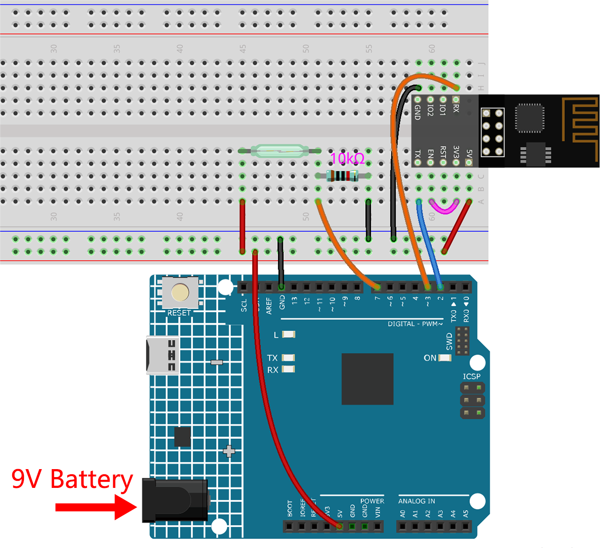

.. note::

    Hallo und willkommen in der SunFounder Raspberry Pi & Arduino & ESP32 Enthusiasten-Gemeinschaft auf Facebook! Tauchen Sie tiefer ein in die Welt von Raspberry Pi, Arduino und ESP32 mit anderen Enthusiasten.

    **Warum beitreten?**

    - **Expertenunterstützung**: Lösen Sie Nachverkaufsprobleme und technische Herausforderungen mit Hilfe unserer Gemeinschaft und unseres Teams.
    - **Lernen & Teilen**: Tauschen Sie Tipps und Anleitungen aus, um Ihre Fähigkeiten zu verbessern.
    - **Exklusive Vorschauen**: Erhalten Sie frühzeitigen Zugang zu neuen Produktankündigungen und exklusiven Einblicken.
    - **Spezialrabatte**: Genießen Sie exklusive Rabatte auf unsere neuesten Produkte.
    - **Festliche Aktionen und Gewinnspiele**: Nehmen Sie an Gewinnspielen und Feiertagsaktionen teil.

    👉 Sind Sie bereit, mit uns zu erkunden und zu erschaffen? Klicken Sie auf [|link_sf_facebook|] und treten Sie heute bei!

.. _iot_window:

3. Daten an Blynk senden
=============================

In diesem Kapitel zeigen wir Ihnen, wie Sie Daten an Blynk senden können.

Wir erstellen hier ein Tür- und Fenstererkennungsgerät. Die Schaltung mit dem Reed-Kontakt wird neben der Tür und dem Fenster angebracht, und der Magnet wird am Rand der Tür bzw. des Fensters montiert.
Wenn die Tür oder das Fenster geschlossen ist, wird der Reed-Kontakt durch die Magnetkraft eingeschaltet und der entsprechende Pin-Wert auf dem R4-Board ändert sich.
Blynk.cloud wird diesen Wert empfangen, sodass Sie auch von unterwegs aus sehen können, ob die Türen und Fenster Ihres Hauses geschlossen sind.

Nun werden wir ein LED-Widget in Blynk verwenden, um anzuzeigen, ob Ihre Fenster und Türen geschlossen sind (d.h. ob der Reed-Kontakt ein- oder ausgeschaltet ist).

**Benötigte Komponenten**

Für dieses Projekt benötigen wir die folgenden Komponenten.

Es ist sicherlich praktisch, ein komplettes Set zu kaufen, hier ist der Link:

.. list-table::
    :widths: 20 20 20
    :header-rows: 1

    *   - Name	
        - ARTIKEL IN DIESEM KIT
        - LINK
    *   - 3 in 1 Starter Kit
        - 380+
        - |link_3IN1_kit|

Sie können sie auch separat über die untenstehenden Links kaufen.

.. list-table::
    :widths: 30 20
    :header-rows: 1

    *   - KOMPONENTENBESCHREIBUNG
        - KAUF-LINK

    *   - :ref:`cpn_uno`
        - \-
    *   - :ref:`cpn_breadboard`
        - |link_breadboard_buy|
    *   - :ref:`cpn_esp8266`
        - |link_esp8266_buy|
    *   - :ref:`cpn_wires`
        - |link_wires_buy|
    *   - :ref:`cpn_resistor`
        - |link_resistor_buy|
    *   - :ref:`cpn_reed`
        - \-

**1. Schaltung aufbauen**

.. note::

    Das ESP8266-Modul benötigt einen hohen Strom, um einen stabilen Betrieb zu gewährleisten. Stellen Sie daher sicher, dass die 9V-Batterie angeschlossen ist.

**2. Dashboard bearbeiten**

#. Erstellen Sie einen **Datastream** vom Typ **Virtual Pin** auf der **Datastream**-Seite, um den Wert des Reed-Kontakts zu erhalten. Stellen Sie den DATENTYP auf **Integer** und MIN und MAX auf **0** und **1**.

    .. image:: img/sp220609_162548.png

#. Ziehen Sie ein **LED widget** auf die **Wed Dashboard**-Seite. Bei einem Wert von 1 leuchtet es (farbig), sonst ist es weiß.

    .. image:: img/blynk_edit_drag_led_widget.png

#. Wählen Sie auf der Einstellungsseite des **LED widget** als **Datastream** **Reed(V1)** aus und speichern Sie es.

    .. image:: img/sp220609_163502.png

**3. Den Code ausführen**

#. Öffnen Sie die Datei ``3.push_data_to_blynk.ino`` unter dem Pfad ``3in1-kit\iot_project\3.push_data_to_blynk`` oder kopieren Sie diesen Code in die **Arduino IDE**.

    .. raw:: html
        
        <iframe src=https://create.arduino.cc/editor/sunfounder01/e81b0024-c11e-4507-8d43-aeb3b6656c2c/preview?embed style="height:510px;width:100%;margin:10px 0" frameborder=0></iframe>

#. Ersetzen Sie die ``Template ID``, ``Device Name`` und ``Auth Token`` durch Ihre eigenen Angaben. Sie müssen auch die ``ssid`` und das ``password`` Ihres verwendeten WLANs eingeben. Für detaillierte Anleitungen beachten Sie bitte :ref:`connect_blynk`.
#. Wählen Sie das korrekte Board und den Port aus und klicken Sie auf den **Upoad**-Button.

#. Öffnen Sie den Seriellen Monitor (Baudrate auf 115200 einstellen) und warten Sie auf eine Meldung, z.B. eine erfolgreiche Verbindung.

    .. image:: img/2_ready.png

    .. note::

        Wenn die Meldung ``ESP is not responding`` erscheint, befolgen Sie bitte diese Schritte:

        * Stellen Sie sicher, dass die 9V-Batterie angeschlossen ist.
        * Setzen Sie das ESP8266-Modul zurück, indem Sie den Pin RST für 1 Sekunde mit GND verbinden, dann trennen Sie ihn.
        * Drücken Sie den Reset-Knopf auf dem R4-Board.

        Manchmal müssen Sie den oben genannten Vorgang 3-5 Mal wiederholen, bitte haben Sie Geduld.

#. Nun zeigt Blynk den Status Ihrer Türen und Fenster an. Wenn Ihre Türen und Fenster geschlossen sind, wird das LED-Widget grün sein, sonst grau.

#. Wenn Sie Blynk auf mobilen Geräten nutzen möchten, beachten Sie bitte :ref:`blynk_mobile`.

**Wie funktioniert das?**

Für dieses Beispiel sollten Sie sich auf die folgenden Zeilen konzentrieren. "Daten jede Sekunde an den Blynk Cloud V1 Datastream senden" wird durch diese Zeilen definiert.

.. code-block:: arduino

    BlynkTimer timer;

    void myTimerEvent()
    {
        Blynk.virtualWrite(V1, pinValue);
    }

    void setup()
    {
        timer.setInterval(1000L, myTimerEvent);
    }

    void loop()
    {
        timer.run(); // Initiates BlynkTimer
    }

Die Blynk-Bibliothek stellt einen eingebauten Timer zur Verfügung, zuerst erstellen wir ein Timer-Objekt.

.. code-block:: arduino

    BlynkTimer timer;

Legen Sie das Timer-Intervall in ``setup()`` fest. Hier setzen wir es so, dass die Funktion ``myTimerEvent()`` alle 1000ms ausgeführt wird.

.. code-block:: arduino

    timer.setInterval(1000L, myTimerEvent);

Führen Sie BlynkTimer in ``loop()`` aus.

.. code-block:: arduino

    timer.run();

Bearbeiten Sie die benutzerdefinierte Funktion ``myTimerEvent()``. Der Code ``Blynk.virtualWrite(V1, pinValue)`` dient dazu, den Datenpin-Wert für V1 zu schreiben.

.. code-block:: arduino

    void myTimerEvent()
    {
        Blynk.virtualWrite(V1, pinValue);
    }

