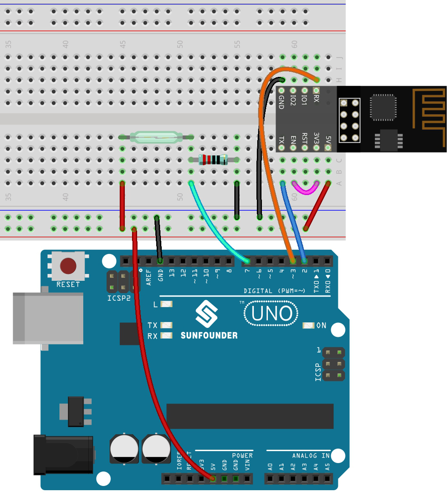

.. _iot_window:

3. Daten an Blynk senden
=============================

In diesem Kapitel zeigen wir Ihnen, wie Sie Daten an Blynk senden können.

Wir erstellen hier ein Tür- und Fenstererkennungsgerät. Die Schaltung mit dem Reed-Schalter wird neben der Tür und dem Fenster platziert und der Magnet wird am Rand der Tür und des Fensters angebracht.
Wenn die Tür oder das Fenster geschlossen sind, wird der Reed-Schalter durch die magnetische Kraft eingeschaltet und der entsprechende Pinwert auf dem R3-Board ändert sich.
Blynk.cloud erhält diesen Wert, sodass Sie sehen können, ob die Türen und Fenster Ihres Hauses geschlossen sind, auch wenn Sie nicht zu Hause sind.

Jetzt werden wir ein LED-Widget in Blynk verwenden, um anzuzeigen, ob Ihre Fenster und Türen geschlossen sind (d.h. ob der Reed-Schalter ein- oder ausgeschaltet ist).

**Benötigte Komponenten**

Für dieses Projekt benötigen wir folgende Komponenten.

Es ist definitiv praktisch, ein ganzes Set zu kaufen, hier ist der Link:

.. list-table::
    :widths: 20 20 20
    :header-rows: 1

    *   - Name
        - ARTIKEL IN DIESEM KIT
        - LINK
    *   - 3 in 1 Starter Kit
        - 380+
        - |link_3IN1_kit|

Sie können sie auch einzeln über die untenstehenden Links kaufen.

.. list-table::
    :widths: 30 20
    :header-rows: 1

    *   - KOMPONENTENBESCHREIBUNG
        - KAUF-LINK

    *   - :ref:`cpn_uno`
        - |link_Uno_R3_buy|
    *   - :ref:`cpn_breadboard`
        - |link_breadboard_buy|
    *   - :ref:`cpn_esp8266`
        - |link_esp8266_buy|
    *   - :ref:`cpn_wires`
        - |link_wires_buy|
    *   - :ref:`cpn_resistor`
        - |link_resistor_buy|
    *   - :ref:`cpn_reed`
        - \-

**1. Die Schaltung aufbauen**

.. note::

    Das ESP8266-Modul benötigt einen hohen Strom, um eine stabile Betriebsumgebung zu gewährleisten. Stellen Sie daher sicher, dass die 9V-Batterie angeschlossen ist.

**2. Dashboard bearbeiten**

#. Erstellen Sie einen **Datastream** vom Typ **Virtual Pin** auf der **Datastream**-Seite, um den Wert des Reed-Schalters abzurufen. Stellen Sie den DATENTYP auf **Integer** und MIN und MAX auf **0** und **1**.

    .. image:: img/sp220609_162548.png

#. Ziehen Sie ein **LED widget** auf die **Wed Dashboard**-Seite. Bei einem Wert von 1 leuchtet es (farbig), ansonsten ist es weiß.

    .. image:: img/sp220609_163350.png

#. Auf der Einstellungsseite des **LED widget** wählen Sie **Datastream** als **Reed(V1)** und speichern es.

    .. image:: img/sp220609_163502.png

**3. Den Code ausführen**

#. Öffnen Sie die Datei ``3.push_data_to_blynk.ino`` unter dem Pfad ``3in1-kit\iot_project\3.push_data_to_blynk`` oder kopieren Sie diesen Code in die **Arduino IDE**.

    .. raw:: html
        
        <iframe src=https://create.arduino.cc/editor/sunfounder01/e81b0024-c11e-4507-8d43-aeb3b6656c2c/preview?embed style="height:510px;width:100%;margin:10px 0" frameborder=0></iframe>

#. Ersetzen Sie die ``Template ID``, ``Device Name`` und ``Auth Token`` durch Ihre eigenen Werte. Geben Sie außerdem die ``ssid`` und das ``password`` Ihres WLANs ein. Für detaillierte Anleitungen verweisen Sie bitte auf :ref:`connect_blynk`.
#. Nachdem Sie das richtige Board und den Port ausgewählt haben, klicken Sie auf die Schaltfläche **Upoad**.

#. Öffnen Sie den Seriellen Monitor (Baudrate auf 115200 einstellen) und warten Sie, bis eine Meldung wie eine erfolgreiche Verbindung angezeigt wird.

    .. image:: img/2_ready.png

    .. note::

        Wenn die Meldung ``ESP antwortet nicht`` erscheint, wenn Sie sich verbinden, befolgen Sie bitte diese Schritte:

        * Stellen Sie sicher, dass die 9V-Batterie angeschlossen ist.
        * Setzen Sie das ESP8266-Modul zurück, indem Sie den RST-Pin 1 Sekunde lang auf GND setzen und dann entfernen.
        * Drücken Sie die Reset-Taste auf dem R3-Board.

        Manchmal müssen Sie den obigen Vorgang 3-5 Mal wiederholen. Bitte haben Sie Geduld.

#. Jetzt zeigt Blynk den Status Ihrer Türen und Fenster an. Wenn Ihre Türen und Fenster geschlossen sind, wird das LED-Widget grün sein, ansonsten grau.

#. Wenn Sie Blynk auf mobilen Geräten verwenden möchten, verweisen Sie bitte auf :ref:`blynk_mobile`.

**Wie funktioniert das?**

In diesem Beispiel sollten Sie sich auf die folgenden Zeilen konzentrieren. "Daten jede Sekunde an den Blynk Cloud's V1 Datastream senden" wird durch diese Zeilen definiert.

.. code-block:: arduino

    BlynkTimer timer;

    void myTimerEvent()
    {
        Blynk.virtualWrite(V1, pinValue);
    }

    void setup()
    {
        timer.setInterval(1000L, myTimerEvent);
    }

    void loop()
    {
        timer.run(); // Initiiert BlynkTimer
    }

Die Blynk-Bibliothek bietet einen eingebauten Timer; zuerst erstellen wir ein Timer-Objekt.

.. code-block:: arduino

    BlynkTimer timer;

Legen Sie das Timer-Intervall in ``setup()`` fest. Hier setzen wir es so, dass die Funktion ``myTimerEvent()`` alle 1000ms ausgeführt wird.

.. code-block:: arduino

    timer.setInterval(1000L, myTimerEvent);

Führen Sie BlynkTimer in ``loop()`` aus.

.. code-block:: arduino

    timer.run();

Bearbeiten Sie die benutzerdefinierte Funktion ``myTimerEvent()``. Der Code ``Blynk.virtualWrite(V1, pinValue)`` wird verwendet, um den Datenpin-Wert für V1 zu schreiben.

.. code-block:: arduino

    void myTimerEvent()
    {
        Blynk.virtualWrite(V1, pinValue);
    }

