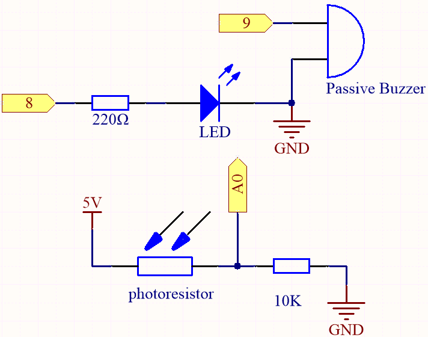

.. _ar_calibration:

7.8 Calibration
==========================

When you use analog input components, such as photoresistors, soil moisture sensors, etc., you may find that their reading range is not 0 to 1023, but rather a range like 0 to 800 or 600 to 1000, because it is impossible to reach the limits of these devices with normal use.

In this case, a technique for calibrating the sensor inputs can be used. During startup, have the control board measure the sensor readings for five seconds and record the highest and lowest readings. This five-second reading defines the minimum and maximum expected values of the readings taken during the cycle.

In this project, we use a photoresistor and a passive buzzer to implement a `theremin <https://en.wikipedia.org/wiki/Theremin>`_ -like game using the calibration technique described above.

.. note::
    The `theremin <https://en.wikipedia.org/wiki/Theremin>`_ is an electronic musical instrument that requires no physical contact. It generates different tones by sensing the position of the player's hands.

**Schematic**

**Wiring**

.. image:: img/calibration_bb.jpg

* :ref:`cpn_uno`
* :ref:`cpn_breadboard`
* :ref:`cpn_wires`
* :ref:`cpn_resistor`
* :ref:`cpn_buzzer`
* :ref:`cpn_led` 
* :ref:`cpn_photoresistor` 

**Code**

.. note::

    * Open the ``7.8.calibration.ino`` file under the path of ``3in1-kit\learning_project\7.8.calibration``.
    * Or copy this code into **Arduino IDE**.
    * For detailed tutorials, please refer to :ref:`ar_upload_code`.
    * Or upload the code through the `Arduino Web Editor <https://docs.arduino.cc/cloud/web-editor/tutorials/getting-started/getting-started-web-editor>`_.

.. raw:: html
    
    <iframe src=https://create.arduino.cc/editor/sunfounder01/141ec396-913c-4641-bc8b-5d440a484355/preview?embed style="height:510px;width:100%;margin:10px 0" frameborder=0></iframe>

After the code is uploaded successfully, the LED will light up, and we will have 5 seconds to calibrate the detection range of the photoresistor. This is because we may be in a different light environment each time we use it (e.g. the light intensity is different between midday and dusk).

At this time, we need to swing our hands up and down on top of the photoresistor, and the movement range of the hand will be calibrated to the playing range of this instrument.

After 5 seconds, the LED will go out and we can wave our hands on the photoresistor to play.

**How it works?**

#. Set the initial values and pins of all components.

    .. code-block:: arduino

    const int buzzerPin = 9;
    const int ledPin = 8;
    const int photocellPin = A0;  //photoresistor attach to A2

    int lightLow = 1023;
    int lightHigh = 0;

    int sensorValue = 0;        // value read from the sensor
    int pitch = 0;           // sensor value converted into LED 'bars'

    unsigned long previousMillis = 0;
    const long interval = 5000;

#. Set up a calibration process in ``setup()``.

    .. code-block:: arduino

        void setup()
        {
            pinMode(buzzerPin, OUTPUT);// make all the LED pins outputs

            /* calibrate the photoresistor max & min values */
            previousMillis = millis();
            digitalWrite(ledPin, HIGH);
            while (millis() - previousMillis <= interval) {
                sensorValue = analogRead(photocellPin);
                if (sensorValue > lightHigh) {
                    lightHigh = sensorValue;
                }
                if (sensorValue < lightLow) {
                    lightLow = sensorValue;
                }
            }
            digitalWrite(ledPin, LOW);
        }

    The work flow is as follows.

    * using ``millis()`` for timing with an interval of 5000ms.

    .. code-block:: arduino

        previousMillis = millis();
        ...
        while (millis() - previousMillis <= interval) {
        ...
        }

    * During these five seconds, wave a hand around the photoresistor, the maximum and minimum values ​​of the detected light are recorded and assigned to ``lightHigh`` and ``lightLow`` respectively.

    .. code-block:: arduino
        
        sensorValue = analogRead(photocellPin);
        if (sensorValue > lightHigh) {
            lightHigh = sensorValue;
        }
        if (sensorValue < lightLow) {
            lightLow = sensorValue;
        }

#. Now you can start playing this Thermin. Read the value of the photoresistor to ``sensorValue`` and map it from the small range to the large range to be used as the frequency of the buzzer. 

    .. code-block:: arduino

        void loop()
        {
        /* play*/
        sensorValue = analogRead(photocellPin); //read the value of A0
        pitch = map(sensorValue, lightLow, lightHigh, 50, 6000);  // map to the buzzer frequency
        if (pitch > 50) {
            tone(buzzerPin, pitch, 20);
        }
        delay(10);
        }
