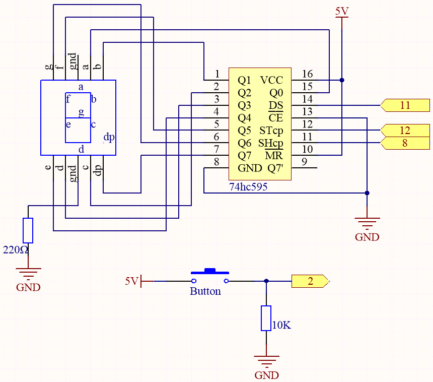

.. _ar_eeprom:

7.9 EEPROM
===========

`EEPROM <https://docs.arduino.cc/learn/built-in-libraries/eeprom>`_ is a memory, so the data it stores will not be erased when the main control board is turned off. You can use it to record some data and read it the next time you turn it on.

As an example, you can make a sports counter that keeps track of how many rope skippings you do every day.

You can also write data to it in one program and read it in another. For example, when you are working on a car project, the speeds of the two motors are inconsistent. You can write a calibration program to record the compensation value of the motor speed.

Here we use button, 7-segment and 74hc595 to make an electronic dice. Each time the button is pressed, a random number ranging from 1 to 6 is generated, and the number is recorded in the EEPROM.

**Schematic**

**Wiring**

.. image:: img/eeprom_bb.jpg

* :ref:`cpn_uno`
* :ref:`cpn_breadboard`
* :ref:`cpn_wires`
* :ref:`cpn_resistor`
* :ref:`cpn_button`
* :ref:`cpn_74hc595`
* :ref:`cpn_7_segment`

**Code**

.. note::

    * Open the ``7.9.eeprom.ino`` file under the path of ``3in1-kit\learning_project\7.9.eeprom`` .
    * Or copy this code into **Arduino IDE**.
    * For detailed tutorials, please refer to :ref:`ar_upload_code`.
    * Or upload the code through the `Arduino Web Editor <https://docs.arduino.cc/cloud/web-editor/tutorials/getting-started/getting-started-web-editor>`_.

.. raw:: html
    
    <iframe src=https://create.arduino.cc/editor/sunfounder01/f1e9ad30-b595-4c5b-acae-e627a0d0605e/preview?embed style="height:510px;width:100%;margin:10px 0" frameborder=0></iframe>
    

After the code is successfully uploaded, you can press a button to make the 7-segment display show a random number, and if you restart at that point, it will still show that number.

**How it works?**

By using ``EEPROM.h`` library, the number is saved in EEPROM to avoid the value reset after the restart of MCU.

Here are some of its functions.
    
* ``write(address,value)``: Write a byte to the EEPROM.

    * ``address``: the location to write to, starting from 0 (int)
    * ``value``: the value to write, from 0 to 255 (byte)
    * An EEPROM write takes 3.3 ms to complete. The EEPROM memory has a specified life of 100,000 write/erase cycles, so you may need to be careful about how often you write to it.

* ``Read(address)``: Reads a byte from the EEPROM. Locations that have never been written to have the value of 255.

* ``update(address,value)``: Write a byte to the EEPROM. The value is written only if differs from the one already saved at the same address.

    * An EEPROM write takes 3.3 ms to complete. The EEPROM memory has a specified life of 100,000 write/erase cycles, so using this function instead of write() can save cycles if the written data does not change often

* ``EEPROM.put(address, data)``: Write any data type or object to the EEPROM.

    * ``address``: the location to read from, starting from 0 (int).
    * ``data``: the data to read, can be a primitive type (eg. float) or a custom struct.
    * This function uses EEPROM.update() to perform the write, so does not rewrites the value if it didn't change.

* ``EEPROM.get(address, data)``: Read any data type or object from the EEPROM.

    * ``address``: the location to read from, starting from 0 (int).
    * ``data``: the data to read, can be a primitive type (eg. float) or a custom struct.
