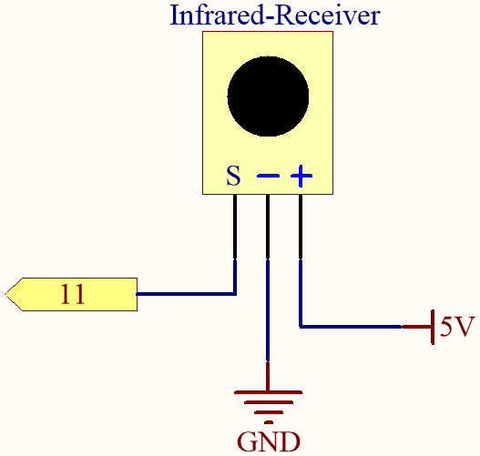

.. _ar_receiver:

6.2 IR Receiver
=========================

In this project, you will learn to use IR Receiver. 

An infrared-receiver is a component which receives infrared signals and can independently receive infrared rays and output signals compatible with TTL level. 
It is similar with a normal plastic-packaged transistor in size and is suitable for all kinds of infrared remote control and infrared transmission.

**Schematic**

**Wiring**

In this example, we wire up the left pin of IR Receiver to pin 11, 
the middle pin to GND, and the right pin to 5V.

.. image:: img/ir_remote_control_bb.jpg

* :ref:`cpn_uno`
* :ref:`cpn_breadboard`
* :ref:`cpn_wires`
* :ref:`cpn_receiver`

**Code**

.. note::

    * Open the ``6.2.ir_remote_control.ino`` file under the path of ``3in1-kit\learning_project\6.2.ir_remote_control`` .
    * Or copy this code into **Arduino IDE**.
    * For detailed tutorials, please refer to :ref:`ar_upload_code`.

.. raw:: html

    <iframe src=https://create.arduino.cc/editor/sunfounder01/20205df9-1753-42d8-bb63-ef4766d03702/preview?embed style="height:510px;width:100%;margin:10px 0" frameborder=0></iframe>

After uploading the codes to the R3 board, you can see that the
current value of the pressed button of IR Remote Controller displays on
the serial monitor.

**How it works?**

There are two important parts to notice in this program.

#. The code uses an extra file ``decodeKeyValue.ino`` to decode the values in
class ``decode_result`` into key name. The file will be opened together with
the main file.

#. Import the library ``IRremote``, here you will need to refer to :ref:`add_libraries_ar` to add this library.

    .. code-block:: arduino

        const int recvPin = 11;

        IRrecv irrecv(recvPin);
        decode_results results;

    * ``IRrecv irrecv(recvPin)``: Create an instance of the ``IRrecv`` class, specifying the pins it's attached to.
    * ``decode_results results``: Create an instance of the ``decode_results`` class, which is the result returned by the decoder.

#. Initialize the IR receiver and set the baudrate of the Serial Monitor to 9600bps.

    .. code-block:: arduino

        void setup()
        {
            Serial.begin(9600);
            irrecv.enableIRIn(); // Start the receiver
        }
#. When you press a key on the remote control, the serial monitor will print the key name if it is received by the IR receiver.

    .. code-block:: arduino

        void loop() {
            if (irrecv.decode(&results)) {
                //Serial.println(results.value,HEX);
                if (decodeKeyValue(results.value)!="ERROR")
                {
                    Serial.println(decodeKeyValue(results.value));
                }
                irrecv.resume(); // Receive the next value
            }
        }

    * ``irrecv.decode(&results)``: Decodes the received IR message. Returns 0 if no data ready, 1 if data ready. Results of decoding are stored in ``results``.
    * ``decodeKeyValue(results.value)``: ``results.value`` is the decoded value, usually in 8-bit hexadecimal, and ``decodeKeyValue()`` is to convert these values to the key names on the remote control.
    * ``irrecv.resume()``: Restart for receiving an other value.