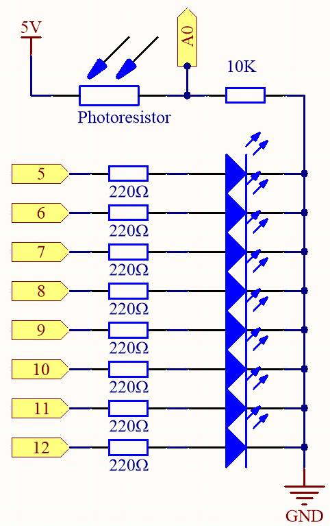

6.1 Light Controlled Flowing LEDs
=====================================

A photoresistor or photocell is a light-controlled variable resistor. The resistance of a photoresistor decreases with increasing incident light intensity; in other words, it exhibits photoconductivity. A photoresistor can be applied in light-sensitive detector circuits, and light- and darkness-activated switching circuits.

The resistance of a photoresistor changes with incident light intensity. If the light intensity gets higher, the resistance decreases; if it gets lower, the resistance increases.
In this experiment, we will use eight LEDs to show the light intensity. The higher the light intensity is, the more LEDs will light up. When the light intensity is high enough, all the LEDs will be on. When there is no light, all the LEDs will go out.

**Schematic**

**Wiring**

.. image:: img/light_control_led.png
    :width: 800
    :align: center

* :ref:`cpn_uno`
* :ref:`cpn_breadboard`
* :ref:`cpn_wires`
* :ref:`cpn_resistor`
* :ref:`cpn_led`
* :ref:`cpn_photoresistor`

**Code**

.. note::

    * Open the ``6.1.light_control_led.ino`` file under the path of ``3in1-kit\learning_project\6.1.light_control_led``.
    * Or copy this code into **Arduino IDE**.
    
    * Or upload the code through the `Arduino Web Editor <https://docs.arduino.cc/cloud/web-editor/tutorials/getting-started/getting-started-web-editor>`_.

.. raw:: html

    <iframe src=https://create.arduino.cc/editor/sunfounder01/859e1688-5801-400e-9409-f844ca9b7da7/preview?embed style="height:510px;width:100%;margin:10px 0" frameborder=0></iframe>
    
Now, shine some light on the photoresistor, and you will see several LEDs light up. Shine more light and you will see more LEDs light up. When you place it in a dark environment, all the LEDs will go out.

**How it works?**

.. code-block:: arduino

    void loop() 
    {
        sensorValue = analogRead(photocellPin); //read the value of A0
        ledLevel = map(sensorValue, 300, 1023, 0, NbrLEDs); // map to the number of LEDs
        for (int led = 0; led < NbrLEDs; led++)//
        {
            if (led < ledLevel ) //When led is smaller than ledLevel, run the following code. 
            {
                digitalWrite(ledPins[led], HIGH); // turn on pins less than the level
            }
            else 
            {
                digitalWrite(ledPins[led],LOW); // turn off pins higher than 
            }
        }
    }

By using the ``map()`` function, you can map the photoresistor value to the 8 LEDs, for example, if sensorValue is 560, then ledLevel is 4, so at this point, ledPins[0] to ledPins[4] should be lit, and ledPins[5] to ledPins[7] should be off.
