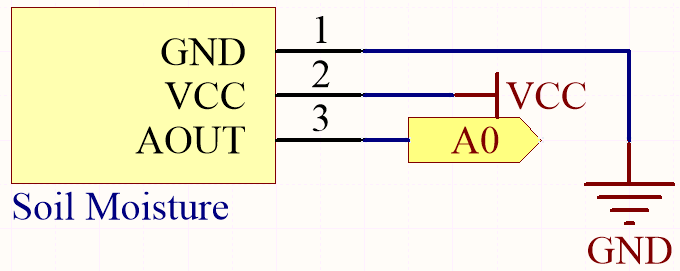
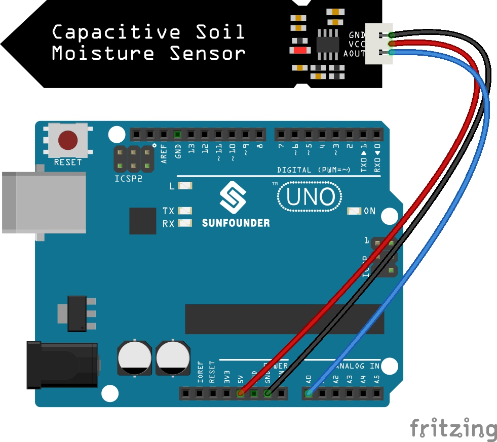

.. _ar_moisture:

4.4 Measure Soil Moisture
==========================

In the planting industry, the crops themselves cannot directly obtain the inorganic elements in the soil,
Water in the soil acts as a solvent for dissolving these inorganic elements.

Crops absorb soil moisture through the root system, obtain nutrients, and promote growth.

In the process of crop growth and development, the requirements for soil temperature are also different.
Therefore, a soil moisture sensor is required.

**Schematic**

**Wiring**

* :ref:`cpn_uno`
* :ref:`cpn_wires`
* :ref:`cpn_soil_moisture`

**Code**

.. note::

    * Open the ``4.4.measure_soil_moisture.ino`` file under the path of ``3in1-kit\learning_project\4.4.measure_soil_moisture``.
    * Or copy this code into **Arduino IDE**.
    * For detailed tutorials, please refer to :ref:`ar_upload_code`.
    * Or upload the code through the `Arduino Web Editor <https://docs.arduino.cc/cloud/web-editor/tutorials/getting-started/getting-started-web-editor>`_.

.. raw:: html

    <iframe src=https://create.arduino.cc/editor/sunfounder01/b6f7e756-0f14-4117-9bb2-ee5083b6445f/preview?embed style="height:510px;width:100%;margin:10px 0" frameborder=0></iframe>
    
Once the code is successfully uploaded, the serial monitor will print out the soil moisture value.

By inserting the module into the soil and watering it, the value of the soil moisture sensor will become smaller.