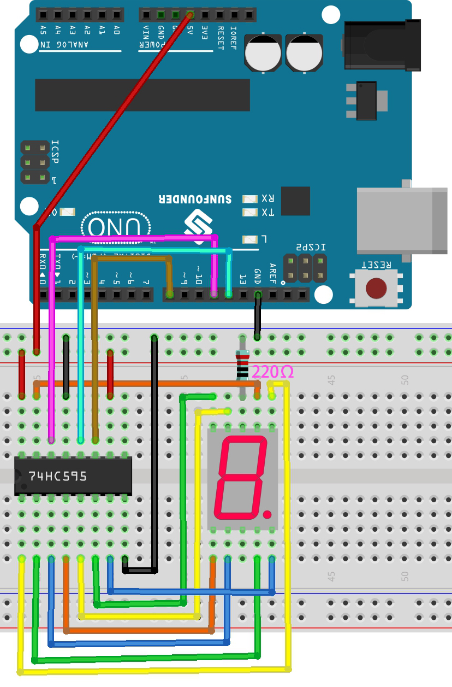

.. _ar_74hc_7seg:

5.5 Number Display
=======================

7-segment Display can be seen everywhere in life.
For example, on an air conditioner, it can be used to display temperature; on a traffic indicator, it can be used to display a timer.

The 7-segment Display is essentially a device packaged by 8 LEDs, of which 7 strip-shaped LEDs form an "8" shape, and there is a slightly smaller dotted LED as a decimal point. These LEDs are marked as a, b, c, d, e, f, g, and dp. They have their own anode pins and share cathodes. Their pin locations are shown in the figure below.

.. image:: img/segment_cathode.png

This means that it needs to be controlled by 8 digital pins at the same time to fully work and the 74HC595 can do this.

**Schematic**

.. image:: img/circuit_6.5_segment.png

**Wiring**

.. list-table:: Wiring
    :widths: 15 25
    :header-rows: 1

    *   - 74HC595
        - LED Segment Display
    *   - Q0
        - a
    *   - Q1
        - b
    *   - Q2
        - c
    *   - Q3
        - d
    *   - Q4
        - e
    *   - Q5
        - f
    *   - Q6
        - g
    *   - Q7
        - dp

* :ref:`cpn_uno`
* :ref:`cpn_breadboard`
* :ref:`cpn_wires`
* :ref:`cpn_resistor`
* :ref:`cpn_7_segment`
* :ref:`cpn_74hc595` 

**Code**

.. note::

    * Open the ``5.5.number_display.ino`` file under the path of ``3in1-kit\learning_project\5.5.number_display`` .
    * Or copy this code into **Arduino IDE**.
    * For detailed tutorials, please refer to :ref:`ar_upload_code`.
    * Or upload the code through the `Arduino Web Editor <https://docs.arduino.cc/cloud/web-editor/tutorials/getting-started/getting-started-web-editor>`_.

.. raw:: html
    
    <iframe src=https://create.arduino.cc/editor/sunfounder01/644f2d1a-b163-4618-ae09-73d3283d61db/preview?embed style="height:510px;width:100%;margin:10px 0" frameborder=0></iframe>
    
After the code is uploaded successfully, you will be able to see the LED Segment Display display 0~9 in sequence.

**How it works?**

``shiftOut()`` will make 74HC595 output 8 digital signals.
It outputs the last bit of the binary number to Q0, 
and the output of the first bit to Q7. In other words, 
writing the binary number "00000001" will make Q0 output high level and Q1~Q7 output low level.

Suppose that the 7-segment Display display the number "1", 
we need to write a high level for b, c, and write a low level for a, d, e, f, g, and dg.
That is, the binary number "00000110" needs to be written. 
For readability, we will use hexadecimal notation as "0x06".

* `Hexadecimal <https://en.wikipedia.org/wiki/Hexadecimal>`_

* `BinaryHex Converter <https://www.binaryhexconverter.com/binary-to-hex-converter>`_

Similarly, we can also make the LED Segment Display display other numbers in the same way. 
The following table shows the codes corresponding to these numbers.

.. list-table:: Glyph Code
    :widths: 20 20 20
    :header-rows: 1

    *   - Numbers	
        - Binary Code
        - Hex Code  
    *   - 0	
        - 00111111	
        - 0x3f
    *   - 1	
        - 00000110	
        - 0x06
    *   - 2	
        - 01011011	
        - 0x5b
    *   - 3	
        - 01001111	
        - 0x4f
    *   - 4	
        - 01100110	
        - 0x66
    *   - 5	
        - 01101101	
        - 0x6d
    *   - 6	
        - 01111101	
        - 0x7d
    *   - 7	
        - 00000111	
        - 0x07
    *   - 8	
        - 01111111	
        - 0x7f
    *   - 9	
        - 01101111	
        - 0x6f

Write these codes into ``shiftOut()`` to make the LED Segment Display display the corresponding numbers.