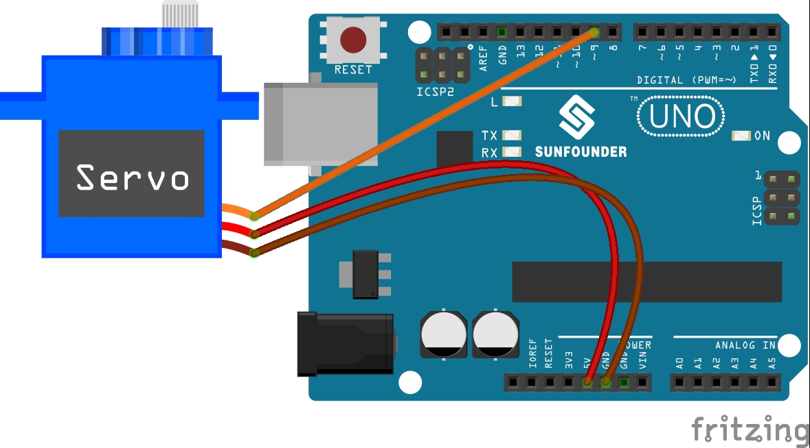

.. _ar_servo:

5.2 Swinging Servo
=========================

In this project, you will learn something about Servo. Servo is a kind of
driver whose position (angular) can be adjustable and kept or a rotary
actuator that allows for precise control of angular position. Currently,
it is widely used in upscale remote control toys, such as airplane,
submarine, telerobot and so on.

**Schematic**

.. image:: img/circuit_6.2_servo.png

In this example, we use PWM pin 9 to drive the Servo, and get the orange
wire of the servo connected to the PWM pin 9, the red one to 5V, and the
brown one to GND.

**Wiring**

* :ref:`cpn_uno`
* :ref:`cpn_wires`
* :ref:`cpn_servo`

**Code**

.. note::

    * Open the ``5.2.swinging_servo.ino`` file under the path of ``3in1-kit\learning_project\5.2.swinging_servo`` .
    * Or copy this code into **Arduino IDE**.
    * For detailed tutorials, please refer to :ref:`ar_upload_code`.
    * Or upload the code through the `Arduino Web Editor <https://docs.arduino.cc/cloud/web-editor/tutorials/getting-started/getting-started-web-editor>`_.

.. raw:: html

    <iframe src=https://create.arduino.cc/editor/sunfounder01/6382bc4e-7319-42a2-97cb-88b88dc2e755/preview?embed style="height:510px;width:100%;margin:10px 0" frameborder=0></iframe>

Once you finish uploading the codes to the R3 board, you can see the servo arm rotating in the range 0°~180°.

**How it works?**

By calling the library ``Servo.h``, you can drive the servo easily. 

.. code-block:: arduino

    #include <Servo.h> 

Library Functions：

.. code-block:: arduino

    Servo

Create **Servo** object to control a servo.

.. code-block:: arduino

    uint8_t attach(int pin); 

Call ``pinMode()`` to turn a pin into a servo driver and return 0 on failure.

.. code-block:: arduino

    void detach();

Release a pin from servo driving.

.. code-block:: arduino

    void write(int value); 

Set the angle of the servo in degrees, 0 to 180.

.. code-block:: arduino

    int read();

Return that value set with the last ``write()``.

.. code-block:: arduino

    bool attached(); 

Return 1 if the servo is currently attached.