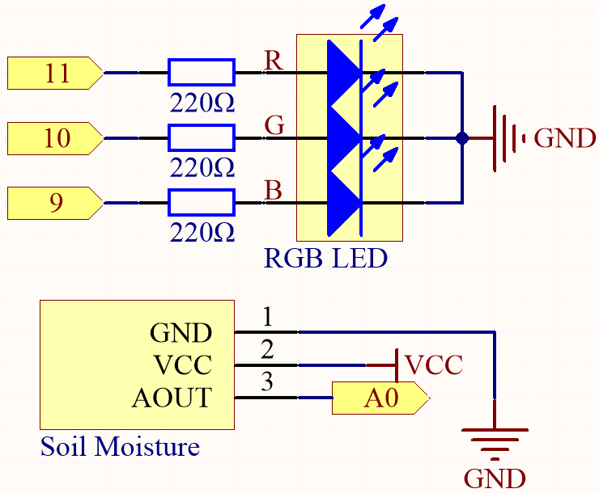
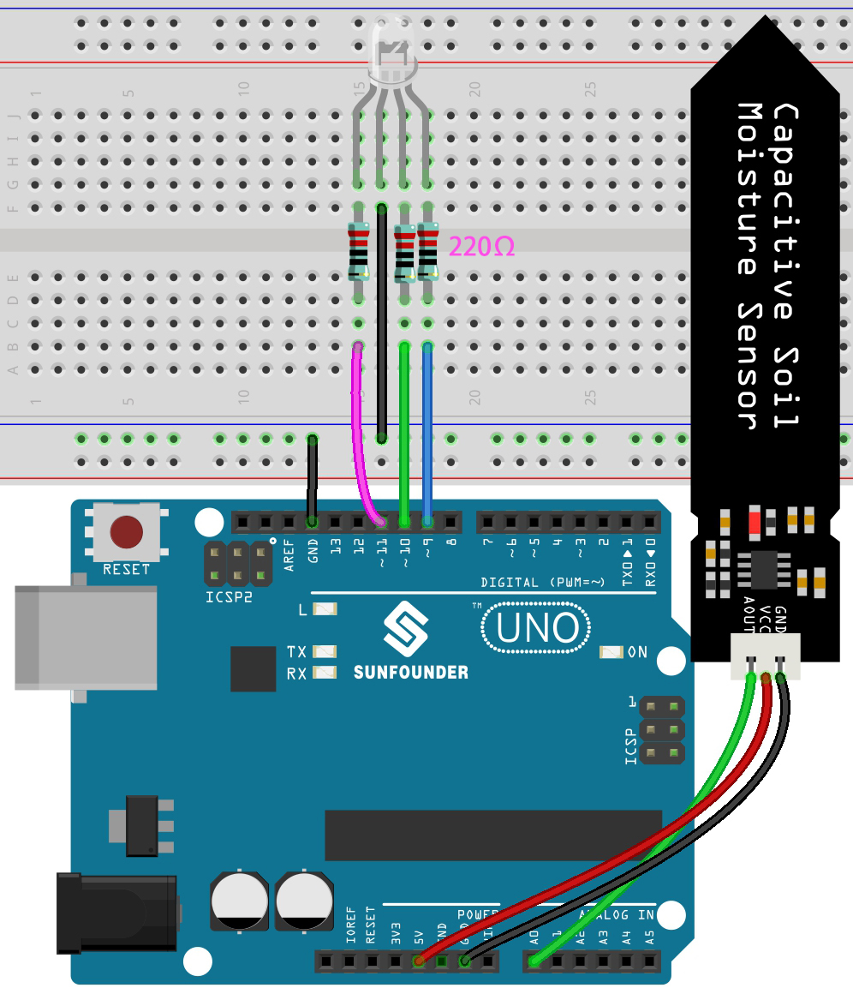

.. _ar_threshold:

7.2 Threshold
=======================

In many projects, you will encounter such a need.
"When xxx reaches a certain level, then..."

For example, in a smart home, when the light intensity is lower than 50Lux, turn on the light;
Another example is in the computer motherboard, if the operating temperature of the CPU is higher than 65 degrees Celsius, turn on the fan, and so on.

In these requirements, the keyword "threshold" is reflected.

We can adjust the value of the threshold to make the circuit operate more in line with individual needs.
For example, if I like a brighter living environment, I can increase the threshold of the automatic lights of the smart home to 80Lux.
Another example is that the ventilation environment of my studio is not very good, and the heat dissipation demand is higher, then the threshold value of automatic fan opening can be adjusted to 50 degrees Celsius.

Here we use soil moisture sensor and RGB LED to make a pot monitor. If the soil is too dry, the light will be red; if the soil is moist enough, the light will be blue. You need to manually adjust the thresholds for determining the dryness and wetness of the soil.

**Schematic**

**Wiring**

* :ref:`cpn_uno`
* :ref:`cpn_breadboard`
* :ref:`cpn_wires`
* :ref:`cpn_resistor`
* :ref:`cpn_rgb`
* :ref:`cpn_soil_moisture`
* 

**Code**

.. note::

    * Open the ``7.2.threshold.ino`` file under the path of ``3in1-kit\learning_project\7.2.threshold`` .
    * Or copy this code into **Arduino IDE**.
    * For detailed tutorials, please refer to :ref:`ar_upload_code`.

.. raw:: html
    
    <iframe src=https://create.arduino.cc/editor/sunfounder01/e379d512-6ee8-40cc-92a9-b378e3d9f4bf/preview?embed style="height:510px;width:100%;margin:10px 0" frameborder=0></iframe>

After the code is uploaded successfully, if your threshold is set correctly, you will see the RGB LED show red when the soil is dry to remind you that you need to water; after watering, the color of the RGB LED will change to blue.

**How it works**

.. code-block:: Arduino

    ...

    int threshold = 900;

    ...
    void loop() {
        int sensorValue = analogRead(soilMoisture);
        Serial.println(sensorValue);
        if(sensorValue>threshold){
            color(255,0,252); // red
        }else{
            color(0,112,255); // blue
        }
    }
    ...

First set a ``threshold`` value and then read the value of the soil moisture module, its value decreases as the moisture level increases. If the value currently read is greater than the set ``threshold``, then let the RGB LED show red, otherwise it will show blue.

This ``threshold`` value needs to be adjusted according to the actual situation, you can upload the code first, then open the serial monitor to check the humidity value, record the value in both wet and dry conditions, and then choose a middle value as the ``threshold`` value.

