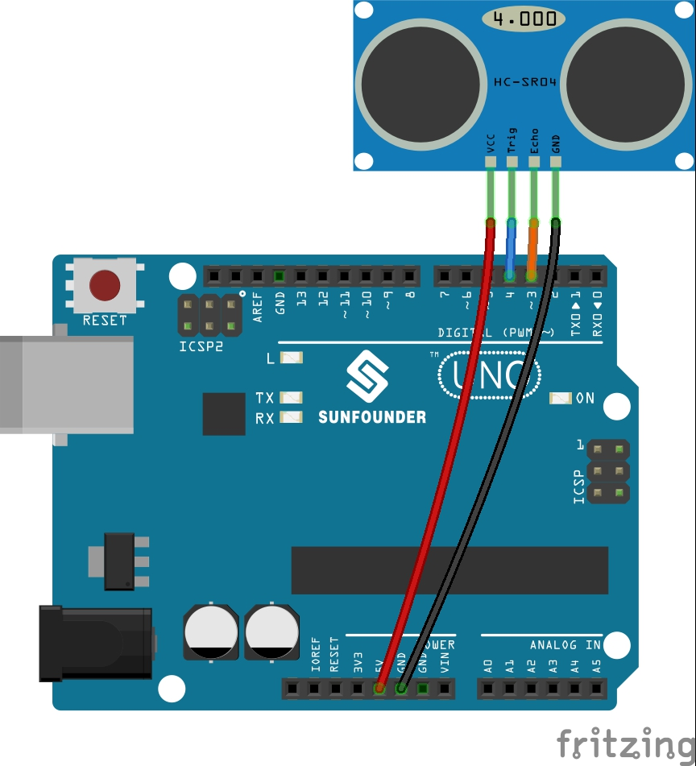

.. _ar_ultrasonic:

5.3 Measuring Distance
======================================

The ultrasonic sensor module works on the principle of sonar and radar systems for determining the distance to an object.

**Schematic**

.. image:: img/circuit_6.3_ultrasonic.png

**Wiring**

* :ref:`cpn_uno`
* :ref:`cpn_wires`
* :ref:`cpn_ultrasonic`

**Code**

.. note::

    * Open the ``5.3.measuring_distance.ino`` file under the path of ``3in1-kit\learning_project\5.3.measuring_distance`` .
    * Or copy this code into **Arduino IDE**.
    * For detailed tutorials, please refer to :ref:`ar_upload_code`.
    * Or upload the code through the `Arduino Web Editor <https://docs.arduino.cc/cloud/web-editor/tutorials/getting-started/getting-started-web-editor>`_.

.. raw:: html
    
    <iframe src=https://create.arduino.cc/editor/sunfounder01/70987bc7-44a5-44ed-be40-c3c3c303b3aa/preview?embed style="height:510px;width:100%;margin:10px 0" frameborder=0></iframe>

After the code is successfully uploaded, the serial monitor will print out the distance between the ultrasonic sensor and the obstacle ahead.

**How it works?**

About the application of ultrasonic sensor, we can directly check the
subfunction.

.. code-block:: arduino

    float readSensorData(){// ...}

The ``trigPin`` of the ultrasonic module transmits a 10us square wave signal every 2us

.. code-block:: arduino

    digitalWrite(trigPin, LOW); 
    delayMicroseconds(2);
    digitalWrite(trigPin, HIGH); 
    delayMicroseconds(10);
    digitalWrite(trigPin, LOW); 

The ``echoPin`` receives a high level signal if there is an obstacle within the range and use the ``pulseIn()`` function to record the time from sending to receiving.

.. code-block:: arduino

    microsecond=pulseIn(echoPin, HIGH);

The speed of sound is 340 m/s or 29 microseconds per centimeter.

This gives the distance travelled by the square wave, outbound and return, so
we divide by 2 to get the distance of the obstacle.

.. code-block:: arduino

    float distance = microsecond / 29.00 / 2;  

Note that the ultrasonic sensor will pause the program when it is working, which may cause some lagging when writing complex projects.
