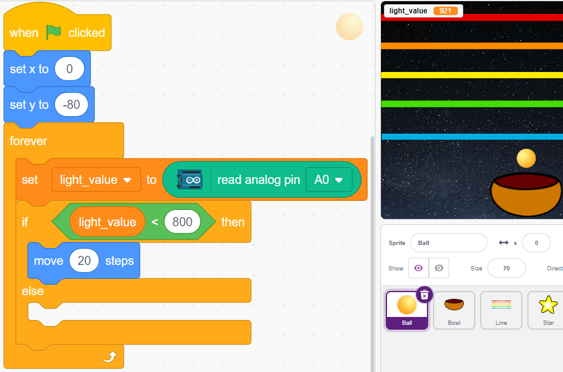
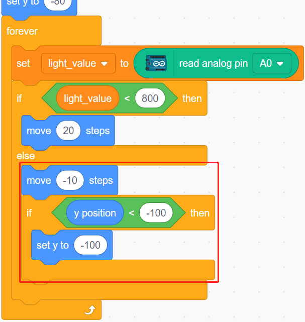

.. _sh_light_ball:

2.12 Light Sensitive Ball
==============================

In this project, we use Photoresistor to make the ball on the stage fly upwards. Place your hand on top of the photoresistor to control the light intensity it receives. The closer your hand is to the photoresistor, the smaller its value and the higher the ball flies on the stage, otherwise it will fall. When the ball touches the string, it makes a nice sound as well as a twinkling starlight.

.. image:: img/18_ball.png

You Will Learn
---------------------

- Fill the sprite with colors
- Touch between the sprites

Build the Circuit
-----------------------

A photoresistor or photocell is a light-controlled variable resistor. The resistance of a photoresistor decreases with increasing incident light intensity.

Build the circuit according to the following diagram.

Connect one end of the photoresistor to 5V, the other end to A0, and connect a 10K resistor in series with GND at this end.

So when the light intensity increases, the resistance of a photoresistor decreases, the voltage division of the 10K resistor increases, and the value obtained by A0 becomes larger.

.. image:: img/circuit/photoresistor_circuit.png

* :ref:`cpn_uno`
* :ref:`cpn_breadboard`
* :ref:`cpn_photoresistor` 
* :ref:`cpn_resistor`

Programming
------------------

The effect we want to get is that the closer your hand is to the photoresistor, the ball sprite on the stage keeps going up, otherwise it will fall on the bowl sprite. If it touches the Line sprite while walking up or falling down, it will make a musical sound and emit star sprites in all directions.

**1. Select sprite and backdrop**

Delete the default sprite, select the **Ball**, **Bowl** and **Star** sprite.

.. image:: img/18_ball1.png

Move the **Bowl** sprite to the bottom center of the stage and enlarge its size.

.. image:: img/18_ball3.png

Because we need to move it upwards, so set direction of **Ball** sprite to 0.

.. image:: img/18_ball4.png

Set the size and direction of the **Star** sprite to 180 because we need it to fall down, or you can change it to another angle.

.. image:: img/18_ball12.png

Now add the **Stars** backdrop.

.. image:: img/18_ball2.png

**2. Draw a Line sprite**

Add a Line sprite.

.. image:: img/18_ball7.png

Go to the **Costumes** page of the **Line** sprite, reduce the width of the red line on the canvas slightly, then copy it 5 times and align the lines.

.. image:: img/18_ball8.png

Now fill the lines with different colors. First choose a color you like, then click on the **Fill** tool and move the mouse over the line to fill it with color.

.. image:: img/18_ball9.png

Follow the same method to change the color of the other lines.

.. image:: img/18_ball10.png

**3. Scripting the Ball sprite**

Set the initial position of the **Ball** sprite, then when the light value is less than 800 (it can be any other value, depending on your current environment.), let the Ball move up.

You can make the variable light_value show up on the stage to observe the change of light intensity at any time.

Otherwise, the **Ball** sprite will fall and limit its Y coordinate to a minimum of -100. This can be modified to make it look like it is falling on the **Bowl** sprite.

When the **Line** sprite is hit, the current Y coordinate is saved to the variable **ball_coor** and a **Bling** message is broadcast.

.. image:: img/18_ball11.png

**4. Scripting the Star sprite**

When the script starts, first hide the **Star** sprite. When the **Bling** message is received, clone the **Star** sprite.

.. image:: img/18_ball13.png

When the **Star** sprite appears as a clone, play the sound effect and set its coordinates to be in sync with the **Ball** sprite.

.. image:: img/18_ball14.png

Create the effect of the **Star** sprite appearing, and adjust it as needed.

.. image:: img/18_ball15.png