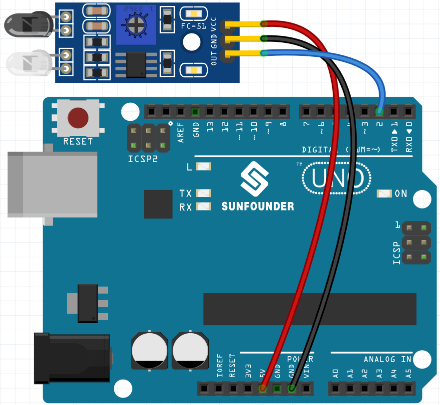

.. note::

    Ciao, benvenuto nella Community di appassionati SunFounder per Raspberry Pi, Arduino ed ESP32 su Facebook! Approfondisci le tue conoscenze su Raspberry Pi, Arduino ed ESP32 insieme ad altri appassionati.

    **Perché unirti?**

    - **Supporto Esperto**: Risolvi problemi post-vendita e sfide tecniche con l'aiuto della nostra comunità e del nostro team.
    - **Impara e Condividi**: Scambia consigli e tutorial per migliorare le tue competenze.
    - **Anteprime Esclusive**: Ottieni accesso anticipato agli annunci di nuovi prodotti e alle anteprime.
    - **Sconti Speciali**: Approfitta di sconti esclusivi sui nostri prodotti più recenti.
    - **Promozioni Festive e Giveaway**: Partecipa a promozioni festive e concorsi con premi.

    👉 Sei pronto a esplorare e creare con noi? Clicca su [|link_sf_facebook|] e unisciti oggi!

.. _sh_shooting:

2.13 GIOCO - Tiro al Bersaglio
====================================

Hai mai visto quei giochi di tiro in TV? Più vicino un concorrente spara un proiettile al centro del bersaglio, più alto sarà il suo punteggio.

Oggi realizziamo anche noi un gioco di tiro con Scratch. Nel gioco, fai in modo che il mirino spari il più vicino possibile al centro del bersaglio per ottenere un punteggio più alto.

Clicca sulla bandiera verde per iniziare. Usa il modulo di evitamento ostacoli per sparare un proiettile.

.. image:: img/14_shooting.png

Cosa Imparerai
---------------------

- Come funziona il modulo di evitamento ostacoli e il suo intervallo angolare
- Disegnare diversi sprite
- Riconoscimento dei colori

Componenti Necessari
------------------------

In questo progetto, ci servono i seguenti componenti.

È sicuramente conveniente acquistare un kit completo, ecco il link:

.. list-table::
    :widths: 20 20 20
    :header-rows: 1

    *   - Nome	
        - COMPONENTI IN QUESTO KIT
        - LINK
    *   - Kit Starter 3 in 1
        - 380+
        - |link_3IN1_kit|

Puoi anche acquistarli separatamente dai link qui sotto.

.. list-table::
    :widths: 30 20
    :header-rows: 1

    *   - INTRODUZIONE AI COMPONENTI
        - LINK PER L'ACQUISTO

    *   - :ref:`cpn_uno`
        - |link_Uno_R3_buy|
    *   - :ref:`cpn_wires`
        - |link_wires_buy|
    *   - :ref:`cpn_avoid` 
        - |link_obstacle_avoidance_buy|

Costruire il Circuito
------------------------

Il modulo di evitamento ostacoli è un sensore di prossimità a infrarossi regolabile in distanza il cui output è normalmente alto e diventa basso quando viene rilevato un ostacolo.

Ora costruisci il circuito seguendo lo schema sottostante.

Programmazione
-------------------

**1. Disegna lo sprite Mirino**

Elimina lo sprite predefinito, seleziona il pulsante **Sprite** e clicca su **Disegna**, apparirà uno sprite vuoto chiamato **Sprite1** che rinominerai in **Mirino**.

.. image:: img/14_shooting0.png

Vai alla pagina **Costumi** dello sprite **Mirino**. Clicca sullo strumento **Cerchio**, rimuovi il colore di riempimento e imposta il colore e lo spessore del contorno.

.. image:: img/14_shooting02.png

Ora disegna un cerchio con lo strumento **Cerchio**. Dopo averlo disegnato, puoi cliccare sullo strumento **Seleziona** e spostare il cerchio in modo che il punto originale sia allineato con il centro della tela.

.. image:: img/14_shooting03.png

Usando lo strumento **Linea**, disegna una croce all'interno del cerchio.

.. image:: img/14_shooting033.png

**Disegna lo sprite Bersaglio**

Crea un nuovo sprite chiamato **Bersaglio**.

.. image:: img/14_shooting01.png

Vai alla pagina Costumi dello sprite **Bersaglio**, clicca sullo strumento **Cerchio**, seleziona un colore di riempimento e rimuovi il contorno, poi disegna un grande cerchio.

.. image:: img/14_shooting05.png

Usa lo stesso metodo per disegnare ulteriori cerchi, ciascuno con un colore diverso, e puoi utilizzare lo strumento **Avanti** o **Indietro** per modificare la posizione dei cerchi sovrapposti. Nota che devi anche selezionare lo strumento per spostare i cerchi, in modo che l'origine di tutti i cerchi e il centro della tela siano allineati.

.. image:: img/14_shooting04.png

**3. Aggiungi uno sfondo**

Aggiungi uno sfondo adeguato che preferibilmente non abbia troppi colori e non corrisponda ai colori dello sprite **Bersaglio**. Qui ho scelto lo sfondo **Wall1**.

.. image:: img/14_shooting06.png

**4. Script per lo sprite Mirino**

Imposta la posizione e la dimensione casuale dello sprite **Mirino** e fallo muovere in modo casuale.

.. image:: img/14_shooting4.png

Quando una mano viene posta di fronte al modulo di evitamento ostacoli, esso emetterà un segnale basso come segnale di trasmissione.

.. image:: img/14_shooting5.png

Quando viene ricevuto il messaggio **sparo**, lo sprite smette di muoversi e si restringe lentamente, simulando così l'effetto di un proiettile sparato.

.. image:: img/14_shooting6.png

Usa il blocco [Tocca colore ()] per determinare la posizione del colpo.

.. image:: img/14_shooting7.png

Quando il colpo è all'interno del cerchio giallo, viene segnalato un punteggio di 10.

.. image:: img/14_shooting8.png

Usa lo stesso metodo per determinare la posizione del proiettile sparato, se non è impostato sullo sprite **Bersaglio**, significa che è fuori dal cerchio.

.. image:: img/14_shooting9.png
