.. _sh_tap_tile:

2.20 GAME - Don't Tap on The White Tile
==========================================

I'm sure many of you have played this game on your cell phones. This game is played by tapping on randomly appearing black to add points, the speed will get faster and faster, tap on white blocks or miss black blocks game over.

Now we use PictoBlox to replicate it.

Insert two IR obstacle avoidance modules vertically on the breadboard, when your hand is placed above one of the IR modules, a blink dot will appear on the stage, representing a tap was made.

If the tap to the black block, the score plus 1, touch the white block, the score minus 1.

You need to decide whether to place your hand on top of the IR module on the left or on top of the IR module on the right, depending on the position of the black block on the stage.

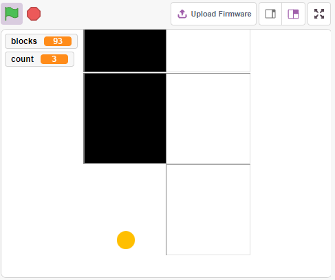

Build the Circuit
-----------------------

The obstacle avoidance module is a distance-adjustable infrared proximity sensor whose output is normally high and low when an obstacle is detected.

Now build the circuit according to the diagram below.

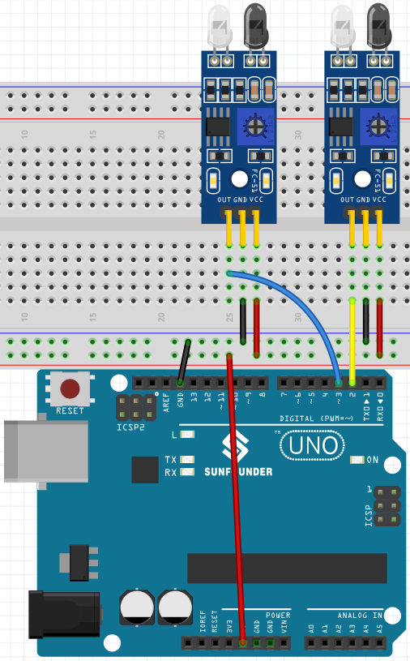

* :ref:`cpn_uno`
* :ref:`cpn_breadboard`
* :ref:`cpn_avoid` 

Programming
------------------

Here we need to have 3 sprites, **Tile** , **Left IR** and **Right IR**.

* **Tile** sprite: used to achieve the effect of alternating black and white tiles downward, in the cell phone this game is generally 4 columns, here we only do two columns.
* **Left IR** sprite: used to achieve the click effect, when the left IR module senses your hand, it will send a message - **left** to **Left IR** sprite, let it start working. If it touches the black tile on the stage, the score will be increased by 1, otherwise the score will be decreased by 1.
* **Right IR** sprite: The function is basically the same as **Left IR**, except that it receives **Right** information.

**1. Paint a Tile sprite**.

Delete the default sprite, mouse over the **Add Sprite** icon, select **Paint** and a blank sprite will appear and name it **Tile**.

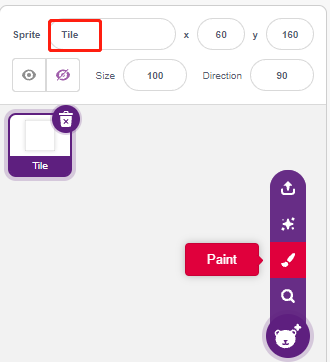

Go to the **Costumes** page and use the **Rectangle** tool to draw a rectangle.

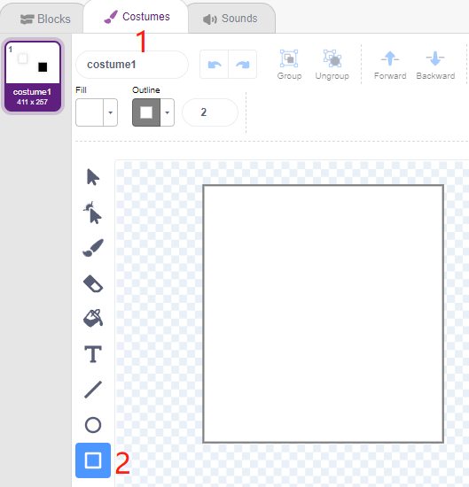

Select the rectangle and click **Copy** -> **Paste** to make an identical rectangle, then move the two rectangles to a flush position.

.. image:: img/21_tile01.png

Select one of the rectangles and choose a fill color of black.

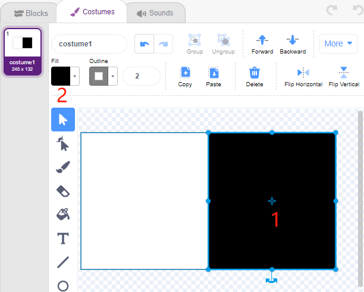

Now select both rectangles and move them so that their center points match the center of the canvas.

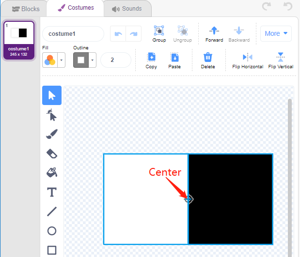

Duplicate costume1, alternating the fill colors of the two rectangles. For example, the fill color of costume1 is white on the left and black on the right, and the fill color of costume2 is black on the left and white on the right.

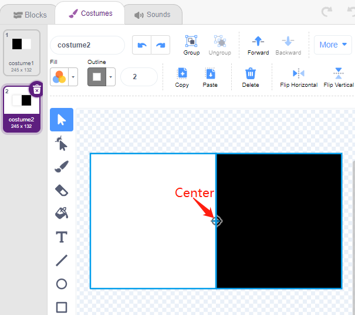

**2. Scripting the Tile sprite**

Now go back to the **Blocks** page and set the initial position of the **Tile** sprite so that it is at the top of the stage.

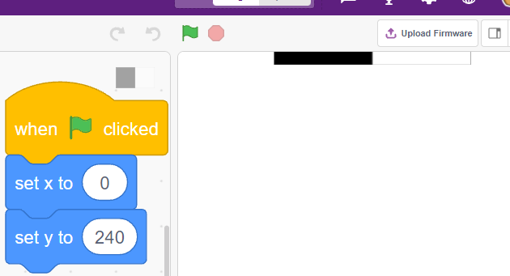

Create a variable -**blocks** and give it an initial value to determine the number of times the **Tile** sprite will appear. Use the [repeat until] block to make the variable **blocks** gradually decrease until **blocks** is 0. During this time, have the sprite **Tile** randomly switch its costume.

After clicking on the green flag, you will see the **Tile** sprite on the stage quickly switch costumes.

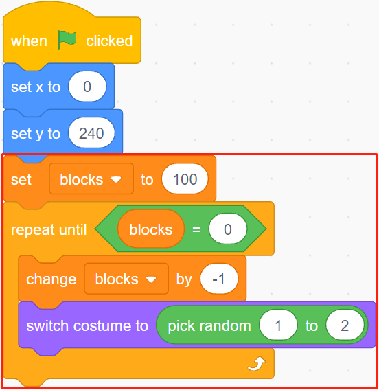

Create clones of the **Tile** sprite while the variable **blocks** is decreasing, and stop the script from running when blocks is 0. Two [wait () seconds] blocks are used here, the first to limit the interval between **Tile's** clones and the second is to let the variable blocks decrease to 0 without stopping the program immediately, giving the last tile sprite enough time to move.

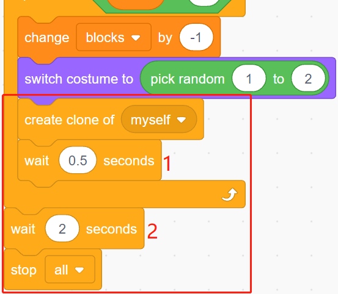

Now script the clone of the **Tile** sprite to move down slowly and delete it when it reaches the bottom of the stage. The change in the y coordinate affects the drop speed, the larger the value, the faster the drop speed.

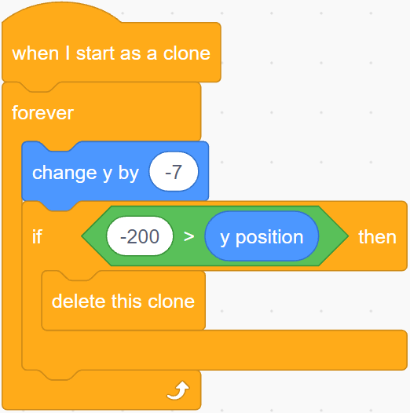

Hide the body and show the clone.

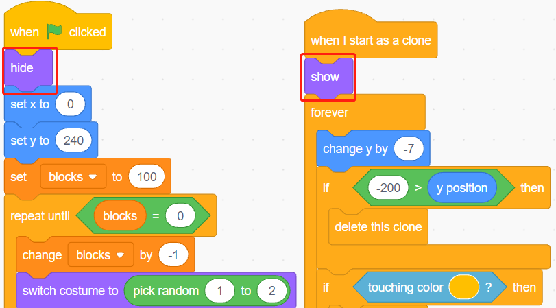

**3. Read the values of the 2 IR modules**

In the backdrop, read the values of the 2 IR modules and make the corresponding actions.

* If the left IR obstacle avoidance module senses your hand, broadcast a message - **left**.
* If the left IR avoidance module senses your hand, broadcast a message - **right**.

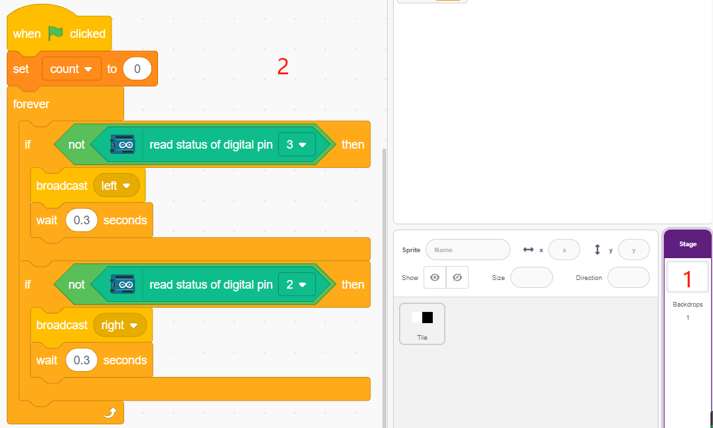

**4. Left IR sprite**

Again, mouse over the **Add sprite** icon and select **Paint** to create a new sprite called **Left IR**.

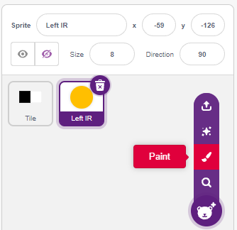

Go to the **Costumes** page of the **Left IR** sprite, select the fill color (any color out of black and white) and draw a circle.

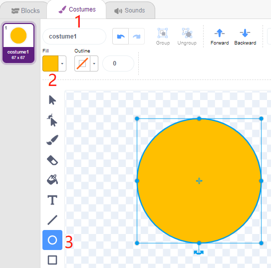

Now start scripting the **Left IR** sprite. When the message - **left** is received (the IR receiver module on the left detects an obstacle), then determine if the black block of the **Tile** sprite is touched, and if it is, let the variable **count** add 1, otherwise subtract 1.

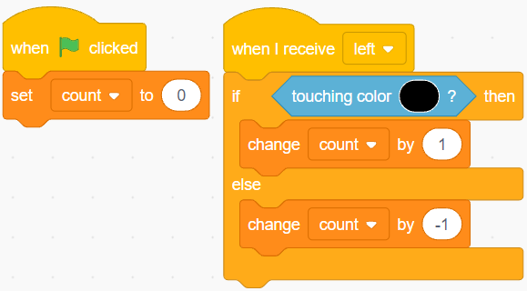

.. note::

    You need to make the **Tile** sprite appear on the stage, and then absorb the color of the black block in the **Tile** sprite.

    .. image:: img/21_tile13.png

Now let's do the sensing effect (zoom in and out) for **Left IR**.

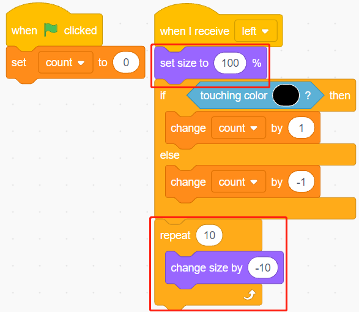

Make the **Left IR** sprite hide when the green flag is clicked, show when the message - **left** is received, and finally hide again.

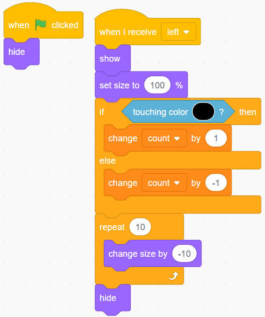

**5. Right IR sprite**

Copy the **Left IR** sprite and rename it to **Right IR**.

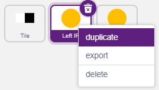

Then change the receive message to - **right**.

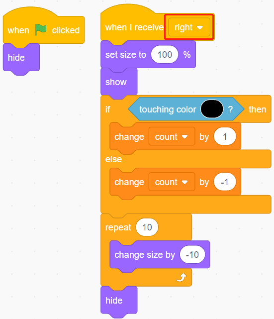

Now all the scripting is done and you can click on the green flag to run the script.