.. _sh_protect_heart:

2.21 GAME -  Protect Your Heart
=====================================

In this project, let's make a game that tests reaction speed.

In the stage, there is a heart protected in a rectangular box, and there are arrows flying towards this heart from any position on the stage. The color of the arrow will alternate between black and white at random and the arrow will fly faster and faster.

If the color of the rectangular box and the arrow color are the same, the arrow is blocked outside and level is added 1; if the color of both is not the same, the arrow will shoot through the heart and the game is over.

Here the color of the rectangle box is controlled by the Line Tracking module. When the module is placed on a black surface (a surface that is reflective), the color of the rectangle box is black, otherwise it is white.

So you need to decide whether to put the Line Tracking module on a white surface or a black surface according to the arrow color.

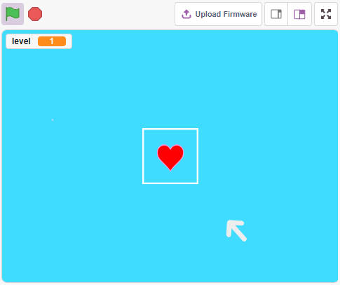

Build the Circuit
-----------------------

This is a digital Line Tracking module, when a black line is detected, it outputs 1; when a white line is detected, it outputs a value of 0. In addition, you can adjust its sensing distance through the potentiometer on the module.

Now build the circuit according to the diagram below.

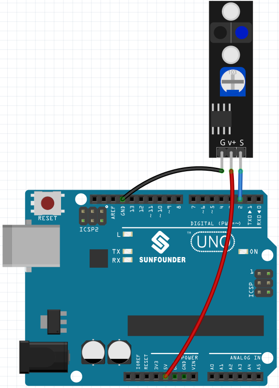

* :ref:`cpn_uno`
* :ref:`cpn_track` 

.. note::

    Before starting the project, you need to adjust the sensitivity of the module.

    Wiring according to the above diagram, then power up the R3 board (either directly into the USB cable or the 9V battery button cable), without uploading the code.

    Now stick a black electrical tape on the desktop, put the Line Track module at a height of 2cm from the desktop.

    With the sensor facing down, observe the signal LED on the module to make sure it lights up on the white table and goes off on the black tape.

    If not, you need to adjust the potentiometer on the module, so that it can do the above effect.

Programming
------------------

Here we need to create 3 sprites, **Heart**, **Square Box** and **Arrow1**.

* **Heart**: stops in the middle of the stage, if touched by **Arrow1** sprite, the game is over.
* **Square Box**: There are two types of costumes, black and white, and will switch costumes according to the value of Line Tracking module.
* **Arrow**: flies towards the middle of the stage from any position in black/white; if its color matches the color of the **Square Box** sprite, it is blocked and re-flies towards the middle of the stage from a random position; if its color does not match the color of the **Square Box** sprite, it passes through the **Heart** sprite and the game is over.

**1. Add Square Box sprite**

Since the Arrow1 and Square Box sprite both have white costumes, in order for them to be displayed on the stage, now fill the background with a color that can be any color except black, white, and red.

* Click on **Backdrop1** to go to its **Backdrops** page.
* Select the color you want to fill.
* Use the **Rectangle** tool to draw a rectangle the same size as the drawing board.

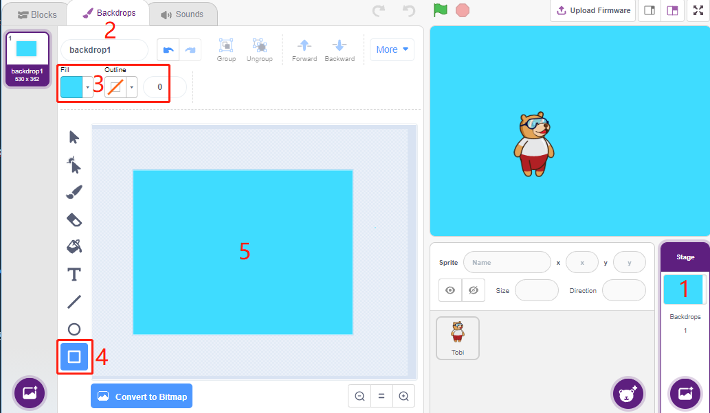

Delete the default sprite, use the **Choose a Sprite** button to add the **Square Box** sprite, and set its x and y to (0, 0).

.. image:: img/22_heart1.png

Go to the **Square Box** sprite's **Costumes** page and set the black and white costumes.

* Click the selection tool
* Select the rectangle on the canvas
* Select the fill color as black
* and name the costume **Black**

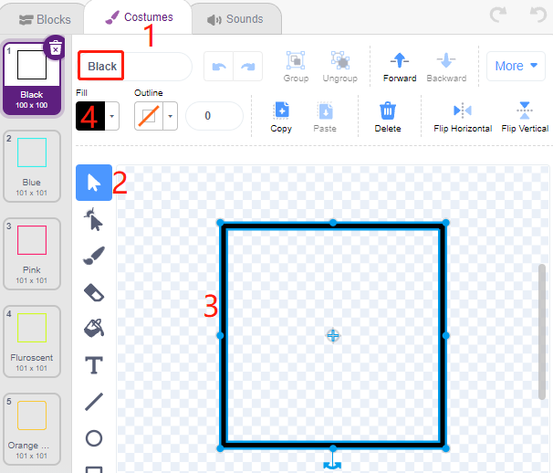

Select the second costume, set the fill color to white, name it White, and delete the rest of the costume.

.. image:: img/22_heart3.png

**2. Add Heart sprite**

Also add a **Heart** sprite, set its position to (0, 0), and shrink its size so that it appears to be located inside the Square Box.

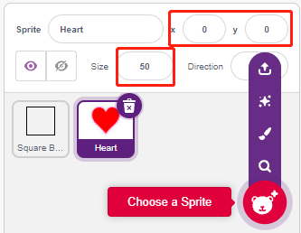

On the **Costumes** page, adjust the heart purple costume so that it appears to be broken.

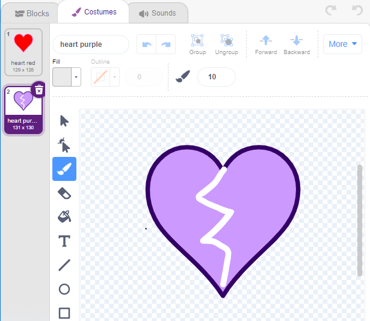

**3. Add Arrow1 sprite**

Add an **Arrow1** sprite.

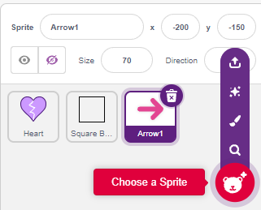

On the **Costumes** page, keep and copy the rightward facing costume and set its color to black and white.

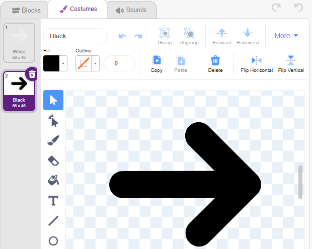

**4. Scripting for Square Box sprite**

Go back to the **Blocks** page and script **Square Box** sprite.

* So when the value of the digital pin 2 (Line Following module) is 1 (black line detected), then switch the costume to **Black**.
* Otherwise toggle the costume to **White**.

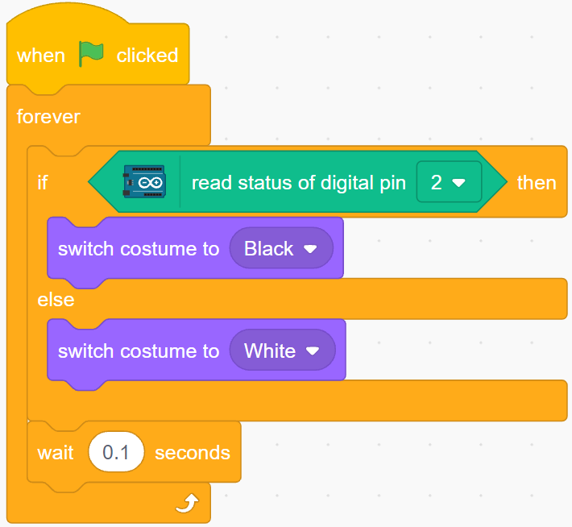

**5. Scripting for Heart sprite**

**Heart** sprite is protected inside **Square Box**, and by default is a red costume. When the Arrow1 sprite is touched, the game ends.

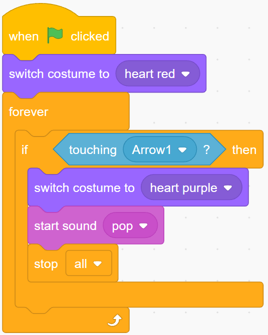

**6. Scripting for Arrow1 sprite**

Make the **Arrow1** sprite hide and create a clone when the green flag is clicked.

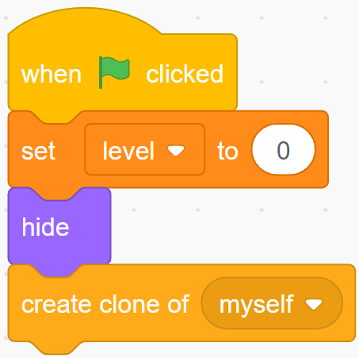

Create an [init] block to initialize the **Arrow1** sprite's position, orientation and color.

It appears at a random location, and if the distance between it and the **Heart** sprite is less than 200, it moves outward until the distance is greater than 200.

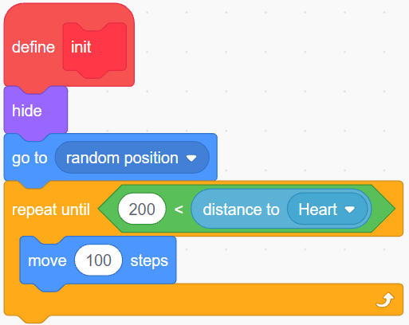

Set its direction to face the **Heart** sprite.

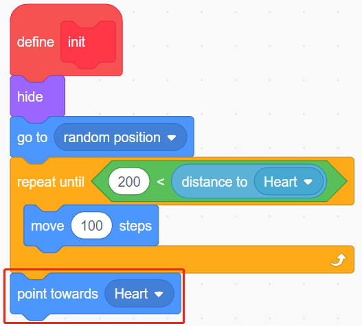

Make its color alternate randomly between black/white.

* Variable color is 0, toggle costume to **White**.
* Variable color is 1, toggles the outfit to **Black**.

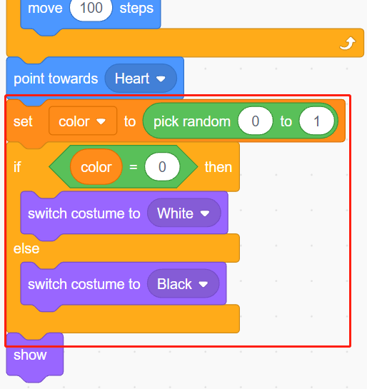

Now let it start moving, it will move faster as the value of the variable **level** increases.

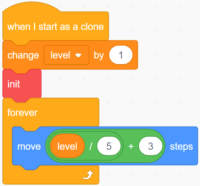

Now set its collision effect with the **Square Box** sprite.

* If the **Arrow1** sprite and the **Square Box** sprite have the same color (which will be modified according to the value of the Line Track module), either black or white, a new clone is created and the game continues.
* If their colors do not match, the **Arrow1** sprite continues to move and the game ends when it hits the **Heart** sprite.

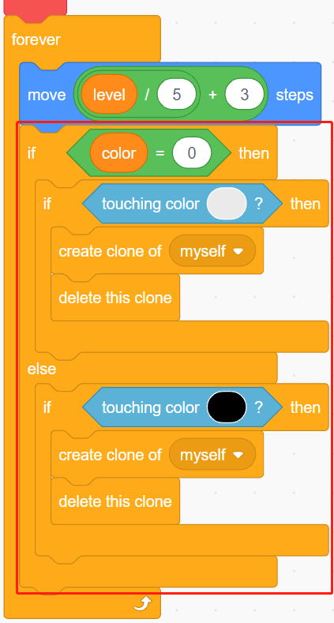

.. note::
    The two [touch color()] blocks need to pick up the black/white costumes of Square Box separately.

    .. image:: img/22_heart16.png
