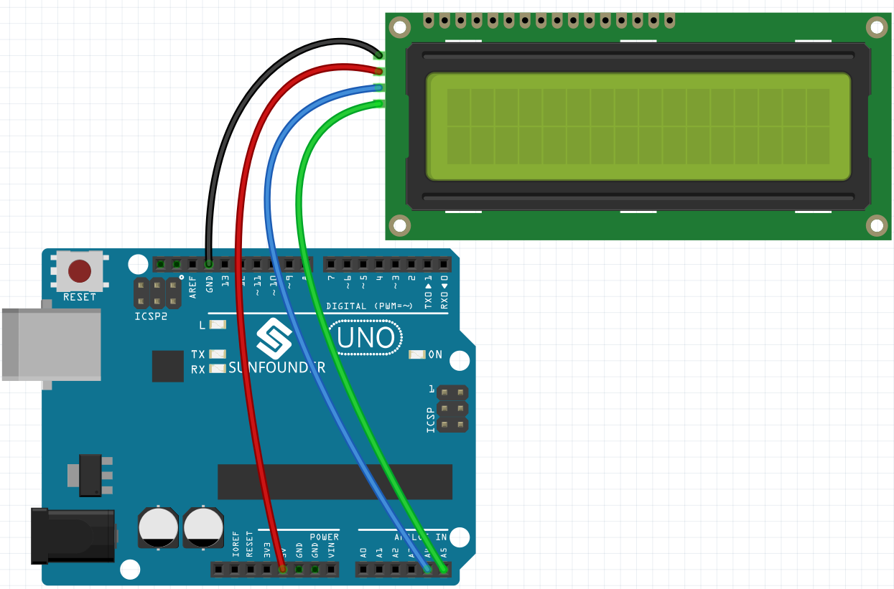

.. _sh_lcd1602:

2.4 LCD1602
=================

El LCD1602 puede usarse para mostrar 2x16 caracteres, ahora lo haremos mostrar los caracteres correspondientes con los sprites de caracteres en el escenario.

Cuando hagas clic en Hello en el escenario uno por uno, tendrán diferentes efectos de animación y los caracteres se mostrarán en el LCD1602 al mismo tiempo.

.. image:: img/5_hello.png

Aprenderás
---------------------

- Usar el LCD1602
- Seleccionar múltiples sprites diferentes
- Cambiar el tamaño del sprite, ángulo de rotación, color y mostrar u ocultar.

Componentes Necesarios
--------------------------

En este proyecto, necesitamos los siguientes componentes.

Es definitivamente conveniente comprar un kit completo, aquí está el enlace:

.. list-table::
    :widths: 20 20 20
    :header-rows: 1

    *   - Nombre	
        - ELEMENTOS EN ESTE KIT
        - ENLACE
    *   - 3 in 1 Starter Kit
        - 380+
        - |link_3IN1_kit|

También puedes comprarlos por separado en los enlaces a continuación.

.. list-table::
    :widths: 30 20
    :header-rows: 1

    *   - INTRODUCCIÓN DEL COMPONENTE
        - ENLACE DE COMPRA

    *   - :ref:`cpn_uno`
        - |link_Uno_R3_buy|
    *   - :ref:`cpn_wires`
        - |link_wires_buy|
    *   - :ref:`cpn_i2c_lcd1602`
        - |link_i2clcd1602_buy|

Construir el Circuito
---------------------

Programación
------------------

**1. Seleccionar sprite**

Elimina el sprite predeterminado, haz clic en **Choose a Sprite**, luego haz clic en **letters** y selecciona el sprite que desees.

.. image:: img/5_sprite.png

Por ejemplo, elegí Hello, como se muestra a continuación.

.. image:: img/5_sprite1.png

Ahora para configurar diferentes efectos para estos sprites y mostrarlos en el LCD1602 mientras se hacen clic.

**2. La H se agranda y se reduce**

Haz clic en el sprite **H**, y ahora escribe un script para él.

Cuando se hace clic en el sprite **H**, cambia su tamaño al 50%, luego restablécelo; mientras muestra H en la primera fila y columna del LCD1602.

* [set size to]: De la paleta **Aspectos**, se utiliza para establecer el tamaño del sprite, desde el 0% hasta el 100%.
* [set cursor at columan row]: De la paleta **Módulos de Pantalla**, se utiliza para establecer el cursor en una fila específica del LCD1602 para comenzar a mostrar caracteres.
* [write display]: De la paleta **Módulos de Pantalla**, se utiliza para mostrar caracteres o cadenas en el LCD1602.

.. image:: img/5_h.png

La distribución de filas y columnas en el LCD1602 se muestra en la figura.

.. image:: img/5_row.png

**3. La E se voltea de izquierda a derecha**

Haz clic en el sprite **E**, y ahora escribe un script para él.

Cuando se hace clic en el sprite **E**, haz que gire 180 grados en el sentido de las agujas del reloj, luego 180 grados en sentido contrario para que puedas verlo voltearse de izquierda a derecha; y muestra H en la primera fila y columna 2 del LCD1602.

* [turn degrees]: De la paleta **Movimientos**, se utiliza para girar el sprite en el sentido de las agujas del reloj o en sentido contrario, el rango es de 0 a 360 grados.

.. image:: img/5_lcd.png

**4. La L se encoge lentamente y se agranda**

Haz clic en el sprite **primera L** y ahora escribe un script para él.

Cuando se hace clic en el sprite **L**, usa el bloque [repeat] para aumentar su tamaño en un 50% (5 veces, 10 cada vez), luego encógelo de nuevo a su tamaño original de la misma manera, mientras muestra L en la primera fila y columna 3 del LCD1602.

* [change size by]: De la paleta Movimientos, se utiliza para cambiar el tamaño del sprite.

.. image:: img/5_l.png

**5. La segunda L cambia de color**

Haz clic en el sprite **segunda L** y ahora escribe un script para él.

Cuando se hace clic en el sprite **L**, usa el bloque [repeat] para repetir 10 veces a una tasa de 20 incrementos para cambiar entre colores y volver al color original. También muestra L en la primera fila y columna 4 del LCD1602.

* [`change color effect by <https://en.scratch-wiki.info/wiki/Graphic_Effect#Changing_of_colors_using_the_Color_Effect_block>`_]: Se utiliza para cambiar el Efecto de color, un disfraz puede tener 200 esquemas de color diferentes usando el efecto de color, 0 y 200 son el mismo color.

.. image:: img/5_2l.png

**6. La O se oculta y se muestra**

Haz clic en el sprite **O** y ahora escribe un script para él.

Cuando se hace clic en el sprite **O**, repite el proceso de ocultar y mostrar 3 veces, mientras muestra O en la primera fila y columna 5 del LCD1602.

* [Hide] y [Show]: hacen que el sprite se oculte y se muestre.

.. image:: img/5_o.png
