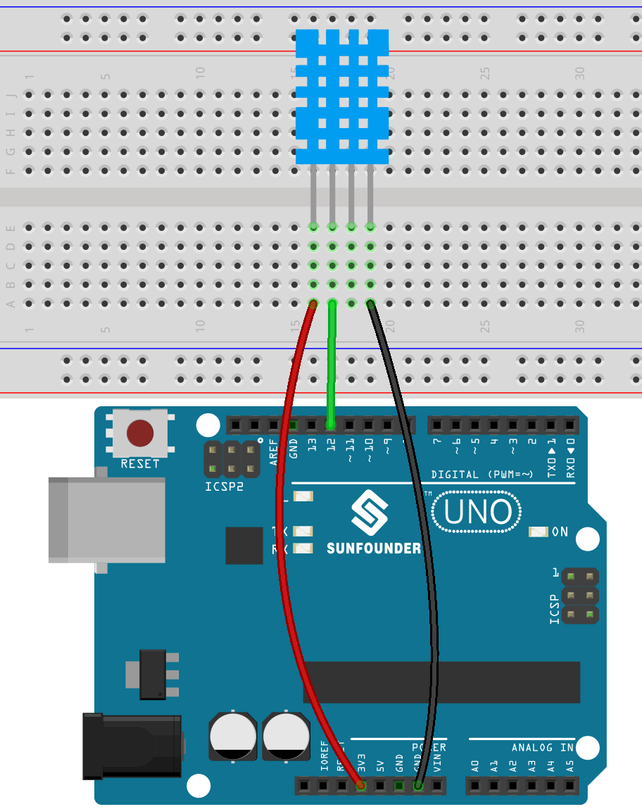

.. note::

    Ciao, benvenuto nella Community SunFounder di appassionati di Raspberry Pi, Arduino ed ESP32 su Facebook! Approfondisci le tue conoscenze su Raspberry Pi, Arduino ed ESP32 insieme ad altri appassionati.

    **Perché unirti?**

    - **Supporto Esperto**: Risolvi problemi post-vendita e sfide tecniche con l'aiuto della nostra comunità e del nostro team.
    - **Impara e Condividi**: Scambia suggerimenti e tutorial per migliorare le tue competenze.
    - **Anteprime Esclusive**: Ottieni accesso anticipato a nuovi annunci di prodotto e anteprime.
    - **Sconti Speciali**: Approfitta di sconti esclusivi sui nostri prodotti più recenti.
    - **Promozioni Festive e Giveaway**: Partecipa a giveaway e promozioni durante le festività.

    👉 Sei pronto a esplorare e creare con noi? Clicca su [|link_sf_facebook|] e unisciti oggi!

.. _sh_humiture:

2.9 Leggere Temperatura e Umidità
=================================================

Nei progetti precedenti abbiamo utilizzato la modalità Stage, ma alcune funzioni sono disponibili solo in modalità Upload, come la funzione di comunicazione seriale.
In questo progetto, stamperemo la temperatura e l'umidità rilevate dal DHT11 utilizzando il Monitor Seriale in :ref:`upload_mode`.

.. image:: img/11_serial.png

Cosa Imparerai
-----------------

- Ottenere temperatura e umidità dal modulo DHT11
- Monitor Seriale per la :ref:`upload_mode`
- Aggiungere estensioni

Componenti Necessari
------------------------

In questo progetto, avremo bisogno dei seguenti componenti.

È sicuramente conveniente acquistare un intero kit, ecco il link:

.. list-table::
    :widths: 20 20 20
    :header-rows: 1

    *   - Nome	
        - COMPONENTI IN QUESTO KIT
        - LINK
    *   - 3 in 1 Starter Kit
        - 380+
        - |link_3IN1_kit|

Puoi anche acquistarli separatamente dai link sottostanti.

.. list-table::
    :widths: 30 20
    :header-rows: 1

    *   - INTRODUZIONE AI COMPONENTI
        - LINK PER L'ACQUISTO

    *   - :ref:`cpn_uno`
        - |link_Uno_R3_buy|
    *   - :ref:`cpn_breadboard`
        - |link_breadboard_buy|
    *   - :ref:`cpn_wires`
        - |link_wires_buy|
    *   - :ref:`cpn_dht11`
        - \-

Costruire il Circuito
-------------------------

Il sensore digitale di temperatura e umidità DHT11 è un sensore composito che contiene un'uscita digitale calibrata del segnale di temperatura e umidità.

Ora costruisci il circuito secondo il diagramma seguente.

Programmazione
------------------

**1. Aggiungere Estensioni**

Passa alla modalità **Upload**, clicca sul pulsante **Aggiungi Estensione** nell'angolo in basso a sinistra, poi seleziona **Comunicazione** per aggiungerla, e apparirà alla fine dell'area della palette.

.. image:: img/11_addcom.png

**2. Inizializzare l'Arduino Uno e il Monitor Seriale**

In modalità **Upload**, avvia Arduino Uno e poi imposta la velocità della porta seriale.

* [quando Arduino si avvia]: In modalità **Upload**, avvia Arduino Uno.
* [imposta velocità baud seriale a]: Dal palette **Comunicazione**, usato per impostare la velocità della porta seriale 0, il default è 115200. Se stai utilizzando Mega2560, puoi scegliere di impostare la velocità della porta seriale da 0 a 3.

.. image:: img/11_init.png

**3. Leggere temperatura e umidità**

Crea 2 variabili **tem** e **humi** per memorizzare rispettivamente temperatura e umidità, il codice apparirà sul lato destro mentre trascini e rilasci il blocco.

.. image:: img/11_readtem.png

**4. Stampare i valori nel Monitor Seriale**

Scrivi la temperatura e l'umidità lette nel Monitor Seriale. Per evitare trasferimenti troppo veloci che potrebbero bloccare PictoBlox, utilizza il blocco [aspetta secondi] per aggiungere un intervallo di tempo prima della prossima stampa.

.. image:: img/11_writeserial.png

**5. Caricare il codice**

A differenza della modalità **Stage**, in modalità **Upload** il codice deve essere caricato sulla scheda Arduino utilizzando il pulsante **Carica Codice** per vedere l'effetto. Questo ti permette anche di scollegare il cavo USB e continuare a far funzionare il programma.

.. image:: img/11_upload.png

**6. Accendi il monitor seriale**

Ora apri il **Monitor Seriale** per vedere la temperatura e l'umidità.

.. image:: img/11_serial.png

