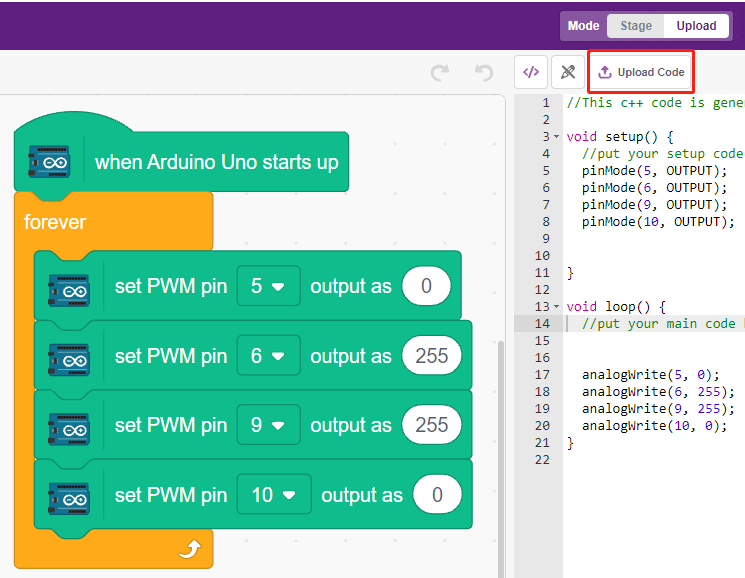
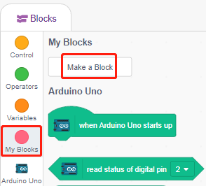
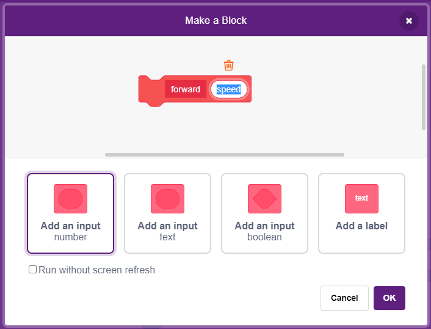
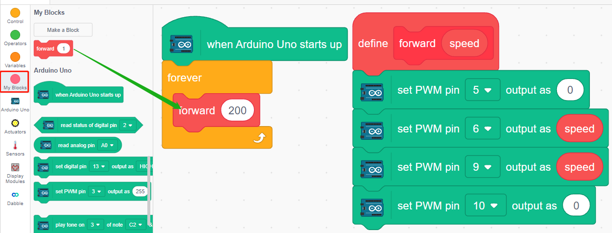
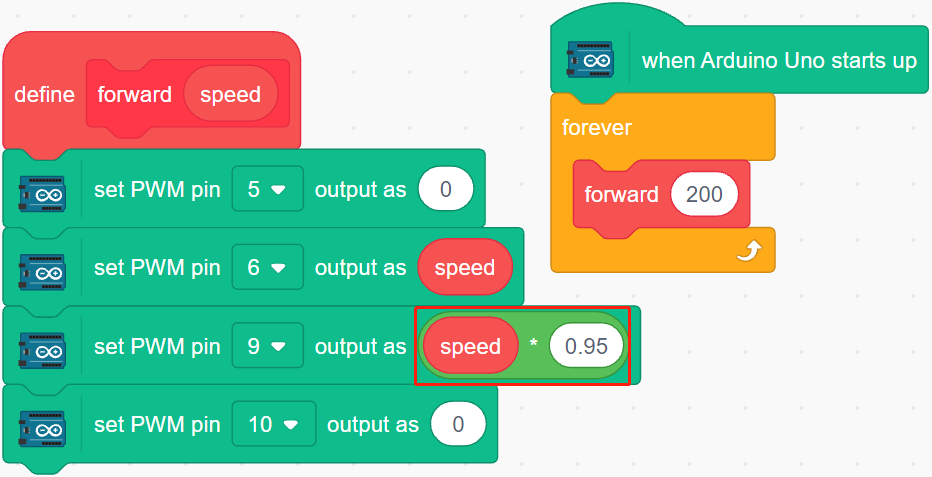

.. _sh_test:

3.1 Test the Car
======================

Hear, you will learn how to write scripts to make the car go forward, but you need to refer to :ref:`car_projects` to assemble the car and to get a basic understanding of it.

But before you start the project, you need to know the steps to use PictoBlox in :ref:`upload_mode`.

Build the Circuit
-----------------------

.. The L298N motor driver module is a high power motor driver module for driving DC and stepper motors. The L298N module can control up to 4 DC motors, or 2 DC motors with direction and speed control.

.. Connect the wires between the L298N module and the R3 board according to the diagram below.

.. .. list-table:: 
..     :widths: 25 25 50
..     :header-rows: 1

..     * - L298N
..       - R3 Board
..       - Motor
..     * - IN1
..       - 5
..       - 
..     * - IN2
..       - 6
..       - 
..     * - IN3
..       - 9
..       - 
..     * - IN4
..       - 10
..       - 
..     * - OUT1
..       - 
..       - Black wire of right motor
..     * - OUT2
..       - 
..       - Red wire of right motor
..     * - OUT3
..       - 
..       - Black wire of left motor
..     * - OUT4
..       - 
..       - Red wire of left motor

.. .. image:: img/car_motor1.jpg
..     :width: 800

* :ref:`cpn_uno`
* :ref:`cpn_l9110s` 
* :ref:`cpn_tt_motor`

Programming
-------------------

**1. Let the car go forward**

Based on the above wiring, we know that pins 5 and 6 are used to control the right motor rotation and pins 9 and 10 are used for the left motor rotation. Now let's write a script to make the car go forward.

After selecting Board as Arduino Uno, switch to :ref:`upload_mode` and write the script according to the following diagram.

Click the **Upload Code** button to upload the code to the R3 board. When it's done, you will see the two motors of the car moving forward (if you put the car on the ground, it will move forward in a straight line, but maybe the car will go in a curve because the speed of the two motors is a bit different). 

If not both turn forward, but the following situations occur, you need to readjust the wiring of the two motors.

* If both motors turn backward at the same time (left motor turns clockwise, right motor turns counterclockwise), swap the wiring of the left and right motors at the same time, OUT1 and OUT2 swap, OUT3 and OUT4 swap.
* If the left motor turns backward (clockwise rotation), exchange the wiring of OUT3 and OUT4 of the left motor.
* If the right motor turns backward (counterclockwise rotation), swap the wiring of OUT1 and OUT1 of the right motor.

**2. Creating block**

In order to make the script more clean and easy to use, here we put all the blocks that control the forward movement into a block, and when using it, just call this block directly.

Click **Make a Block** in the **My Blocks** palette.

Enter the name of the block - **forward** and check **Add an input**, set the input name to **speed**.

Drag and drop the blocks that control the cars forward into **forward**, note that you need to add the parameter - **speed** to pin6 and pin9.

.. image:: img/1_test33.png

Call the created block in the [Forward] block - **forward**. In Upload mode, the [When Arduino Uno starts up] block must be added at the beginning.

* The motor rotation speed range is 100 ~ 255.

    
**3. Adjusting the speed of motors**

Since there may be a slight difference in the speed of the 2 motors, resulting in the car not being able to move along a straight line, we can give the left and right motors different speeds to keep the car moving along a straight line as much as possible.

Since my car will move slowly to the right front, so here reduce the speed of the left motor.

