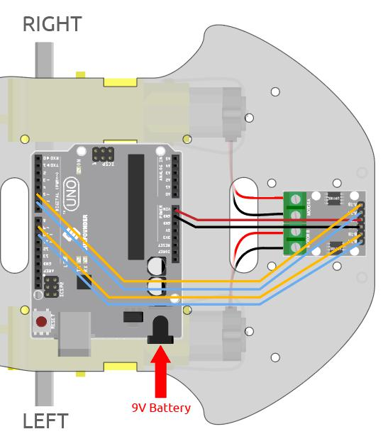

.. _sh_test:

3.1 Das Auto testen
======================

Hier erfahren Sie, wie Sie Skripte schreiben, um das Auto vorwärts fahren zu lassen. Sie sollten sich jedoch auf :ref:`car_projects` beziehen, um das Auto zusammenzubauen und ein grundlegendes Verständnis dafür zu erlangen.

Bevor Sie mit dem Projekt beginnen, sollten Sie die Schritte kennen, um PictoBlox im :ref:`upload_mode` zu verwenden.

Benötigte Komponenten
------------------------

Für dieses Projekt benötigen wir die folgenden Komponenten.

Es ist sicherlich praktisch, ein gesamtes Kit zu kaufen. Hier ist der Link:

.. list-table::
    :widths: 20 20 20
    :header-rows: 1

    *   - Name
        - ARTIKEL IN DIESEM KIT
        - LINK
    *   - 3-in-1 Starter Kit
        - 380+
        - |link_3IN1_kit|

Sie können sie auch einzeln über die untenstehenden Links kaufen.

.. list-table::
    :widths: 30 20
    :header-rows: 1

    *   - KOMPONENTENBESCHREIBUNG
        - KAUF-LINK

    *   - :ref:`cpn_uno`
        - |link_Uno_R3_buy|
    *   - :ref:`cpn_l298n` 
        - |link_l298n_buy|
    *   - :ref:`cpn_tt_motor`
        - \-

Schaltung aufbauen
-----------------------

Das L298N Motor-Treiber-Modul ist ein Hochleistungs-Motortreiber-Modul zum Antrieb von Gleichstrom- und Schrittmotoren. Das L298N-Modul kann bis zu 4 Gleichstrommotoren steuern oder 2 Gleichstrommotoren mit Richtungs- und Geschwindigkeitskontrolle.

Verbinden Sie die Kabel zwischen dem L298N-Modul und dem R3-Board gemäß dem untenstehenden Diagramm.

.. list-table:: 
    :widths: 25 25 50
    :header-rows: 1

    * - L298N
      - R3 Board
      - Motor
    * - IN1
      - 5
      - 
    * - IN2
      - 6
      - 
    * - IN3
      - 9
      - 
    * - IN4
      - 10
      - 
    * - OUT1
      - 
      - Schwarzes Kabel des rechten Motors
    * - OUT2
      - 
      - Rotes Kabel des rechten Motors
    * - OUT3
      - 
      - Schwarzes Kabel des linken Motors
    * - OUT4
      - 
      - Rotes Kabel des linken Motors

Programmierung
-------------------

**1. Das Auto vorwärts fahren lassen**

Basierend auf der oben gezeigten Verkabelung wissen wir, dass die Pins 5 und 6 verwendet werden, um die Drehung des rechten Motors zu steuern, und die Pins 9 und 10 für die Drehung des linken Motors. Lassen Sie uns nun ein Skript schreiben, um das Auto vorwärts fahren zu lassen.

Nachdem Sie das Board als Arduino Uno ausgewählt haben, wechseln Sie zum :ref:`upload_mode` und schreiben Sie das Skript gemäß dem folgenden Diagramm.

.. image:: img/1_test1.png

Klicken Sie auf die Schaltfläche **Upload Code**, um den Code auf das R3-Board zu laden. Wenn dies erledigt ist, sehen Sie die beiden Motoren des Autos vorwärts bewegen (wenn Sie das Auto auf den Boden setzen, wird es geradeaus fahren, aber vielleicht wird das Auto in einer Kurve fahren, da die Geschwindigkeit der beiden Motoren etwas unterschiedlich ist).

Wenn nicht beide vorwärts drehen, aber die folgenden Situationen auftreten, müssen Sie die Verkabelung der beiden Motoren erneut anpassen.

* Wenn beide Motoren gleichzeitig rückwärts drehen (linker Motor dreht im Uhrzeigersinn, rechter Motor gegen den Uhrzeigersinn), tauschen Sie die Verkabelung der linken und rechten Motoren gleichzeitig, OUT1 und OUT2 tauschen, OUT3 und OUT4 tauschen.
* Wenn der linke Motor rückwärts dreht (im Uhrzeigersinn), tauschen Sie die Verkabelung von OUT3 und OUT4 des linken Motors.
* Wenn der rechte Motor rückwärts dreht (gegen den Uhrzeigersinn), tauschen Sie die Verkabelung von OUT1 und OUT1 des rechten Motors.

**2. Block erstellen**

Um das Skript übersichtlicher und benutzerfreundlicher zu gestalten, fügen wir hier alle Blöcke, die die Vorwärtsbewegung steuern, in einen Block ein, und beim Gebrauch rufen wir diesen Block direkt auf.

Klicken Sie in der Palette **Make a Block** auf **My Blocks**.

.. image:: img/1_test31.png

Geben Sie den Namen des Blocks - **forward** ein und setzen Sie einen Haken bei **Add an input**, setzen Sie den Eingabenamen auf **speed**.

.. image:: img/1_test32.png

Ziehen Sie die Blöcke, die die Vorwärtsbewegung des Autos steuern, in **forward** und beachten Sie, dass Sie den Parameter - **speed** zu Pin6 und Pin9 hinzufügen müssen.

.. image:: img/1_test33.png

Rufen Sie den erstellten Block im [Forward] Block - **forward** auf. Im Upload-Modus muss der Block [When Arduino Uno starts up] am Anfang hinzugefügt werden.

* Der Geschwindigkeitsbereich der Motorrotation liegt zwischen 100 und 255.

.. image:: img/1_test3.png

**3. Geschwindigkeit der Motoren anpassen**

Da es möglicherweise einen leichten Geschwindigkeitsunterschied zwischen den 2 Motoren gibt, was dazu führt, dass das Auto nicht genau geradeaus fährt, können wir den linken und rechten Motoren unterschiedliche Geschwindigkeiten geben, um das Auto so gerade wie möglich zu halten.

Da mein Auto langsam nach rechts vorne fährt, reduziere ich hier die Geschwindigkeit des linken Motors.

.. image:: img/1_test2.png

