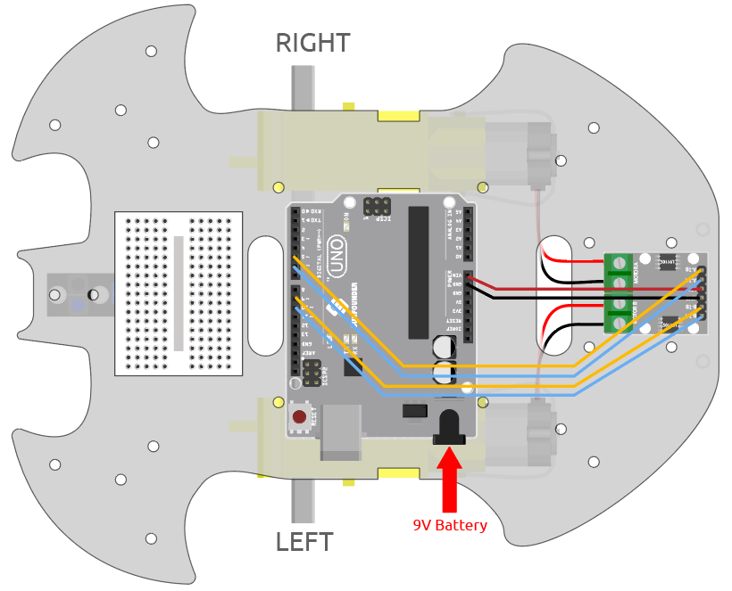

.. note::

    Ciao, benvenuto nella SunFounder Raspberry Pi & Arduino & ESP32 Enthusiasts Community su Facebook! Approfondisci Raspberry Pi, Arduino ed ESP32 insieme ad altri appassionati.

    **Perché unirti a noi?**

    - **Supporto Esperto**: Risolvi i problemi post-vendita e le sfide tecniche con l'aiuto della nostra comunità e del nostro team.
    - **Impara e Condividi**: Scambia suggerimenti e tutorial per migliorare le tue abilità.
    - **Anteprime Esclusive**: Ottieni accesso anticipato agli annunci di nuovi prodotti e anteprime.
    - **Sconti Esclusivi**: Approfitta di sconti esclusivi sui nostri prodotti più recenti.
    - **Promozioni Festive e Giveaway**: Partecipa a promozioni e concorsi durante le festività.

    👉 Sei pronto a esplorare e creare con noi? Clicca su [|link_sf_facebook|] e unisciti oggi stesso!

.. _sh_test:

3.1 Testare l'Auto
======================

Qui imparerai a scrivere script per far avanzare l'auto, ma devi fare riferimento a :ref:`car_projects` per assemblare l'auto e ottenere una comprensione di base del funzionamento.

Prima di iniziare il progetto, è necessario conoscere i passaggi per utilizzare PictoBlox in :ref:`upload_mode`.

Componenti Necessari
------------------------

In questo progetto, abbiamo bisogno dei seguenti componenti.

È sicuramente conveniente acquistare un intero kit, ecco il link:

.. list-table::
    :widths: 20 20 20
    :header-rows: 1

    *   - Nome	
        - ARTICOLI IN QUESTO KIT
        - LINK
    *   - Starter Kit 3 in 1
        - 380+
        - |link_3IN1_kit|

Puoi anche acquistarli separatamente dai link sottostanti.

.. list-table::
    :widths: 30 20
    :header-rows: 1

    *   - INTRODUZIONE AI COMPONENTI
        - LINK PER L'ACQUISTO

    *   - :ref:`cpn_uno`
        - |link_Uno_R3_buy|
    *   - :ref:`cpn_l9110` 
        - \-
    *   - :ref:`cpn_tt_motor`
        - \-

Costruisci il Circuito
--------------------------

Il modulo driver motore L9110 è un modulo ad alta potenza per pilotare motori DC e stepper. Il modulo L9110 può controllare fino a 4 motori DC, o 2 motori DC con controllo di direzione e velocità.

Collega i cavi tra il modulo L9110 e la scheda R3 secondo il diagramma sottostante.

.. list-table:: 
    :widths: 25 25 50
    :header-rows: 1

    * - Modulo L9110
      - Scheda R3
      - Motore
    * - A-1B
      - 5
      - 
    * - A-1A
      - 6
      - 
    * - B-1B(B-2A)
      - 9
      - 
    * - B-1A
      - 10
      - 
    * - OB(B)
      - 
      - Filo nero del motore destro
    * - OA(B)
      - 
      - Filo rosso del motore destro
    * - OB(A)
      - 
      - Filo nero del motore sinistro
    * - OA(A)
      - 
      - Filo rosso del motore sinistro

Programmazione
-------------------

**1. Far avanzare l'auto**

Basandosi sul cablaggio sopra descritto, sappiamo che i pin 5 e 6 sono utilizzati per controllare la rotazione del motore destro e i pin 9 e 10 per la rotazione del motore sinistro. Ora scriviamo uno script per far avanzare l'auto.

Dopo aver selezionato la scheda Arduino Uno, passa a :ref:`upload_mode` e scrivi lo script seguendo il diagramma qui sotto.

.. image:: img/1_test1.png

Fai clic sul pulsante **Carica Codice** per caricare il codice sulla scheda R3. Una volta fatto, vedrai i due motori dell'auto avanzare (se metti l'auto a terra, si muoverà in linea retta, ma potrebbe andare in curva a causa della differenza di velocità tra i due motori).

Se entrambi i motori non avanzano, ma si verificano le seguenti situazioni, devi regolare il cablaggio dei due motori.

* Se entrambi i motori ruotano all'indietro contemporaneamente (il motore sinistro ruota in senso orario, il motore destro in senso antiorario), scambia il cablaggio dei motori sinistro e destro contemporaneamente: scambia OA(A) con OB(A) e OA(B) con OB(B).
* Se il motore sinistro ruota all'indietro (rotazione in senso orario), scambia i cavi di OA(B) e OB(B) del motore sinistro.
* Se il motore destro ruota all'indietro (rotazione in senso antiorario), scambia i cavi di OA(A) e OB(A) del motore destro.

**2. Creare un blocco**

Per rendere lo script più pulito e facile da usare, inseriamo tutti i blocchi che controllano il movimento in avanti in un unico blocco, e quando lo usiamo, basta richiamare direttamente questo blocco.

Clicca su **Crea un Blocco** nella palette **I Miei Blocchi**.

.. image:: img/1_test31.png

Inserisci il nome del blocco - **avanti** e seleziona **Aggiungi un input**, impostando il nome dell'input su **velocità**.

.. image:: img/1_test32.png

Trascina i blocchi che controllano l'avanzamento dell'auto in **avanti**, nota che devi aggiungere il parametro - **velocità** ai pin 6 e 9.

.. image:: img/1_test33.png

Richiama il blocco creato nel blocco [Avanti] - **avanti**. In modalità Carica, il blocco [Quando Arduino Uno si avvia] deve essere aggiunto all'inizio.

* Il range di velocità di rotazione del motore è 100 ~ 255.

.. image:: img/1_test3.png
    
**3. Regolazione della velocità dei motori**

Poiché potrebbe esserci una leggera differenza nella velocità dei 2 motori, che porta l'auto a non muoversi in linea retta, possiamo assegnare velocità diverse ai motori sinistro e destro per mantenere l'auto il più possibile in linea retta.

Dato che la mia auto tende a spostarsi lentamente verso destra, qui riduco la velocità del motore sinistro.

.. image:: img/1_test2.png

