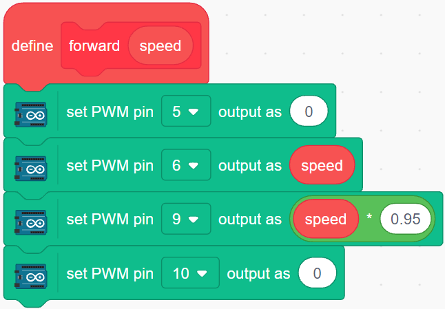
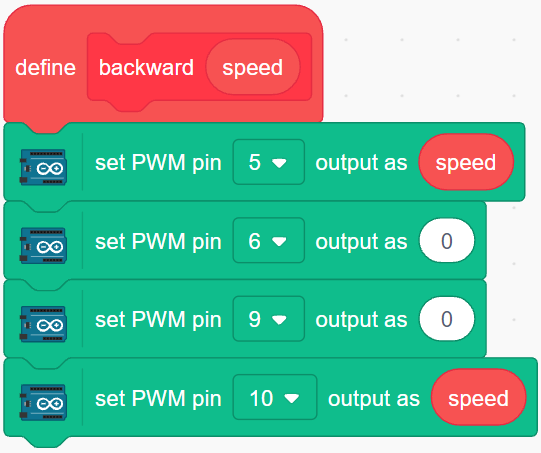
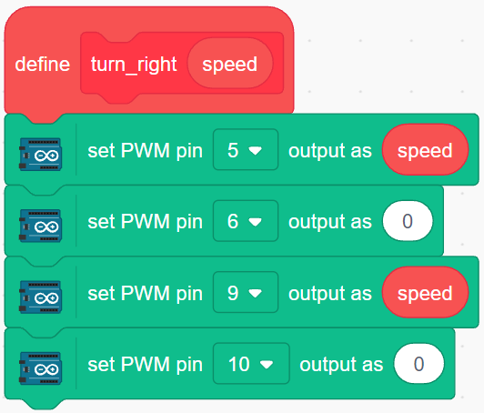
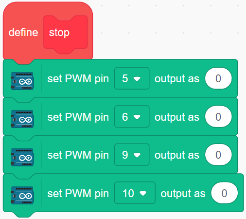
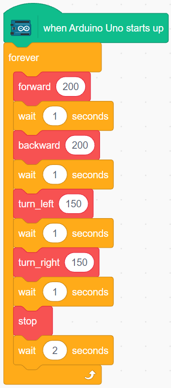

.. _sh_move:

3.2 Movement
==================

This project is based on :ref:`sh_test` to make the car move in all directions.

.. Before we start programming, let's review the working principle of L298N.

.. The working relationship between ENA and IN1,IN2 is as follows.

.. .. list-table:: 
..     :widths: 25 25 25 50
..     :header-rows: 1

..     * - ENA
..       - IN1
..       - IN2
..       - The state of right motor(A)
..     * - 0
..       - X
..       - X
..       - Stop
..     * - 1
..       - 0
..       - 0
..       - Brake
..     * - 1
..       - 0
..       - 1
..       - Rotate clockwise
..     * - 1
..       - 1
..       - 0
..       - Rotate counterclockwise
..     * - 1
..       - 1
..       - 1
..       - Brake

.. The working relationship between ENB and IN3,IN4 is as follows.

.. .. list-table:: 
..     :widths: 25 25 25 50
..     :header-rows: 1

..     * - ENB
..       - IN3
..       - IN4
..       - The state of left motor(B)
..     * - 0
..       - X
..       - X
..       - Stop
..     * - 1
..       - 0
..       - 0
..       - Brake
..     * - 1
..       - 0
..       - 1
..       - Rotate clockwise
..     * - 1
..       - 1
..       - 0
..       - Rotate counterclockwise
..     * - 1
..       - 1
..       - 1
..       - Brake

Programming
-------------------

Now create blocks to make the car, forward, backward, left and right rotation and stop respectively.

**1. Move Forward**

The right motor turns clockwise and the left motor turns counterclockwise to move the car forward.

**2. Move Backward**

Backward is just the opposite, the right motor needs to turn counterclockwise, the left motor clockwise.

**3. Turn Left**

The left and right motors turn clockwise at the same time to make the car turn left.

.. image:: img/2_turn_left.png

**4. Turn Right**

Similarly, turn the left and right motors counterclockwise to turn the car to the right.

**5. Stop**

Stop the car by setting all motors to 0.

**6. Make the car move**

Make the car move forward, backward, left and right for 1 second, then stop. Since all blocks are placed in the [Forever] block, you will see that the car repeats the above actions.

