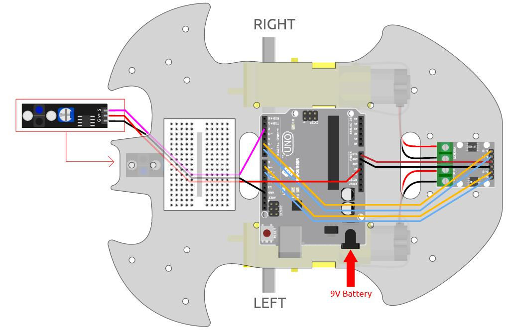
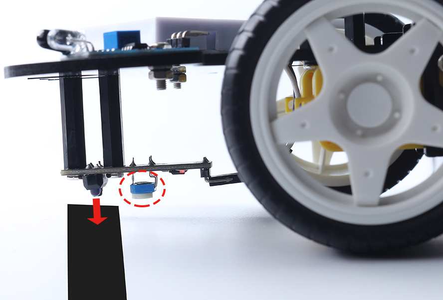
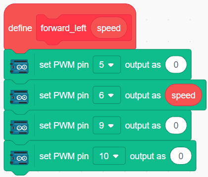
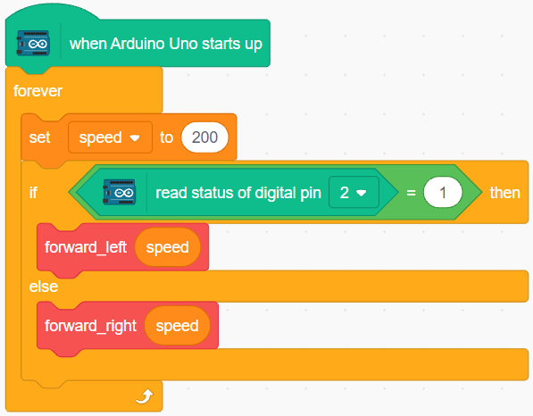

.. _sh_line:

3.3 Follow the line
======================

The car is equipped with a Line Track module, which can be used to make the car follow the black line.

Before starting the project, you need to build a curve map with black line tape, the recommended line width is between 0.8-1.5cm and the angle of the turn should not be less than 90 degrees.

Build the Circuit
-----------------------

This is a digital Line Tracking module, when a black line is detected, it outputs 1; when a white line is detected, it outputs a value of 0. In addition, you can adjust its sensing distance through the potentiometer on the module.

Build the circuit according to the following diagram.

.. list-table:: 

    * - Line Tracking Module
      - R3 Board
    * - S
      - 2
    * - V+
      - 5V
    * - G
      - GND

* :ref:`cpn_uno`
* :ref:`cpn_l9110s` 
* :ref:`cpn_tt_motor`
* :ref:`cpn_track`

Adjust the Module
-----------------------

Before starting the project, you need to adjust the sensitivity of the module.

Wiring according to the above diagram, then power up the R3 board (either directly into the USB cable or the 9V battery button cable), without uploading the code.

Stick a black electrical tape on the table and put the cart on it.

Observe the signal LED on the module to make sure it lights up on the white table and goes off on the black tape.

If not, you need to adjust the potentiometer on the module, so that it can do the above effect.

Programming
------------

Now create 2 blocks that allow the car to move either to the left front or to the right front.

**1. Move to the left front**

When the right motor is turned clockwise and the left motor is left unmoved, the car is moved slightly to the left front.

**2. Moving to the right front**

Similarly, when the left motor is turned counterclockwise and the left motor does not move, the car moves slightly to the right.

**3. Line Tracking**

Read the value of Line Tracking module, if it is 1, it means black line has been detected, let the car move forward to the left, otherwise move forward to the right.

After uploading the code to the R3 board, then align the Line Tracking module under the car with the black line, and you will see the car following the line.