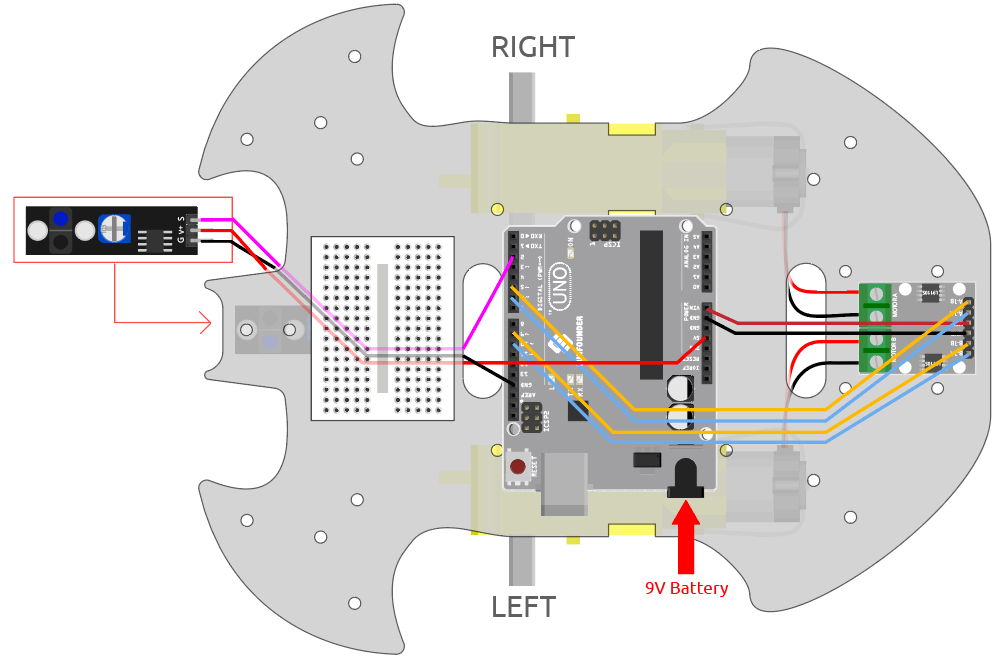

.. _sh_line:

3.3 黒い線を追う
======================

この車にはライン追跡モジュールが搭載されており、車が黒い線を追跡するようにすることができます。

プロジェクトを開始する前に、黒い線テープを使ってカーブマップを作成する必要があります。推奨されるラインの幅は0.8-1.5cmで、曲がり角は90度未満であってはなりません。

必要な部品
---------------------

このプロジェクトでは、以下の部品が必要です。

全体のキットを購入すると非常に便利です。リンクは以下の通りです。

.. list-table::
    :widths: 20 20 20
    :header-rows: 1

    *   - 名前
        - このキットのアイテム
        - リンク
    *   - 3 in 1 Starter Kit
        - 380+
        - |link_3IN1_kit|

以下のリンクから個別に購入することも可能です。

.. list-table::
    :widths: 30 20
    :header-rows: 1

    *   - コンポーネントの紹介
        - 購入リンク

    *   - :ref:`cpn_uno`
        - |link_Uno_R3_buy|
    *   - :ref:`cpn_l9110` 
        - \-
    *   - :ref:`cpn_tt_motor`
        - \-
    *   - :ref:`cpn_track`
        - |link_track_buy|

回路の作成
-----------------------

これはデジタルライン追跡モジュールで、黒い線を検出すると1を出力し、白い線を検出すると0の値を出力します。さらに、モジュール上のポテンショメータを通じて感知距離を調整することができます。

以下の図に従って回路を組み立ててください。

.. list-table:: 

    * - Line Tracking Module
      - R3 Board
    * - S
      - 2
    * - V+
      - 5V
    * - G
      - GND

モジュールの調整
-----------------------

プロジェクトを開始する前に、モジュールの感度を調整する必要があります。

上記の図に従って配線し、R3ボードを電源に接続してください（USBケーブルまたは9Vの電池ボタンケーブルで直接接続）。コードをアップロードすることなく電源を入れます。

テーブルに黒い電気テープを貼り、カートをその上に置きます。

モジュールのシグナルLEDを観察して、白いテーブル上で点灯し、黒いテープ上で消灯することを確認してください。

そうでない場合は、モジュール上のポテンショメータを調整して、上記の効果が得られるようにします。

.. image:: img/line_track_cali.JPG

プログラミング
---------------

左前または右前に車を動かす2つのブロックを作成します。

**1. 左前方に移動**

右のモーターが時計回りに回転し、左のモーターが動かないと、車は左前方にわずかに移動します。

.. image:: img/3_forward_left.png

**2. 右前方への移動**

同様に、左モータが反時計回りに回転し、左モータが動かないと、車は右方向にわずかに移動します。

.. image:: img/3_forward_left.png

**3. ライン追跡**

ライン追跡モジュールの値を読み取り、1の場合は黒い線が検出されたことを意味するので、車を左に進めます。そうでなければ、右方向に進みます。

.. image:: img/3_follow.png

R3ボードにコードをアップロードした後、ライン追跡モジュールを車の下の黒い線と一致させると、車が線を追跡するのを見ることができます。
