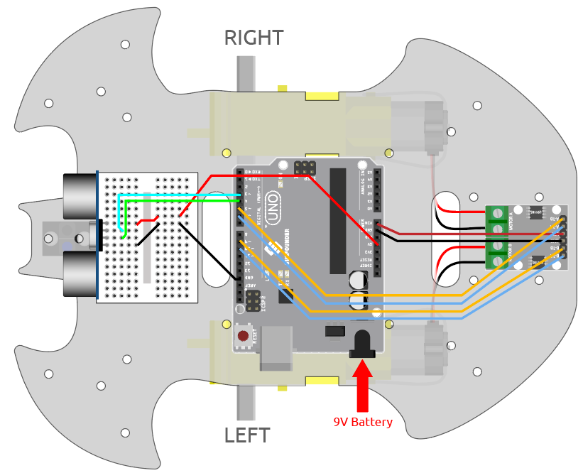

.. _sh_follow1:

3.4 Sigue tu Mano
===========================

Piensa en este coche como tu mascota, y cuando le hagas señas, vendrá corriendo hacia ti.

Componentes Necesarios
-------------------------

Para este proyecto, necesitamos los siguientes componentes.

Es definitivamente conveniente comprar un kit completo, aquí está el enlace:

.. list-table::
    :widths: 20 20 20
    :header-rows: 1

    *   - Nombre	
        - ELEMENTOS EN ESTE KIT
        - ENLACE
    *   - 3 in 1 Starter Kit
        - 380+
        - |link_3IN1_kit|

También puedes comprarlos por separado en los siguientes enlaces.

.. list-table::
    :widths: 30 20
    :header-rows: 1

    *   - INTRODUCCIÓN DEL COMPONENTE
        - ENLACE DE COMPRA

    *   - :ref:`cpn_uno`
        - |link_Uno_R3_buy|
    *   - :ref:`cpn_l9110` 
        - \-
    *   - :ref:`cpn_tt_motor`
        - \-
    *   - :ref:`cpn_ultrasonic`
        - |link_ultrasonic_buy|

Construye el Circuito
-----------------------

Un módulo de sensor ultrasónico es un instrumento que mide la distancia a un objeto utilizando ondas sonoras ultrasónicas.
Tiene dos sondas. Una es para enviar ondas ultrasónicas y la otra es para recibir las ondas y transformar el tiempo de envío y recepción en una distancia, detectando así la distancia entre el dispositivo y un obstáculo.

Ahora construye el circuito según el siguiente diagrama.

.. list-table:: 

    * - Módulo Ultrasónico
      - Placa R3
    * - Vcc
      - 5V
    * - Trig
      - 3
    * - Echo
      - 4
    * - Gnd
      - GND

Programación
------------

Crea bloques para hacer que el coche avance y se detenga.

.. image:: img/4_hand1.png

Pon tu mano frente al coche, luego lee el valor del módulo ultrasónico, si la distancia detectada de tu mano es de 5-10cm, entonces haz que el coche avance, de lo contrario detente.

.. image:: img/4_hand2.png
