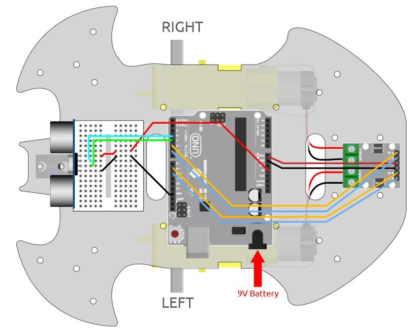
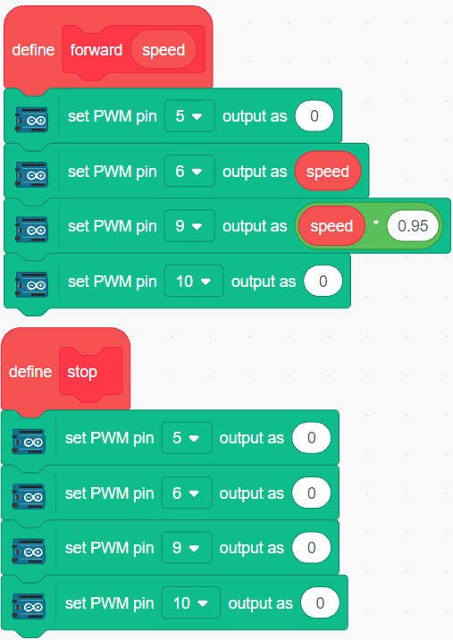
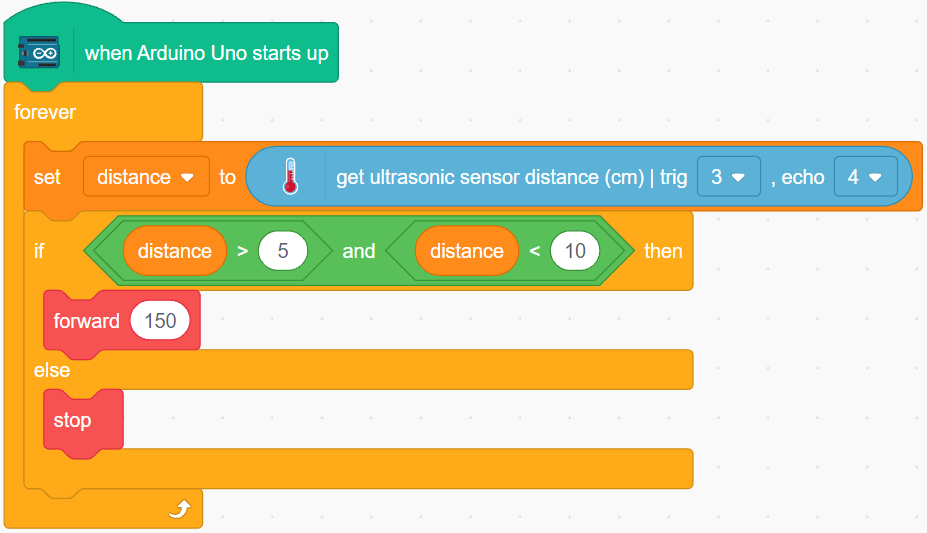

.. _sh_follow1:

3.4 Follow Your Hand
===========================

Think of this car as your pet here, and when you will wave to him, it comes running to you.

Build the Circuit
-----------------------

An ultrasonic sensor module is an instrument that measures the distance to an object using ultrasonic sound waves. 
It has two probes. One is to send ultrasonic waves and the other is to receive the waves and transform the time of sending and receiving into a distance, thus detecting the distance between the device and an obstacle.

Now build the circuit according to the following diagram.

.. list-table:: 

    * - Ultrasonic Module
      - R3 Board
    * - Vcc
      - 5V
    * - Trig
      - 3
    * - Echo
      - 4
    * - Gnd
      - GND

* :ref:`cpn_uno`
* :ref:`cpn_l9110s` 
* :ref:`cpn_tt_motor`
* :ref:`cpn_ultrasonic`

Programming
------------

Create blocks to make the car go forward and stop.

Put your hand in front of the car, then read the value of the ultrasonic module, if the detected distance of your hand is 5-10cm, then let the car go forward, otherwise stop.

