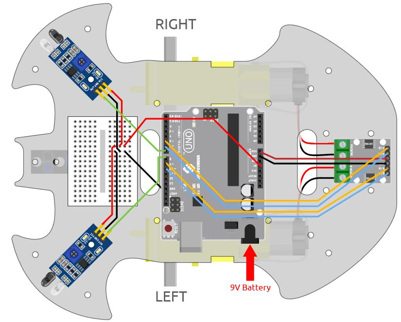
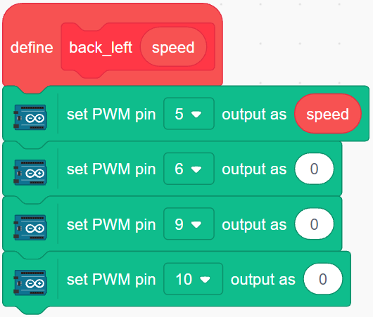
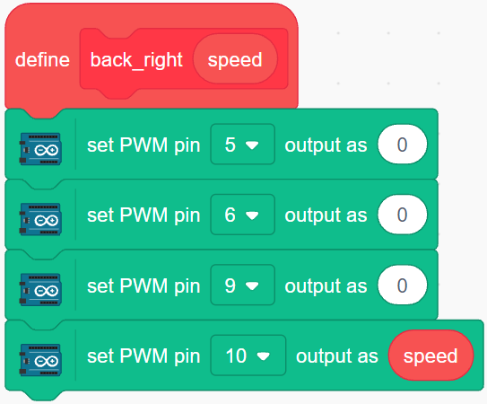
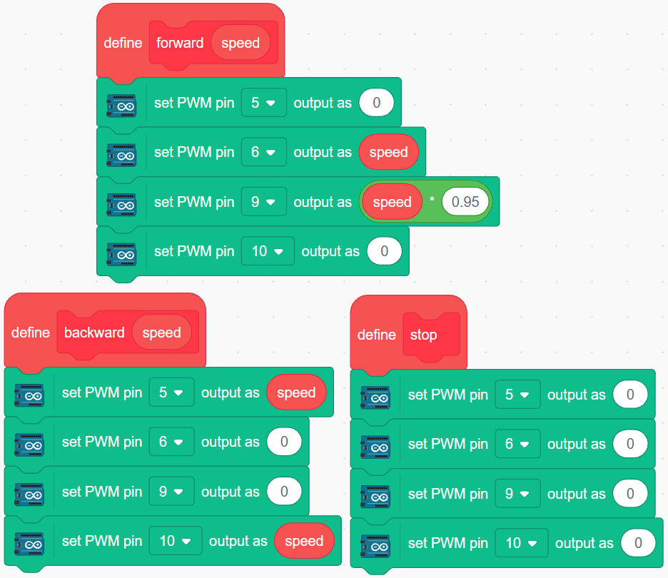
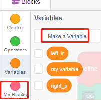
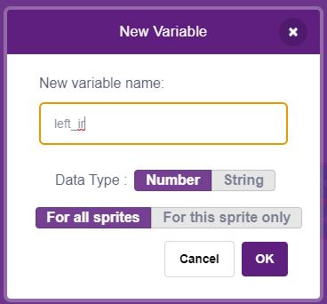
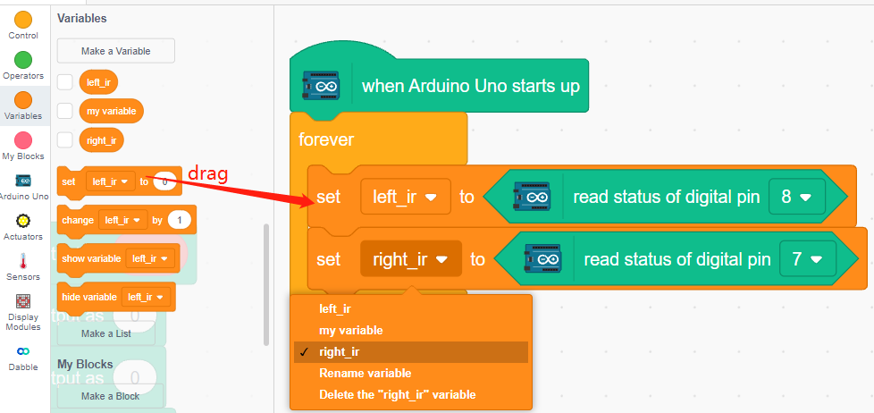

.. _sh_avoid1:

3.5 Obstacle avoidance
==================================

Two infrared obstacle avoidance modules are mounted on the front of the car, which can be used to detect some close obstacles.

In this project, the car is allowed to move forward freely, and when it encounters an obstacle it is able to avoid it and continue to move in other directions.

Build the Circuit
-----------------------

The obstacle avoidance module is a distance-adjustable infrared proximity sensor whose output is normally high and low when an obstacle is detected.

Now build the circuit according to the diagram below.

.. list-table:: 

    * - Left IR Module
      - R3 Board
    * - OUT
      - 8
    * - GND
      - GND
    * - VCC
      - 5V

.. list-table:: 

    * - Right IR Module
      - R3 Board
    * - OUT
      - 7
    * - GND
      - GND
    * - VCC
      - 5V

* :ref:`cpn_uno`
* :ref:`cpn_l9110s` 
* :ref:`cpn_tt_motor`
* :ref:`cpn_avoid` 

Adjust the Module
-----------------------

Before starting the project, you need to adjust the detection distance of the module.

Wiring according to the above diagram, power up the R3 board (either by plugging in the USB cable directly or by snapping the 9V battery cable), without uploading the code.

Place a notebook or any other flat object about 5cm in front of the IR obstacle avoidance.

Then use a screwdriver to rotate the potentiometer on the module until the signal indicator on the module just lights up, so as to adjust its maximum detection distance of 5cm.

Follow the same method to adjust another infrared module.

.. image:: img/ir_obs_cali.jpg

Programming
---------------

The effect we want to achieve.

* When the left IR module detects an obstacle, the car goes backward to the left
* When the right IR module detects an obstacle, the car goes backward to the right.
* If both IR modules detect the obstacle, the car will go back directly.
* Otherwise the car will go forward.

Now create the corresponding blocks.

**1. The car goes backward to the left**

When the right motor is turning counterclockwise and the left motor is not turning, the car will go backward to the left.

**2. The car goes backward to the right**

When the left motor is turning clockwise and the right motor is not turning, the car will go backward to the right.

**3. The car moves forward, backward and stops**

**4. Read the values of the 2 IR modules**

Click **Make a variable** in the **Variables** palette.

Enter the variable name and click **OK** to create a new variable.

Read the values of the left and right IR obstacle avoidance modules and store them in the 2 new variables.

**5. obstacle avoidance**

* When the left IR module is 0 (obstacle detected) and the right IR module is 1, let the car back up to the left.
* When the right IR module is 0 (obstacle detected), let the car go back up to the right.
* If 2 IR modules detect the obstacle at the same time, the car will go backward.
* Otherwise the car will keep going forward.

.. image:: img/5_avoid7.png