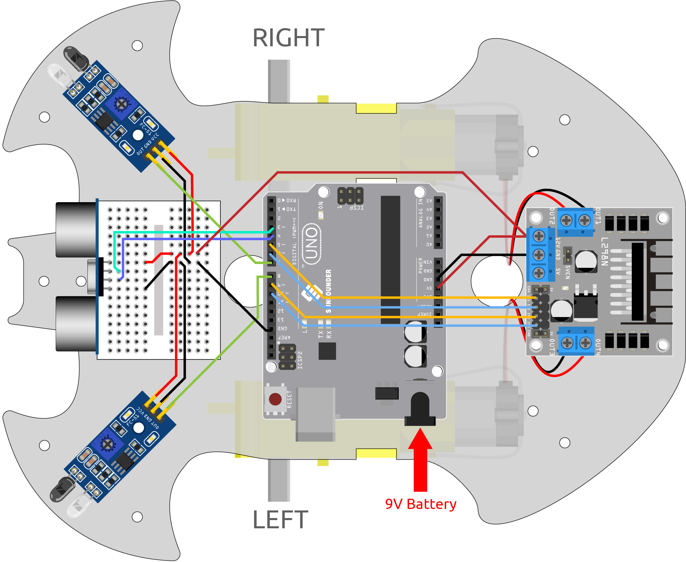
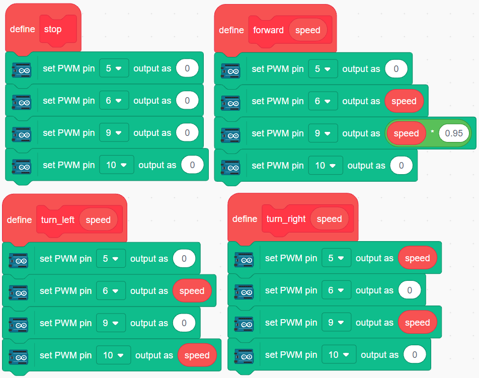
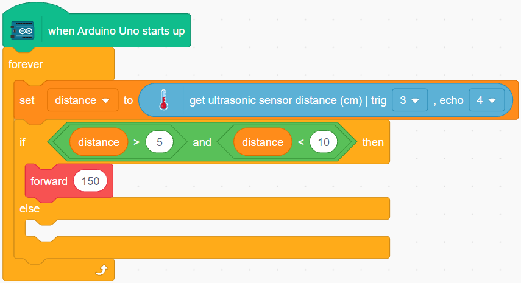
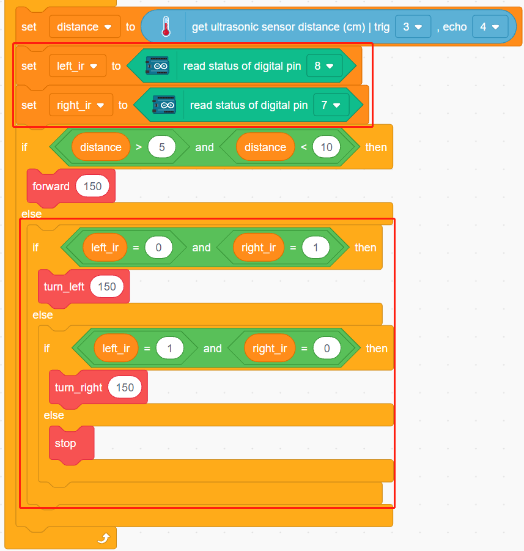

.. _sh_follow2:

3.6 Follow Your Hand 2
==============================

In the :ref:`sh_follow1` project only the ultrasonic module is used, it can only follow your hand forward.

In this project, we use 2 IR obstacle avoidance modules at the same time, so that the car can follow your hand left or right.

Build the Circuit
-----------------------

Connect the ultrasonic module and the two IR obstacle avoidance modules at the same time.

The wiring between the ultrasonic and the R3 board is as follows.

.. list-table:: 

    * - Ultrasonic Module
      - R3 Board
    * - Vcc
      - 5V
    * - Trig
      - 3
    * - Echo
      - 4
    * - Gnd
      - GND

The wiring of the 2 IR obstacle avoidance modules to the R3 board is as follows.

.. list-table:: 

    * - Left IR Module
      - R3 Board
    * - OUT
      - 8
    * - GND
      - GND
    * - VCC
      - 5V

.. list-table:: 

    * - Right IR Module
      - R3 Board
    * - OUT
      - 7
    * - GND
      - GND
    * - VCC
      - 5V

* :ref:`cpn_uno`
* :ref:`cpn_l9110s` 
* :ref:`cpn_tt_motor`
* :ref:`cpn_ultrasonic`
* :ref:`cpn_avoid` 

Programming
---------------

The effect to be achieved by this project is as follows

* Ultrasonic detects your hand about 5-10cm in front and let the car follow.
* The infrared module on the left detects your hand and turns to the left.
* The right IR module detects your hand and turns to the right.

**1. Create a block**

Create blocks that allow the car to move forward, turn left, turn right and stop.

**2. Follow to move forward**

Read the ultrasonic value and if your hand is detected at a distance of 5-10cm, then let the car follow.

**3. Follow to turn left and right**

Read the values of the left and right IR modules.

* If the left IR module detects your hand, turn left.
* If the right IR module detects your hand, turn right.
* If neither IR module and ultrasonic module detect your hand, make the car stop.

