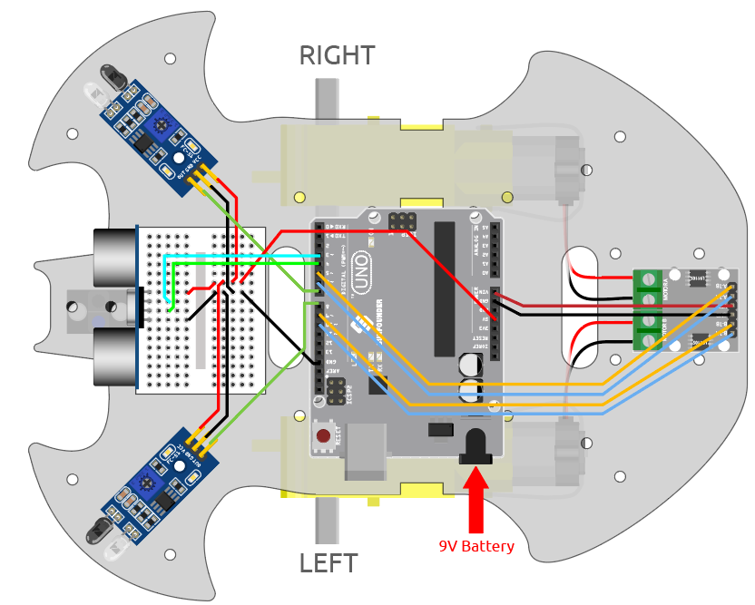

.. _sh_avoid2:

3.7 Evitación de obstáculos 2
==================================

En el proyecto :ref:`sh_avoid1`, solo se utilizan 2 módulos IR de evitación de obstáculos para evitar obstáculos, pero la distancia de detección del módulo IR de evitación de obstáculos es corta, lo que puede hacer que el coche sea demasiado lento para evitar los obstáculos.

En este proyecto, también agregamos un módulo ultrasónico para realizar algunas detecciones a larga distancia, de modo que el coche pueda detectar obstáculos a una mayor distancia para tomar una decisión.

Componentes Necesarios
------------------------

Para este proyecto, necesitamos los siguientes componentes.

Es definitivamente conveniente comprar un kit completo, aquí está el enlace:

.. list-table::
    :widths: 20 20 20
    :header-rows: 1

    *   - Nombre	
        - ELEMENTOS EN ESTE KIT
        - ENLACE
    *   - 3 in 1 Starter Kit
        - 380+
        - |link_3IN1_kit|

También puedes comprarlos por separado en los siguientes enlaces.

.. list-table::
    :widths: 30 20
    :header-rows: 1

    *   - INTRODUCCIÓN DEL COMPONENTE
        - ENLACE DE COMPRA

    *   - :ref:`cpn_uno`
        - |link_Uno_R3_buy|
    *   - :ref:`cpn_l9110` 
        - \-
    *   - :ref:`cpn_tt_motor`
        - \-
    *   - :ref:`cpn_ultrasonic`
        - |link_ultrasonic_buy|
    *   - :ref:`cpn_avoid` 
        - |link_obstacle_avoidance_buy|

Construye el Circuito
-----------------------

Conecta el módulo ultrasónico y los 2 módulos IR de evitación de obstáculos al mismo tiempo.

Conecta el ultrasónico a la placa R3 de la siguiente manera.

.. list-table:: 

    * - Módulo Ultrasónico
      - Placa R3
    * - Vcc
      - 5V
    * - Trig
      - 3
    * - Echo
      - 4
    * - Gnd
      - GND

El cableado de los 2 módulos IR de evitación de obstáculos a la placa R3 es el siguiente.

.. list-table:: 

    * - Módulo IR Izquierdo
      - Placa R3
    * - OUT
      - 8
    * - GND
      - GND
    * - VCC
      - 5V

.. list-table:: 

    * - Módulo IR Derecho
      - Placa R3
    * - OUT
      - 7
    * - GND
      - GND
    * - VCC
      - 5V

Programación
---------------

**1. Crear función**

Haz que el coche avance y retroceda.

.. image:: img/7_avoid2_1.png

Haz que el coche retroceda hacia la izquierda y hacia la derecha.

.. image:: img/7_avoid2_2.png

Haz que el coche se detenga.

.. image:: img/7_avoid2_3.png

**2. Evitación de obstáculos de emergencia**

Los 2 módulos IR de evitación de obstáculos en el coche se utilizan para la evitación de obstáculos de emergencia, detectando obstáculos a cortas distancias, esquinas o obstáculos relativamente pequeños.

* Si el módulo infrarrojo izquierdo detecta un obstáculo, el coche retrocede hacia la izquierda.
* Si el módulo IR derecho detecta un obstáculo, el coche retrocede hacia la derecha.
* Si los 2 módulos detectan el obstáculo al mismo tiempo, el coche retrocede directamente.

.. image:: img/7_avoid2_4.png

**3. Evitación de obstáculos a larga distancia**

Lee el valor del módulo ultrasónico, cuando el valor detectado sea menor a 10, el coche retrocederá; de lo contrario, seguirá avanzando.

.. image:: img/7_avoid2_5.png
