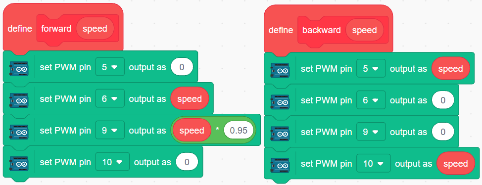
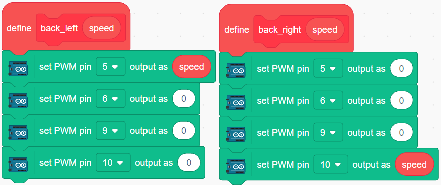
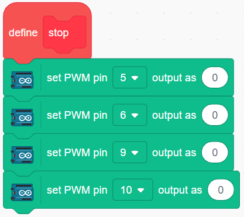
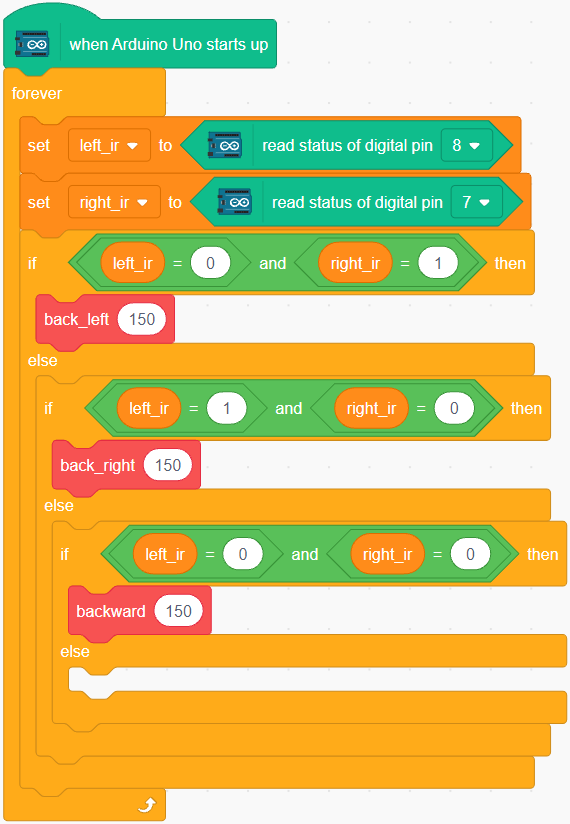
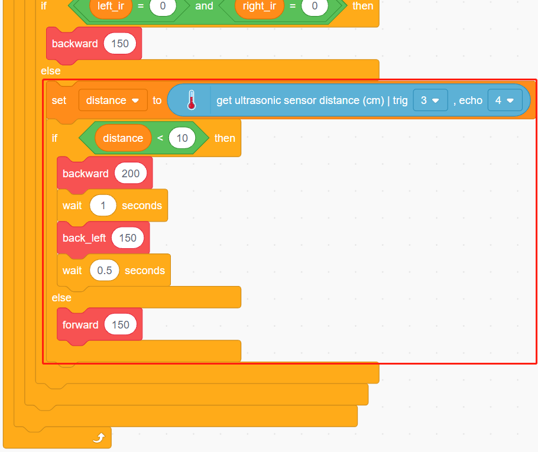

.. _sh_avoid2:

3.7 Obstacle avoidance 2
==================================

In :ref:`sh_avoid1` project, only 2 IR obstacle avoidance modules are used for obstacle avoidance, but the detection distance of IR obstacle avoidance module is short, which may make the car too late to avoid the obstacles.

In this project, we also add ultrasonic module to do some long-distance detection, so that the car can sense obstacles at a farther distance to make a judgment.

Build the Circuit
-----------------------

Connect the ultrasonic module and the 2 IR obstacle avoidance modules at the same time.

Wire the ultrasonic to the R3 board as follows.

.. list-table:: 

    * - Ultrasonic Module
      - R3 Board
    * - Vcc
      - 5V
    * - Trig
      - 3
    * - Echo
      - 4
    * - Gnd
      - GND

The wiring of the 2 IR obstacle avoidance modules to the R3 board is as follows.

.. list-table:: 

    * - Left IR Module
      - R3 Board
    * - OUT
      - 8
    * - GND
      - GND
    * - VCC
      - 5V

.. list-table:: 

    * - Right IR Module
      - R3 Board
    * - OUT
      - 7
    * - GND
      - GND
    * - VCC
      - 5V

.. image:: img/car_avoid_ultrasonic.jpg
    :width: 800

* :ref:`cpn_uno`
* :ref:`cpn_l9110s` 
* :ref:`cpn_tt_motor`
* :ref:`cpn_ultrasonic`
* :ref:`cpn_avoid` 

Programming
---------------

**1. Create function**

Make the car go forward and backward.

Make the car to go backward to the left and backward to the right.

Make the car stop.

**2. Emergency obstacle avoidance**

The 2 infrared obstacle avoidance modules on the car are used for emergency obstacle avoidance, detecting obstacles at short distances, corners or relatively small obstacles.

* If the left infrared module detects an obstacle, the car backs up to the left.
* If the right IR module detects an obstacle, the car recedes to the right rear.
* If 2 modules detect the obstacle at the same time, the car goes backward directly.

**2. Long range obstacle avoidance**

Read the value of ultrasonic module, when the detected value is less than 10, the car will go backward; otherwise it keeps going forward.

